# Atomic Chuckie Egg by Kees van Oss

### Licence

Freeware (source code included)

*Spectrum Chuckie Egg © 1983 A&F Software / Nigel Alderton*
*BBC Micro / Electron Chuckie Egg © 1983 A&F Software / Doug Anderson*
*Atomic Chuckie Egg © 2012 Kees van Oss*

### Introduction

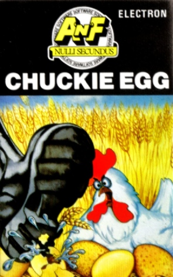 The classic platformer *[Chuckie Egg](wikipedia:Chuckie_Egg "wikilink")* was originally released on the Spectrum, the Dragon 32 and the BBC Micro in 1983 by A&F Software, based on an original idea from the Spectrum author, Nigel Alderton. The BBC Micro version by Doug Anderson was especially popular in schools around the country and two years later was ported by him, with some colour limitation, to the Acorn Electron. Faithful fan ports to the Archimedes and Risc PC followed, leaving the Atom as the last Acorn home computer to have not yet received a port of *Chuckie Egg*.

Retro Software is therefore proud to reveal a brand new Atom port by talented coder Kees van Oss, which was first showcased at the *[In Da 80s](http://inda80s.cgeu.info/)* show in Manchester, July 2011. Designed with input from the professionals behind *[The Chuckie Egg Professional's Resource Kit](http://www.bagshot-row.org/chuckie-egg/)*, this new release is an astonishingly accurate version of the beloved title. The striking background colour aside, the sprites are identical to its bigger Acorn sibling ports and the unique physics that made the original versions stand apart is reproduced here without any compromise. The level designs have been reduced slightly to fit the Atom's smaller MODE resolution, which results in a tighter, faster game - arguably, this release is even more challenging than both the BBC Micro and Electron ports. Even more surprising is the quality of the sound effects that have been achieved, given the Atom's limited sound capabilities.

[Discuss *Atomic Chuckie Egg*](http://www.retrosoftware.co.uk/forum/viewforum.php?f=76)

### Platforms

#### Atom

***Port by Kees van Oss***

##### System Requirements

-   Standard Acorn Atom
-   32 KB RAM (\#0000-\#7FFF)
-   6 KB video RAM (\#8000-\#97FF)
-   VIA
-   Joystick (Optional)

##### Joystick Connections

An optional joystick can be connected to PORTB of the AtoMMC interface with software version 2.9.

`AtoMMC  Joystick`
`-----------------`
` PB0  -  Right`
` PB1  -  Left`
` PB2  -  Down`
` PB3  -  Up`
` PB4  -  Jump`
` PB5  -  nc`
` PB6  -  nc`
` PB7  -  nc`
` GND  -  GND`

##### Downloads

[Chuckie Egg Acorn Atom disc/tape images and 2500AD cross compiler 6502 version assembler source code](./images/Atom Chuckie Egg.zip "wikilink")

This image archive includes both tape and disc versions of the game, in colour and monochrome. Read the included Readme.txt file for more info.

The sourcefiles are compiled with the 2500AD cross compiler.

Type MAKE CHUCKIE -t to compile the program.

An assembler listing is created with the -t parameter in the REPORT.TXT file.

##### Screenshots

<table>
<tbody>
<tr class="odd">
<td>
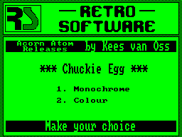
<strong><em>Atomic Chuckie Egg</em> menu mono screen</strong> 
<em>Posted: 22:15, 13 Nov 2012</em>
</td>
<td>
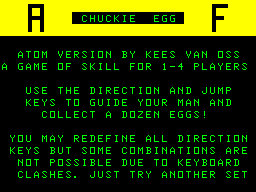
<strong><em>Atomic Chuckie Egg</em> loading screen</strong> 
<em>Posted: 22:25, 13 Nov 2012</em>
</td>
<td>
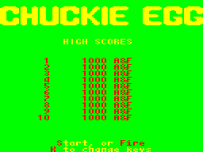
<strong><em>Atomic Chuckie Egg</em> title screen</strong> 
<em>Posted: 19:27, 22 Feb 2012</em>
</td>
</tr>
<tr class="even">
<td>
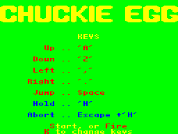
<strong><em>Atomic Chuckie Egg</em> keys screen</strong> 
<em>Posted: 14:27, 26 Feb 2012</em>
</td>
<td>
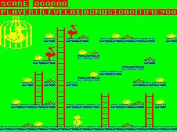
<strong><em>Atomic Chuckie Egg</em> level 1</strong> 
<em>Posted: 23:57, 20 Jul 2011</em>
</td>
<td>
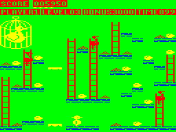
<strong><em>Atomic Chuckie Egg</em> level 3</strong> 
<em>Posted: 23:59, 20 Jul 2011</em>
</td>
</tr>
<tr class="odd">
<td>
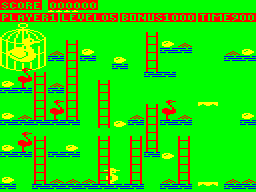
<strong><em>Atomic Chuckie Egg</em> level 5</strong> 
<em>Posted: 00:20, 21 Jul 2011</em>
</td>
<td>
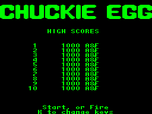
<strong><em>Atomic Chuckie Egg</em> title mono screen</strong> 
<em>Posted: 22:16, 13 Nov 2012</em>
</td>
<td>
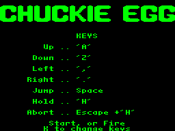
<strong><em>Atomic Chuckie Egg</em> mono keys screen</strong> 
<em>Posted: 22:16, 13 Nov 2012</em>
</td>
</tr>
<tr class="even">
<td>
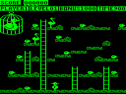
<strong><em>Atomic Chuckie Egg</em> level 1 mono</strong> 
<em>Posted: 22:13, 13 Nov 2012</em>
</td>
<td>
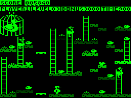
<strong><em>Atomic Chuckie Egg</em> level 3 mono</strong> 
<em>Posted: 22:14, 13 Nov 2012</em>
</td>
<td>
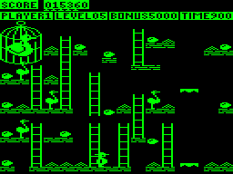
<strong><em>Atomic Chuckie Egg</em> level 5 mono</strong> 
<em>Posted: 22:14, 13 Nov 2012</em>
</td>
</tr>
</tbody>
</table>


