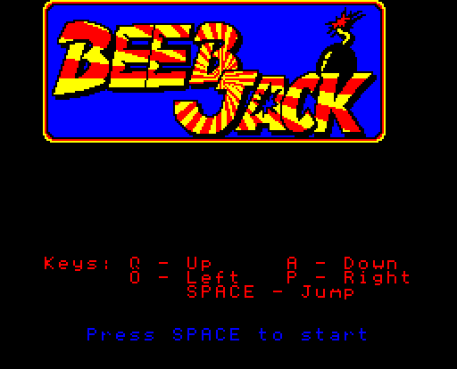
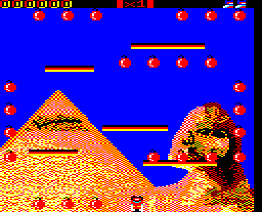
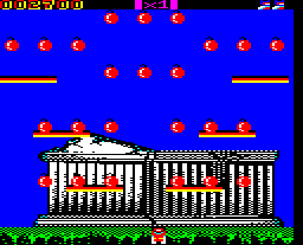
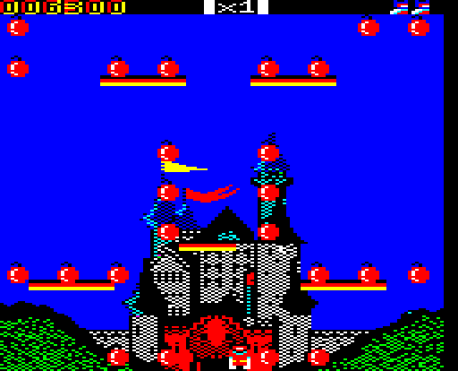
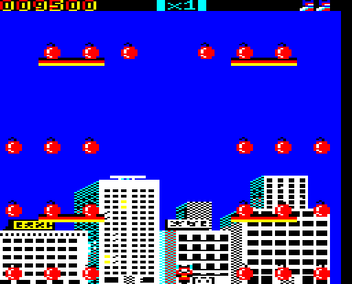
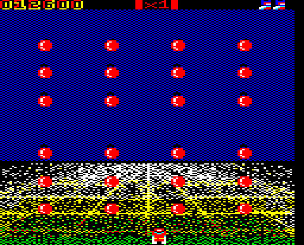

# Beeb Jack by Rob Coleman

### Licence

TBC

### Introduction

*Beeb Jack* is a new BBC Micro conversion based on the the Amstrad CPC port of Tehkan's 1984 popular arcade platform game *[Bomb Jack](wikipedia:Bomb_Jack "wikilink")*, where you must control Jack, a superhero who can leap and glide, to help him defuse bombs at famous tourist sites from around the world.

My mate and I looked at writing a Beeb version when we were kids. I loved playing it in the arcade and was so disappointed when the Beeb version wasn't released. I came across Nicolas Robert's GBA port of the Amstrad CPC version a few years ago and thought about using it as the basis for a Beeb port. However, I didn't do anything with it until I started playing with the Swift development environment and Neil Beresford's Shell towards the end of 2011.

Progress has been fairly sporadic up until now but I'm hoping to finish it eventually!

[Discuss *Beeb Jack*](http://www.retrosoftware.co.uk/forum/viewforum.php?f=96)

### Platforms

#### BBC Microcomputer

***Port by Rob Coleman***

##### Downloads

[*Beeb Jack* early WIP demo of game engine: .ssd disc image](./images/Beebjackj20130810.zip "wikilink")

A quick tech demo for the BBC Micro - lots of rough edges, but includes all the levels and platform collision detection.

##### Screenshots

<table>
<tbody>
<tr class="odd">
<td>

<strong><em>Beeb Jack</em> Title screen</strong> 
<em>Posted: 12:25, 17 Aug 2013</em>
</td>
<td>

<strong><em>Beeb Jack</em> Round 1</strong> 
<em>Posted: 12:22, 17 Aug 2013</em>
</td>
</tr>
<tr class="even">
<td>

<strong><em>Beeb Jack</em> Round 2</strong> 
<em>Posted: 12:23, 17 Aug 2013</em>
</td>
<td>

<strong><em>Beeb Jack</em> Round 3</strong> 
<em>Posted: 12:23, 17 Aug 2013</em>
</td>
</tr>
<tr class="odd">
<td>

<strong><em>Beeb Jack</em> Round 4</strong> 
<em>Posted: 12:24, 17 Aug 2013</em>
</td>
<td>

<strong><em>Beeb Jack</em> Round 5</strong> 
<em>Posted: 12:24, 17 Aug 2013</em>
</td>
</tr>
</tbody>
</table>


