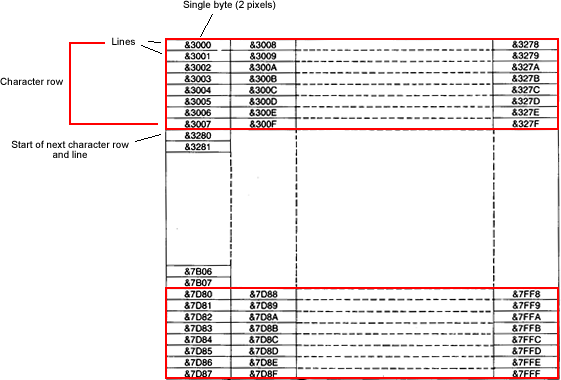

# Calculate Screen Address

Calculates the screen address for 20K screens \*(i.e. Mode 0,1,2,) given X and Y coordinates.

## Provisos and restrictions

-   Works for Mode 0,1 and 2
-   X ord is in byte positions not pixels !
-   Presumes Screen is never hardware scrolled. Which is fine for a large amount of games.
-   No check is made to see if the coordinates are out of bounds, you should implement any such check (if required) in your calling code. Max values : X=0 to 79, Y=0 to 255
-   Written in P65 Ophis assembler

## **Manual Page**

If your not interested in how the code works, just drop it into your project and use the following information to call it.

**Notes**

Labels are used throughout for memory locations so you can change these easily if required. For speed, recommend zero page locations. Just set the various labels in the source (always all at the top of the source file) to memory locations suitable for your project.

**Calling Name : ScreenStartAddress**

***Entry Parameters***

XOrd : X position, 1 byte. Common to the Mode 2 sprite masked sprite plotter routine.

YOrd : Y position, 1 byte. Common to the Mode 2 sprite masked sprite plotter routine.

***On Exit***

XYScreenAddress : 2 byte result, low in XYScreenAddress, high in XYScreenAddress +1. Common to the Mode 2 sprite masked sprite plotter routine. '''

***Workspace***

Temp : 1 byte .

***Other routines Called***

Does not call any other routine.

------------------------------------------------------------------------

## Mode 2 Screen Layout

### Lines and character rows

There are two types or rows on a BBC screen, lines and character rows. The diagram below will help to explain, it’s the Mode 2 screen layout.



&3000 is the top left of screen (X=0,Y=0). You can see that in the X direction each positiion goes up by 8 each time, so coordinates (1,0)=&3008, (2,0)=&3010 etc. etc. For Y values however for the first 8 (0 to 7) they increase by 1 each time, so (0,0)=&3000, (0,1)=&3001, (0,2)=&3002 and so on. However it then gets a little tricky after that. (0,8)=&3280, A massive jump ! You can see why this happens in the diagram. &3008 is actually back up at the start of column 2 (x=1). Why is it like this ? Well, it's all to do with the 6845 video chip, it was designed as a CRT character generator (characters being 8 lines high).

So we need a calculation that given any set of X,Y coordinates we can return the corresponding address on screen. Here is the equation that will do this;

**result=ScreenStartAddress+((((Y div 8)\*NumberOfBytesPerCharacterRow)+(Y and 7)) + X \* 8)**

In this case ScreenStartAddress is &3000 and NumberOfBytesPerCharacterRow is 640, so putting those values directly in

**result=&3000+((((Y div 8)\*640)+(Y and 7)) + X \* 8)**

So if you want this calculation to work for different modes you just need to know the screen start address for the mode and the number of bytes per character row.

## Code

Note : Currently code in the Wiki does not currently render well on Internet Explorer, please use an alternative browser for viewing this page if required.

So below is the implementation of the above calculation in assembler. You can set the variables to any memory locations you wish, but you'll probably want to use zero page for speed and for indexed plotting in your sprite routine later on.



` ; constants`
`     `
`   .alias ScreenStartHighByte $30      ; high value of start of screen`
` `
` ;memory locations used`
`  `
`   ; entry params`
`    .alias XOrd $74`
`    .alias YOrd $75`
`      `
`   ; exit results  `
`    .alias XYScreenAddress $78    ; and $79    contain the returned calculated screen address`
`     `
`   ; workspace`
`    .alias Temp $9F                              `
` `
` `
`  `
` ScreenStartAddress:`
`   ; calculates the screen start address for a mode 2 screen given X,Y ords`
`   ; no check is made to see if X and Y are valid on screen ords, if they are not then`
`   ; the address returned will not be valid and writing to it could well corrupt the`
`   ; main program`
`   `
`   ; entery params`
`   ; XOrd is X`
`   ; YOrd is Y, `
`   `
`   ; exit results  `
`   ; XYScreenAddress,XYScreenAddress+1   contain the calculated screen address`
` `
`   ; The calculation for this routine is :`
`   ; result=ScreenStartAddress+((((Y div 8)*640)+(Y and 7)) + X * 8)   `
`         `
`     `
`  `
`   ; first we are going to perform the (Y div 8)*640 part of the calculation   `
`   ; this will give us the character row start (not the pixel row yet)`
`                                                                  `
`   ; The Y ord is actually in pixels (0 to 255 down the screen) There are 8 pixel rows `
`   ; per character row (see screen layout diagram)`
`   ; so divide Y by 8 to get character rows  `
` `
`   `
`   lda YOrd                          ; load A with the value of the Y ordinate `
`   and #248                          ; make lower three bits zero (see next paragraph)`
`   lsr                               ; effect divide by 2`
`   lsr                               ; effect divide by 4`
` `
`   `
`   ; but hang on... we need to divide by 8 but we've only divided by 4 !`
`   ; well the 640 lookup table is a table of 2 byte values, so to index into it we`
`   ; need to set the index to 2 times it's value to index to the correct value`
`   ; by only dividing by 4 effectivly means our value is already 2 times bigger`
`   ; so we save on an ASL instructionm =1 byte and 2 cycles. `
`   ; The and #248 at the begining ensured that the last bit not LSR's out of the `
`   ; accumulator is set to zero, in fact we could have just used AND #251 if we'd`
`   ; wanted to jsut to zero the bit that would be left`
`                                                                    `
`   ; we use a 640 multiplication look up table to speed things up. Referring to the`
`   ; screen layout, the start of each character row jumps by 640 in memory compared`
`   ; to the previous and there are 32 character rows down the screen (256 pixel rows)`
`   ; so we need 32 entries in our multiplication table and as each entry is two bytes`
`   ; each (as results can go beyond what a single byte can hold), the total table size`
`   ; is 64 bytes. To look up 0 * 640 would mean the low byte of the result is in the`
`   ; very first byte and the high byte is in the second byte of the table. `
`   ; 1 *640, would have the result in byte 2 and 3 etc. etc.        `
` `
`                                     `
`   tay                               ; we will use register Y to index into the table`
`                                     ; so move the index value into Y`
`   lda LookUp640,Y                   ; look up low byte value first`
`   sta XYScreenAddress               ; and store in low byte of result`
`   iny                               ; move the index to point to the high byte in the`
`                                     ; table`
`   lda LookUp640,Y                   ; get the high byte result of the mulitplication`
`   sta XYScreenAddress+1             ; store in the high byte of the result`
` `
`   `
`   ; we have now got the value of (Y div 8)*640 in our result bytes`
`   `
`   ; now add (Y AND 7) to the result bytes, this will give us the pixel (rather than`
`   ; character row) value. All we are doing is wanting to add in the lowe 3 bits of Y`
`   ; to the result of the character row. See the screen layout diagram if unsure.`
` `
`   `
`   lda YOrd                          ; get the Y`
`   and #7                            ; strip out all but lower 3 bits`
` `
`                                     `
`   ; note that normally you would ensure the carry flag is clear here by having a CLC`
`   ; instruction. However right at the begining of this routine we masked out the lower`
`   ; 3 bits of A and then used LSR, this would ensure the carry flag is currently clear`
`   ; as no other instructions have been used that effect it since then`
`   ; Note that it's critical the AND #248 occurred before the LSR, you could have had`
`   ; code that came to the same result if you'd LSR, LSR then AND #1 to set bit 0 to 0`
`   ; but you would have then not known the state of the carry flag`
` `
`   `
`   adc XYScreenAddress               ; add lower 3 bits of Y to result. Even though the`
`                                     ; current result is a 16 bit value we only need to  `
`                                     ; add to low byte as will never trigger a carry as`
`                                     ; only adds a max value of 7 to a value that will `
`                                     ; always be at least 8 less than 255`
`   sta XYScreenAddress               ; store the new result`
` `
`   `
`   ; now add this result to the ScreenStartAddress`
`   ; note again we know that the carry is clear, so no CLC`
`   ; also note the screen start address is $3000 (i.e. lower value is 00) we need`
`   ; only add the high byte value to the high byte of our current result (no point`
`   ; adding 0 to anything as the result would not change !)`
` `
`   `
`   lda #ScreenStartHighByte             ; high byte value of screen start address`
`   adc XYScreenAddress+1                ; add to current high byte value`
`   sta XYScreenAddress+1                ; store result back in high byte value`
` `
`   `
`   ; now add the result of X*8 to the current result `
`   ; For every X pixel we need to add 8 bytes, for this we won't use`
`   ; a look of table as it's quite easy and quickish to multiply by 8. `
`   ; It is true that it would be quicker with a look up table but it would take`
`   ; about 320 bytes for only a small gain`
`   `
`   ; first X*8    `
`   `
`   ; carry will still be clear, no need to clear`
` `
`   `
`   lda #0`
`   sta Temp     ; holds hi value of the multiplication`
`   lda XOrd   `
`   asl          ; effective * 2`
`                ; no need to do a rol for high byte as max result at this point is `
`                ; 79 *2 =158`
`   asl          ; effective * 4`
`                ; the max result now will be 79*4=316 ( $13C), so the carry contains`
`                ; the high byte if any to add to the high byte of the result, put it in`
`                ; a temp var`
`   rol Temp     ; will effectivly clear carry as well, see below     `
`   asl          ; effective * 8`
`   rol Temp     ; could be another carry so roll into temp`
`                ; will effectivly clear carry as well (as temp was 0 at start and max `
`                ; two shifts occurred, see below for use of cleared carry   `
` `
`   `
`   ; ok got result of X*8, now add to current result`
`   ; no need for CLC as carry flag will be 0 as we know that the max result possible is `
`   ; 79 *8 =632 which is $278, so only ever will have a max value of 2 in Temp so all that would `
`   ; have been ROL'd out when doing the "rol Temp" into carry will have been 0's`
` `
`  `
`   adc XYScreenAddress               ; add A (low value of multiply to low value of`
`                                     ; result`
`   sta XYScreenAddress               ; store in low value of result`
`   lda Temp                          ; high byte result of multiplication`
`   adc XYScreenAddress+1             ; add to high byte of result with any carry`
`   sta XYScreenAddress+1             ; store in high byte of result`
` rts`
` ; end ScreenStartAddress`
` `
` `
` LookUp640:  ; a 640x multiplication table`
` .incbin "LookUpTable640"`

LookUpTable640 (download below if required)

`00 00 80 02 00 05 80 07 00 0A 80 0C 00 0F 80 11`
`00 14 80 16 00 19 80 1B 00 1E 80 20 00 23 80 25`
`00 28 80 2A 00 2D 80 2F 00 32 80 34 00 37 80 39`
`00 3C 80 3E 00 41 80 43 00 46 80 48 00 4B 80 4D`



## Testing

If you want to test the above code add the following code above the Screen Start address routine. It plots 2 yellow pixels (2 in each byte) going down the screen in the Y direction and then going across in the X direction. Note this routine is not optimised for the job it does, you wouldn't use this to clear a screen and you wouldn't normally count up in memory locations, you'd count down, but it's presented this way to help the reader visualise the X,Y coordinates being plotted at.



`Main:`
` lda #0                                  ; set the position to start the screen fill at`
`                                         ; the top left corner. X Set to 0`
` sta XOrd ; x                            ; `
` sta YOrd ; y                            ; and Y set to 0`
` tax                                     ; X is just set to 0 so we can use a zero page`
`                                         ; indexed address mode later on. X is not used`
`                                         ; by the screen calc routine. So quite safe to`
`                                         ; set here and it will remain at 0`
`                         `
` Loop:                                   ; our main loop for plotting the byte to `
`                                         ; screen`
`                                         `
` jsr ScreenStartAddress                  ; get the screen address for the XY ords and`
`                                         ; return in zero page locations `
`                                         ; XYScreenAddress and XYScreenAddress+1`
`                                         `
` lda #$0F                                ; this is the colour yellow for two pixels in`
`                                         ; 1 byte `
` sta (XYScreenAddress,X)                 ; store at the screen location returned`
` inc YOrd                                ; move down one line`
` bne Loop                                ; At bottom ?, go back to Loop if false`
` `
` inc XOrd                                ; Y at bottom (will set itself to zero for`
`                                         ; next run down, here we increment the X ord`
`                                         ; by one`
`                                         `
` lda XOrd                                ; load up x and see if we've reached end`
` cmp #80                                 ; note quicker to inc and lda the zero page`
`                                         ; location than to use adc etc.`
`                                         `
` BNE Loop                                ; if not at last column go back and plot some`
`                                         ; more`
` rts`



## Downloads

[ LookUpTable640](./images/Swift SpritePlotter LookUpTable640.zip "wikilink") ( 640 times look up table)
