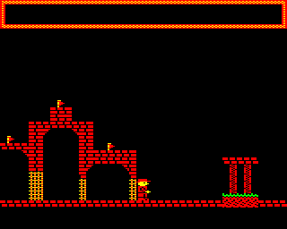
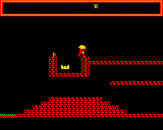
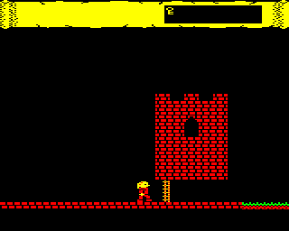
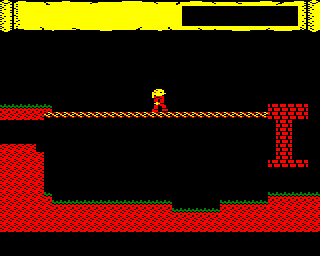
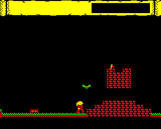
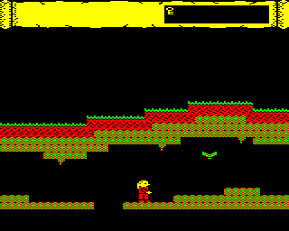
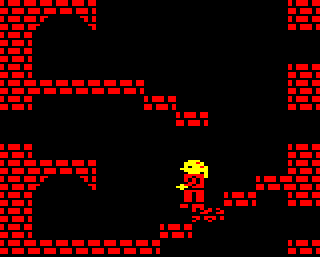
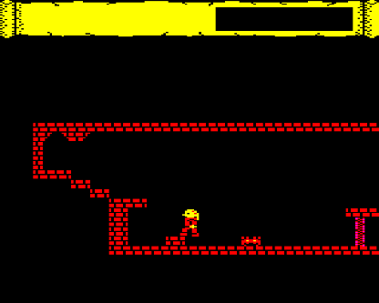
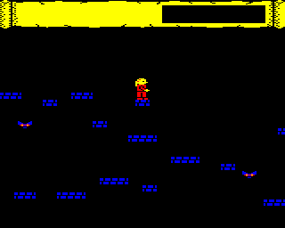
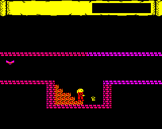

## Castle Raider Development Diary

### Part 2

***by David Boddie***

See the main [Castle Raider](Castle_Raider "wikilink") page for information about the game itself.

I've split the diary into separate parts. See [Part 1](Castle_Raider/DevelopmentDiary "wikilink") for earlier entries. See [Part 3](Castle_Raider/DevelopmentDiary/Part3 "wikilink") and [Part 4](Castle_Raider/DevelopmentDiary/Part4 "wikilink") for later entries.

An overview of some of the development issues can be found on the [Thoughts](Castle_Raider/DevelopmentDiary/Thoughts "wikilink") page.

#### Up and Running Again (2013-04-08)

In an attempt to try to get back into writing the game, even with various other things on the go, I played with the level designer a bit this evening. The level needs to be simplified a lot to get nice fluid scrolling, so bits of fancy decoration got thrown out. I also disliked what I'd done with putting keys and doors in places where the player would have to walk back and forth a lot, so I started taking much of that out. When I find a bit where the player has to stumble over minor obstacles, I smooth the landscape a bit, making it possible to just walk onto them or necessary to jump over them. I also modified the player sprites a bit to add a touch more animation - it's not entirely satisfying, but it's a work in progress.

#### Looking at Drawing Errors (2013-04-14)

Something that's been at the back of my mind for a while has been a drawing error I encountered a while ago. It doesn't occur in the default level I'm working on, so I can pretend it doesn't happen, but sooner or later I know I'll have to face it. I decided that sooner was probably better.

The images below show the problem: the initial view of the level looks fine but, when the character moves right by one step, the second screen bank is shown and the level is displayed incorrectly. Since the whole screen is drawn in full when the gameplay starts, there must be something wrong with the routine to do this. There may also be bugs in the routines to incrementally change the second screen bank, but that's not what we need to solve here.

|                                                                                                     |                                                                                                 |
|-----------------------------------------------------------------------------------------------------|-------------------------------------------------------------------------------------------------|
|          |  |
| **The start of a level correctly drawn on bank 1 (left), but incorrectly drawn on bank 2 (right).** |

So, this is the next challenge. I aim to dig into it in the next day or so.

##### Update

There are two routines to plot the initial view onto the level. The first is fairly simple because it can just plot spans of tiles into corresponding cells on the screen. The second is a bit more complicated because each tile needs to be shifted right by two pixels. This means that each cell on the screen contains one of two combinations of tiles:

-   The end of the previous span (the right edge of a tile on the left) and the start of a new span (the left edge of a tile on the right). A "merged" tile.
-   The continuation of a span (a tile "rotated" so that its right edge is on the left and its left edge is on the right).

Initially, I had thought that cells in the first column on the screen should only contain continuations of spans, but hadn't considered the situation where the initial span on the screen is only one tile wide. This meant that it was being skipped without being plotted in any way at all. The solution is to always plot a merged tile, even if there is no previous span to consider.

So that's a nagging problem solved, at least for the time being. While fixing this, I also changed the brick tile to give the platforms flat edges. This means that I can discard the half-brick tiles at a later date, freeing up two tiles for other things.

Next time, I want to look at jumping again.

#### Jumping and Falling Again (2013-04-15)

I'm not terribly happy with the jumping motion in the game at the moment. I managed to simplify it a bit this evening but it probably needs a bit more work. At least I managed to strip out some unnecessary code. The player's character should still be able to jump as high and as far as before, but we no longer need to perform loops to check that they are not going to jump through platforms.

|                                                                                                                |
|----------------------------------------------------------------------------------------------------------------|
|  |
| **Another character out for a test run.**                                                                      |

I'm starting to think about giving the player a choice of characters, so I'm experimenting with an alternative set of character sprites. In the cassette version, at least, this choice will be made during loading, as it was in Superior Software's Citadel. Other versions, if they eventually appear may allow the player to choose before each new game.

#### Changing Identities (2013-04-16)

I briefly thought about writing code for the loader to allow the user to choose the character they want to play with. The idea of updating the loader, writing a selection routine, and moving data around in memory was a bit much so I decided to include both sets of sprites in the game. To save space, I only need to include the left-facing sprites in the sprite data file, though I also include a set of default right-facing sprites for convenience. The right-facing sprites are generated from the left-facing ones, meaning that you can't designing the sprites to make them do anything fancy for different directions, but we save some space, I hope. As long as the direction-flipping routine is less than 96 bytes long...

##### Update

The routine was too long. It's just easier to include the sprites and make room for them in memory.

#### Level Limitations (2013-04-22)

Thinking about a way to introduce monsters to the level design, I reviewed some of the data structures I am using for the level data. I note that, for each row, I use a single byte index into the array of spans for that row. This means that there is a hard limit of 256 spans for any given row and, once one row has reached that, the level effectively ends. To check the situation with my current design, I printed the number of spans for each row. Right now, I am using at most 144 spans - that is for the penultimate row on the screen, perhaps unsurprisingly. The level is about 27 screens wide at this point, with some fancy bits in places. We'll see how things progress from here. I don't really want to extend the span indices to more than one byte because that would complicate things. Perhaps the limitation will help to focus the design and make development less open-ended.

#### Redecorating (2013-04-23)

While in the process of figuring out how to place monsters on the level, I tarted up the panel at the top of the screen.

|                                                                              |
|------------------------------------------------------------------------------|
|  |
| **An updated panel design.**                                                 |

#### Backtracking (2013-04-29)

Changed my mind about how to add monsters again. I had thought about embedding them as tiles in the main level design, but pulling out the information about them would involve either messing with the plotting routines to see what is there, or traversing the level data for each row to see what has just appeared on screen. Changing back to the original idea of having a single list of monster-gap spans means that it should be easier to pull out the information, and we can use two indices into this list to handle monsters appearing on the left and right edges of the screen. At least there should now be the basis of a workable system to try to implement.

#### Background Tasks (2013-05-01)

Thought about the scheme for handling monsters a bit and managed to implement something. The way the list of spans are traversed is a bit cumbersome but it makes me think that one of the arrays in the plotting routine (the initial tile array) might actually be unnecessary if I adopt the same scheme for plotting. At the moment, the priority is to connect the monster data to routines to put monsters on the screen. I can re-examine the level plotting routines later, if I feel the need to.

#### Making an Entrance (2013-05-02)

Although the scrolling routines have been modified to recognise when a monster should become visible, only a basic effort was made to shove one onto the screen. This evening, I did some work on this to make their appearance a bit more tidy, refactoring the monster plotting routine to allow individual monsters to be plotted separately (though I don't use that yet) and splitting the monster span list traversal code into separate routines. These separate traversal routines make it possible to create new monsters separately from scrolling the level, and therefore can be run after the currently displayed monsters have been unplotted. This means less of an unsightly mess when they appear, though they still just pop up when summoned. I still need to make sure they're scrolled properly, get rid of them when they leave the screen, and enable support for more than one of them.

It would also be good if the creation routine respected the monster type, too. Some adjustment will be needed to bring the data format used for this in the level description in line with the format used by the plotting routines.

#### Keeping Track of Monsters (2013-05-05)

The monster I had added to the level data as a test subject had a nasty habit of appearing in different places on screen when the player ran past a certain point in the level. It turned out that I wasn't properly updating all the parameters related to the left edge of the screen as it traverses the monster data. Ensuring that the span index is decremented as the offset into the span reaches zero (corresponding to being incremented as we step past the start of a span when we scroll right) results in the proper behaviour. The monster is no longer recreated in a strange position on screen.

The problem now is to avoid strangeness when the player repeatedly passes the same point on the level. Some kind of corruption occurs in the on-screen monster array. I'll need to ensure that the array is being managed correctly, and also ensure that monsters are removed from the array when they leave the screen.

#### Landscaping and the Monsters' Revenge (2013-05-12)

The monsters were appearing in unexpected places, even when the monster data wasn't supposed to contain any monsters! As a result, I switched them off for a while and tried to look at creating a basic map. At the moment, I'm only using a few items, such as keys to open doors and items that do pretty much the same for door-like obstacles. Following that, I thought a bit more about the misbehaving monsters and now I understand their motivation a little better. The map needs monsters to make it more interesting - running up and down hills is only fun for a while - so that's where the focus will be next.

|                                                                                    |
|------------------------------------------------------------------------------------|
|  |
| **Part of the updated map.**                                                       |

#### Monster Taming Part 1 (2013-05-16)

I realised that the vertical positions of the monsters weren't taking the extra 8 rows above the 16 map rows into account, so I modified the way monsters are stored in the monster data to allow for values up to 23. It occurs to me that there's currently no way to define monsters on the map that could take advantage of this.

After a detour in which the new encoding played pretty badly with the existing way active monsters are represented in the game, I realised that I didn't need to have exactly the same representation for monsters in the span data and active monsters in the monster table. It would be nice if they could be quite close, as it would reduce the amount of data manipulation needed when creating new active monsters. Currently, we move the vertical position into a separate byte and expand the monster number to include an existence bit, an animation bit and a bit that represents half a horizontal cell on screen.

|                                                                                             |
|---------------------------------------------------------------------------------------------|
|  |
| **Two monsters show up for work.**                                                          |

At the moment, the monsters appear fairly reliably as the player's character runs to the right, but sometimes fail to show up when returning to the left. There's probably a case that I've missed in the span traversal code. Hopefully it won't be too much work to track down.

#### Monster Taming Part 2 (2013-05-18)

When monsters appear on the edge of the screen, they are registered in a table that can contain four entries. Each time the player encounters a monster on the right hand side of the screen, a monster is created and added to the table, and an offset into the table is incremented. If the monster leaves the right hand side of the screen, the entry in the table is cleared and the offset is decremented. Similarly, we use another offset to track monsters entering and leaving the left hand side of the screen. This means that we can keep track of monsters entering and leaving the screen as the player moves around on the map.

|                                                                       |
|-----------------------------------------------------------------------|
|  |
| **Uh oh, what's that?**                                               |

One problem we have to deal with is ensuring that monsters are created before the player encounters them so that they can be plotted partially as they enter the screen, and delete them after they have completely left the screen. This is all fairly easy to imagine in principle, but slightly more work to put into practice. The right hand side of the screen is easy to deal with - when we set up the scrolling routines, we can pretend that the screen is slightly wider than 40 columns and calculate the appropriate span index and offsets to this edge. The left hand side is slightly more difficult to handle because we can't position the initial location of the edge in a span that precedes the first monster span in the level - it doesn't exist! Following some attempts to find a complex solution to this problem, the simple solution presented itself: just insert a two column initial span into the monster span data! This caused some quirks - the indices into the on-screen monster table need to be set to appropriate values to work around the initial empty span - but seems to work as expected.

I've updated the monster plotting routines to take the screen edges into account. The code is probably a lot more complicated than it needs to be, but it can probably be simplified and streamlined later if required.

#### Moving Monsters (2013-05-19)

Now that monsters enter and leave the screen cleanly, it is time to make them move again. Early test code for monsters allowed them to move up and down, so that seemed like a good place to start. I did this in stages: first, making them bounce between the top and bottom of the playing area, then making them take the scenery into account. Finally, I added some basic checks for the player when they move.

#### A New Platform and a New Demo (2013-05-20)

Since the scrolling code relied on the Electron's ULA, it wouldn't run on the BBC Micro. I wondered how much work it would be to do the same bank switching trick on the Beeb and it turned out to be easy to swap out the Electron code for some to access the 6845 registers via the SHEILA memory-mapped addresses. The game runs faster and more smoothly on the Beeb, as you might expect, but not *that* much faster. A diligent programmer would use the facilities provided by the 6845 in a more effective way for a Beeb version, of course.

To demonstrate the current state of the game, I've made a new demo for people to try out: [CastleRaider-demo3.zip](./images/CastleRaider-demo3.zip "wikilink"). It contains UEF files for both the Electron and BBC Micro versions of the game. I may merge these versions at some point in the future and do some run-time checks to see which machine the user is running the game on. We'll see.

#### Misbehaving Monsters (2013-05-23)

I laid the groundwork for horizontally moving monsters last night but was too tired to fill in the final details - basically, just a case of making the monster-tile checking routine able to check for tiles horizontally adjacent to monsters as well as above or below them. Now, the monsters can move left and right as well, though I've currently only enabled this for spiders. As I write more and more code to deal with things like this, I keep having to increase the memory allocated to code. At some point, I'm going to have to perform a spring clean of the code, removing all sorts of unnecessary stuff.

So, some monsters can move horizontally, and they run into scenery and change direction. In the future, it would be good to let them fall off things as well. The trouble is that they don't always change direction. Some work is needed to investigate just why they flaunt the rules like this!

#### Opening Doors (2013-09-22)

Inspired and motivated to work on this again after seeing other Retro releases, I started thinking about ways to make the gameplay a bit less linear. A game in which you run from left to right, potentially backtracking a number of times to get items, is probably about as tedious than any of the other left-to-right run and jump games that already exist. I'd like to give the player the opportunity to explore a bit, and that isn't possible if the whole world is designed to fit on 16 screen rows.

Ignoring the monsters for now, I started to investigate the possibility of adding portals to the level, making it possible to jump between areas instead of having to run to them. Once the data structures were sorted out - portal tiles are stored as regular tiles with values from 48 to 63, and are invisible - some initial experiments proved fairly successful in scrolling between portals. However, we want to give the impression that portals are in distinct places on a larger map, with several logical levels, so the idea is to simply redraw the screen at the new location. This is done by performing all the operations on data structures that are done normally while scrolling, but not actually redrawing everything. Ideally, we would perform calculations on the data that describes the scrolling for each row instead of brute forcing our way through the level data, but the routines for scrolling are already written and memory is getting tight.

Predictably, the monsters are not very happy when scrolling occurs like this. After testing the basic transition routine a bit more, I'll start investigating why they seem to go missing.

#### Watch Your Step (2013-09-28)

As if I don't have my hands full with keeping track of monsters and putting together levels, I realised that I could implement breakable tiles fairly easily. Actually, it turned out to be more complicated than expected, and is the first feature of the game which causes the actual level data to be modified during the game, requiring it to be reset before each new game. Code already existed to check whether the tile the character is standing on is breakable, so it should have been easy to redraw tiles that change. The hardest part was doing the actual drawing - fortunately, we can rely on some assumptions about the extent of the tile spans that the character is standing on because we encode breakable tiles in groups of 1 or 2. The result is that, when the character jumps or falls onto a breakable tile, it breaks a little. If it is already broken then it disappears, with predictable consequences.

|                                                                                          |
|------------------------------------------------------------------------------------------|
|  |
| **Be careful what you step on.**                                                         |

I also wanted to implement an additional feature with the portals, so that different areas feature slightly different colour palettes, like I did for each screen in Jungle Journey. Since I've already implemented machine-specific routines for bank switching, I've now implemented a palette switching routine for the Electron version; the BBC routine will have to wait for the time being.

As usual, memory constraints are imposing themselves on the game. I've had to disable some features for now, but it looks like some consolidation and simplification of code is required anyway.

#### Housekeeping (2013-09-29)

The latest features are good to have, as long as there's a convenient way to add them to the game's map. While working on them it was enough to modify the text file containing the level data, but navigating the rows of tiles in a text editor is something I abandoned in favour of a custom editor a long time ago. The fundamental changes to the way the map is navigated by the player meant that an overhaul of parts of the editor was needed, adding support for portals and mapping their destinations to distinct logical levels. Support for breakable tiles and palette changes on entering a level were also nice features to have.

|                                                                     |
|---------------------------------------------------------------------|
|  |
| **Exploring a cellar.**                                             |

The game now involves exploration of different levels which are accessed from the main game map. Each of these might also lead to other levels, or back to the main map, or to parts of the same level. This should result in a less linear structure to the gameplay.

There are a couple of obvious bugs that need to be fixed, plus the memory saving work mentioned in the previous entry, but some effort also needs to be put into map making now. I don't yet have the big picture of how it will all fit together, so hopefully things will become clear over the next few days.

#### Expanding Horizons (2013-10-06)

I spent some time creating new levels, simplifying old ones, and trying to incorporate some gameplay that suits an old-style platform game. This usually involves designing a new level, making it really fancy, realising it's not fun to play, then finally stripping out the fancy bits. In doing this, it turned out that the monsters were exhibiting more strange behaviour. Sometimes, one would collide with a wall and change into a different type! As usual, this was just a case of being careless with registers (memory locations) with routines overwriting temporary values stored in zero page. It's typically either that or not clearing the carry flag.

The monsters also had an unfortunate habit of opening doors on their own. This was caused by sharing the tile checking routine between the player's character and the monsters. As a quick fix (which will no doubt end up as a permanent fix) I added a flag that is set when the routine is called to check monster movement; this flag is used to return early from the routine, before any tiles are modified.

After changing some sprites to make the basement level look nice, I looked at a dungeon level I'd already created and found that the change wasn't an improvement there. Ideally, I thought, there would be more than one wall sprite to choose from. It turned out that I'd allocated space for a door sprite that I hadn't used at all, so out it went, to be replaced by another wall sprite.

|                                                                                          |
|------------------------------------------------------------------------------------------|
|  |
| **The dungeon under the castle.**                                                        |

Looking at monsters again, it seemed like a good idea to get them to move towards the player's character when they appear on screen. This turned out to be fairly easy to implement, as was a change to the editor to allow the axis of motion to be set on a per-monster basis; the latter was already supported by the underlying level data structure. The monsters still have one problematic feature to resolve, involving their habit of moving through scenery when just off the left hand side of the screen. This will require a more careful look at the tile checking routine, but more memory savings will be required before that can happen.

#### Taking Turns (2013-10-27)

I haven't done much about the monster movement problem; just trying to make time to concentrate on writing the solution. In the meantime, I've removed the monster movement loop and made it so that each monster gets updated in turn every couple of frames, just like in Jungle Journey. This should make it less taxing to handle alongside all the other work the game has to do.

|                                                                        |
|------------------------------------------------------------------------|
|  |
| **Interior decoration.**                                               |

I've also played around a bit with colour schemes and the use of tiles in certain levels. Unfortunately, there aren't many colour combinations that work very well with the fixed black, red and yellow palette that the game uses, but magenta can be used with red to create a darker purple that looks fairly good, if you like that kind of colour. Further experimentation will have to occur, though I'm not too hopeful that I'll find any really good combinations.
