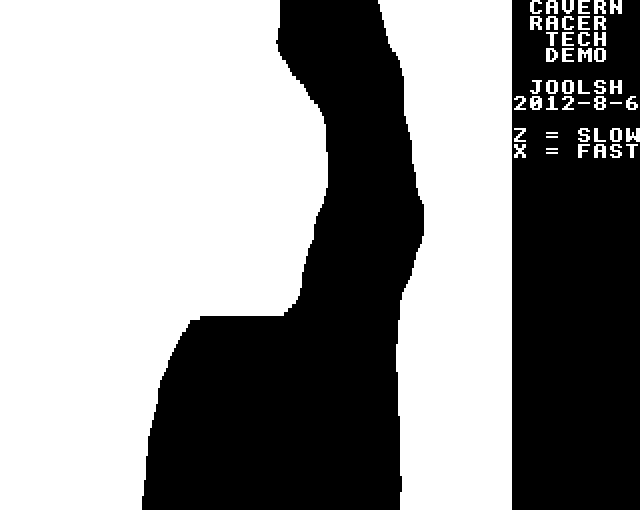

# Cavern Racer by Jools Henn

### Licence

TBC

### Introduction

Similar to 1983's Bally Midway classic *[Spy Hunter](http://www.arcade-museum.com/game_detail.php?game_id=9742)*, *Cavern Racer* is a modern MODE 4 software scrolling vertical racing game for the BBC Micro.

*Cavern Racer* was originally conceived during a discussion at [The Videolympics](http://www.videolympics.co.uk/) event hosted at the Lass O'Gowrie pub in Manchester on the 4-5th August 2012, after some of the attendees reminisced about a very simple BASIC game from the Usborne book *Computer Spacegames*, where the object is to escape the forces of the evil Dissectitrons by flying your single-seater Speed Dart along the jagged, bottomless ravine known as *Death Valley*.

[Discuss *Cavern Racer*](http://www.retrosoftware.co.uk/forum/viewforum.php?f=95)

### Platforms

#### BBC Microcomputer

***Original by Jools Henn***

##### Downloads

[Cavern Racer v0.1 Tech Demo disc version (.ssd)](./images/CavernRacer v0.1 tech demo.zip "wikilink")

A quick tech demo for the BBC Micro. Full Mode 4 software scrolling - running at a pretty much rock-solid 50 frames per second. It's interactive, too - you can change the speed with the Z and X keys. You start to get some graphical glitches if you really increase it to breakneck speeds, that's just because the Beeb is having trouble "racing the beam" down the screen when drawing it :)

[Usborne Computer Space Games - Death Valley disc version (.ssd)](./images/UsborneComputerSpaceGames-DeathValley.zip "wikilink")

Before you start, the computer will ask you for the width of the valley - start at 15 and work your way down. 8 is considered quite difficult according to the book. Steer with Q to go left and P to go right.

##### Screenshots


***Cavern Racer v0.1 Tech Demo***
*Posted: 09:38, 07 Aug 2012*

### Development Diary

#### 6 Aug 2012

Got the basic demo up and running. Wrote a level converter in Perl, to convert images to the format the game uses, so I can design levels in a paint package.

#### 10 Aug 2012

Added a map to the right hand side of the screen, that shows the whole level, and your position on it. It's really small, so not sure how useful this will be in practice, but it's a neat addition.

#### 12 Aug 2012

Added inertia to the speedup/slowdown controls, to make it feel more like the final game will.

#### 20 Jan 2013

Added a player sprite, 8x8 pixels. Needed to store eight versions of this, each 16 pixels wide, for each pixel offset. I decided to do the calculation of these offsetted versions in 6502 rather than precalculate them, that way we have the option of choosing between different player sprites on the fly later.

I had to work out how to do the plotting / unplotting of the user sprite without the level plotting interfering with it - the usual XOR method could potentially leave a bit of a mess if the user is near the sides. I decided on the pretty simple method of just unplotting the sprite by AND-ing an inverted version of it with screen memory, then plotting it again by OR-ing a positive version of it with screen memory. I also tried the game on an Electron, after fixing the compatibility bug that affected this and Mixed Grill March. It ran reasonably well on the Electron, there was more slow-down, but it's not show-stopping.

#### 22 Jan 2013

Made the main player sprite controllable, so you can now use the normal BBC keys to control it. Added some dampening to the horizontal controls too, so now we have inertia in both dimensions.

#### 26 Jan 2013

The original level I drew in the demo wasn't actually that much fun to play - too many jutting out bits with no warning. I re-drew the level, to make it a lot more fun to zip through at high speeds without crashing into anything.

I also added collision detection, so the game knows when you've bashed into a wall. At the moment, the game just restarts if this happens. This makes the game into something that's actually playable, and it's quite good fun racing along the level at high speeds :)

I had two ideas for improving the fact that the game slows down if it can't render the whole screen in time (especially important for running the game on the Electron). Firstly, we could set an interrupt every frame, so we know if the frame isn't drawn in time, in which case we don't wait for the next VBL when the rendering is finished before rendering the new frame - this should increase the speed from 25FPS to 37.5FPS when slowdown happens. Secondly, we could use this interrupt to decouple the game logic from the rendering - this would mean that the game doesn't actually slow down if it can't draw it all in time, but just looks a little less smooth. But first, I'd have to learn how to use interrupts :)

#### 14 Dec 2013

I've not done much on this game in a while, but I thought I'd finally get round to looking into the interrupts thing I mentioned above. I ripped off the code from the "MovingSpritesMode2" demo on the RS Sample Code page, and made it set blank a "waitForVsync" flag. This seemed to work nicely on the BBC, and it does seem to have made the game slightly smoother. Unfortunately this code doesn't seem to work on the Electron, and it's the Electron that needs this the most (the BBC version was running fast enough already).

#### 15 Dec 2013

Managed to do what I wanted to do with the interrupt by creating a VBL event.

#### 21 Jan 2014

To make the game a bit faster on the Electron, I decided to try out the hacky but fast method mentioned in the Electron article Kees posted on a thread the other week. This worked a treat - the old keyboard reading routine took up 21 scanlines of time (determined by the good old "change background palette before and after" trick). This new method took about 4.25 scanlines - about a fifth of the time! That's definitely a worthwhile saving, on the Electron we need all the speed we can get. But this method only works on the Electron.

I wanted to keep one source file, that contains both BBC and Electron versions, with some lines having lines of code that say "This is for the BBC version" and "This is for the Electron version" and have it all work itself out automatically. I thought for a while on how to do this - and eventually, I decided on a convention. So, any line for the BBC only I add ";VER\_BBC" on the end, and any line for the Electron I comment out and add ";VER\_ELK" on the end. Then, I wrote a very simple Perl script that comments out any line containing "VER\_BBC", and de-comments any line saying "VER\_ELK", saving it to a different file, which I import into my Swift project.

So, to compile a version that works on the Electron, I simply run the Perl script to convert the BBC script, and built the project in Swift as normal. At the moment, I have to manually load the game from the disc image on the Electron emulator, otherwise shift-break would try and load the BBC version, but that's something I can come back to later.

To make the Electron version even faster, I took the "write the same line twice" method the BBC version uses, but expanded it further to "write the same line four times". It'll mean the Electron version will look blockier, and has a strange ripple effect when moving slowly (which is strangely nice), but it'll run faster.

#### 22 Jan 2014

The Electron version is still running a bit too slow, though. Not surprising really, when you consider the BBC version is using between 75% and 100% of the CPU time to render the screen. After a long time messing about this evening, I finally worked out a usable solution to this.

It involves noticing when the VBL happens mid-plot, and if that happens then we save the current plotting details, plot the spaceship and map, and do all the other game logic that has to be done every frame. Then, we come back and continue the plotting of the main screen from where we left off. Also, if we're continuing from where we left off from last time, then when that frame finishes, we need to immediately start plotting the current frame that we postponed.

I spent quite a while messing about with this, but the end result is that the game logic on the Electron version now runs at the same speed as the BBC version, so effectively the game plays pretty much the same, it's just not quite so silky smooth (the game screen updates about every 20Hz-30Hz, whereas the BBC version is pretty rock solid at 50Hz). Not bad for an Electron!

That's enough Electron tweaks for now... next, it's time to start fleshing out the game a bit...

#### 27 Oct 2014

Well, I haven't been doing any development lately. But I have been thinking about it.

My original plan was to have a multi-load game where each level is loaded in from disc. That would have worked, but it seems a little lame. I don't really feel like drawing eight levels in MS Paint, and have the game look like I've designed the levels in MS Paint. Perhaps procedurally generating the levels would be a better idea - plus, it opens the door to a tape version of the game.

We would define some kind of algorithm to generate pseudo-random numbers (the same every time, so the difficulty is consistent for every play) to generate the walls (e.g. each wall could move by -2, -1, 0, 1, or 2 depending on this number). And we could have a basic plan of what the level would look like (e.g. at vertical points 50 to 100, the left point wall should be at about 80, and the right wall at about 170) stored in memory, that biases the random numbers based on this, towards that point. Wouldn't be too hard to do - and also if it's a single-load game, it frees up a lot of DFS memory I can use if necessary. Now, what on earth do I do with all that spare memory ;)

I did have another thought. Perhaps this game could have a multiplayer mode? The speed would have to be automatically controlled (starting slow, and gradually increasing), but each player would have just two keys, left and right, and they'd have to avoid the walls. Last man standing wins. That sounds like fun... but perhaps I should walk before I should run, and get the basic game working first.

Hopefully I'll have time for some actual coding soon.

#### 17 Jan 2015

It's a cold Saturday with nothing really happening, so I thought I'd write the level generation code. I managed to get it all written, pretty much as described above.

Next thing is to actually try it and debug it. I'll be incredibly surprised if it works first time... we're talking about 300 lines of source code, and it's very easy to make mistakes in Assembler... but very hard to find them afterwards.

Update - I've now tried it. There were a few bugs, but they weren't too hard to fix. It's now working! - so we can now store a description of a level in a few dozen bytes, rather than 8k to store the whole level data. It'll need a bit of tweaking, but it basically works.

#### 18 Jan 2015

I tweaked the level generation code a bit more today. I found a pretty good random number routine, and incorporated that into it. The walls look nice and jagged now, like a real cavern, rather than the smooth walls I originally drew myself.

I designed three levels, a medium difficulty one, a hard one, and a very hard one. It's got that "one more go" feel when playtesting them, which has to be a good sign.

It always amazes me how compact machine code is. The whole game so far is now approximately 2k in size! Even though the level data takes up 8k of memory when generated, that still leaves loads of memory to spare.

#### 30 Mar 2015

Again, no new development, but some thinking. About game structure this time.

I'm thinking that the game will have three game modes - Arcade mode, Time Trial mode, and Survival mode.

Arcade mode will have lives, and will be a race through each level against the clock. For each lap you complete, you get extra time OutRun style, until you complete a set number of laps and go to the next level. You get points based on how quick you complete the level, and then you go onto the next level. I'll let you practice the later levels, but you'll have to start from the beginning to make the high score list. Maybe I'll have easy, medium, and hard difficulty levels with different time limits.

Time Trial mode is similar, but the aim is just to get the fastest lap time on a particular level. No "game over", just keep playing until you get bored of it.

In Survival mode, you don't have control of the speed - it gradually gets faster and faster, and the aim is to survive on the chosen level as long as possible. As mentioned earlier, this mode could also have multiplayer :)

So, the game logic looks a bit like this:

Arcade mode:

-   On game start - Set number of lives. Set score to 0.
-   On level start - Set timer, based on difficulty level and the current level.
-   Every tick - Decrement timer. If zero, then lose a life. Restart level if there are any more lives, otherwise game over.
-   On wall collision - Lose a life. Restart level if there are any more lives, otherwise game over.
-   On lap complete - Increase timer based on difficulty level, current level, and lap number. If lap number high enough, then complete level, give bonus, and go to next level. If completing last level, then you win :)

Time trial mode:

-   On game start - Set "best" to 99.98, and set "record" to whatever the record is. Set "last" to 99.98
-   On level start - Reset timer to 0
-   Every tick - Increment timer. If carry to 100 seconds then set to 99.98.
-   On wall collision - Restart level
-   On lap complete - Set "last" to current time. Set "best" and "record" if beaten. Reset timer to 0

Survival mode:

-   On level start - Set timer to 0. Set speed to something slow and sensible.
-   Every tick - Increment speed slightly. Increment timer. If carry to 100 seconds then set to 99.98 (shouldn't happen unless player is insanely good)
-   On wall collision - If multiplayer, then remove that player from play. If last player, then game over. Set
-   On lap complete - Increment lap count (no effect on gameplay)

I've got some ideas for seven-segment displays for the timers too, hopefully they'll look good.

So, let's write a todo list for the game:

-   Title screen, with instructions, keys, level select, mode select, etc
-   Right hand side of the screen needs to show points, timer, etc
-   Sound
-   Some kind of explosion anim if you hit the wall
-   Implement arcade mode
-   Implement time trial mode
-   Implement survival mode
-   Implement multiplayer survival mode
-   Generate some more levels - I have four, but I'm thinking eight would be a good number
-   Loading screen and intro

#### 11 Jan 2016

As it's been a year since I've done any coding on this game, I thought I ought to get back to it, and a cold and wet January seemed like a pretty good time to do it.

I've now added a timer to the game. At the moment, it starts at 60 seconds, and counts down to zero. When it gets to zero, it's the same as you crashing into the wall.

I could've gone with the standard BBC font for the timer, but that seems a bit lame. Instead, I wrote some code to show it as a double-height seven-segment display. As we'll be displaying it every frame, then it needs to be drawn as quick as possible, so I've completely unrolled it so it has no loops whatsoever. So, the numbers are defined like this:

`;                        0    1    2    3    4    5    6    7    8    9`
`DigitTopSegment: .byte $7C, $00, $7C, $7C, $00, $7C, $7C, $7C, $7C, $7C`
`DigitTopSides:   .byte $C6, $06, $06, $06, $C6, $C0, $C0, $06, $C6, $C6`
`DigitMidSegment: .byte $00, $00, $7C, $7C, $7C, $7C, $7C, $00, $7C, $7C`
`DigitBotSides:   .byte $C6, $06, $C0, $06, $06, $06, $C6, $06, $C6, $06`
`DigitBotSegment: .byte $7C, $00, $7C, $7C, $00, $7C, $7C, $00, $7C, $7C`

And the digits are plotted like this (for example - there are four of these, one for each digit):

`lda timerSeconds`
`and #$0F`
`tax`
`lda DigitTopSegment, X`
`sta $7E90`
`sta $7E91`
`lda DigitTopSides, X`
`sta $7E92`
`sta $7E93`
`sta $7E94`
`sta $7E95`
`sta $7E96`
`lda DigitMidSegment, X`
`sta $7E97`
`sta $7FD0 ; Second row`
`lda DigitBotSides, X`
`sta $7FD1`
`sta $7FD2`
`sta $7FD3`
`sta $7FD4`
`sta $7FD5`
`lda DigitBotSegment, X`
`sta $7FD6`
`sta $7FD7`

...with all of the destination addresses hard-coded. It's inefficient from a memory usage POV, but this means it's super-quick, but I can only use this code for the timer, and it's going to be a bit of a pain if I want to move the timer from its current location at the bottom of the screen (which I probably will... oh well).

I also did some checking to see if each digit was actually changed since it was last plotted, so there won't be any unnecessary plotting of numbers that are the same.

I'll probably also write a more generic (and slower) version for use in less speed-critical places, so numbers can be plotted elsewhere on the page. I may write a half-height version too.

One other trivial change I made was to add a single-pixel-wide vertical white line to the left of the map on the right hand side. A trivial thing, but it was bugging me that sometimes the left hand side of the map would disappear in places.
