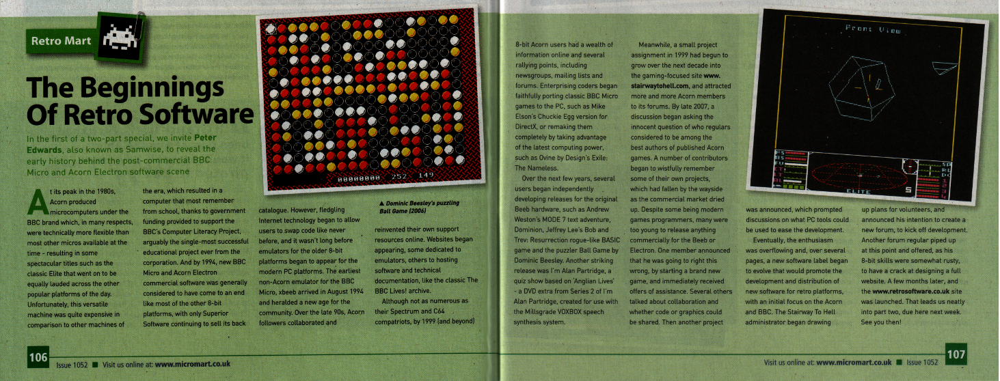
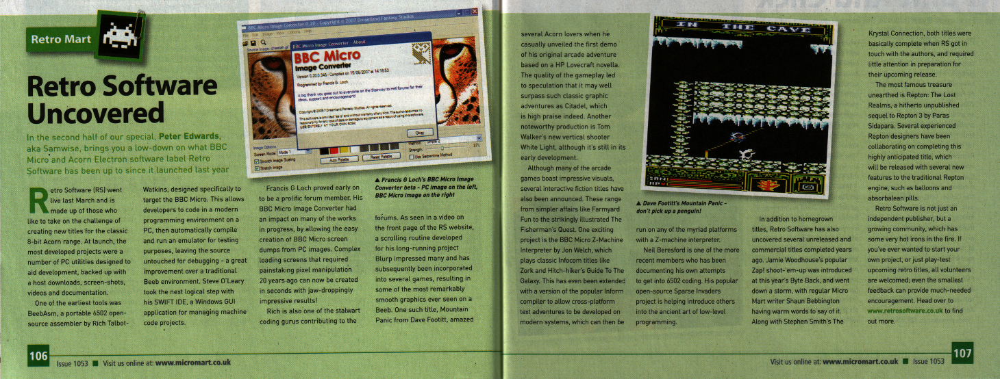

# Contact

For most purposes, to get involved simply sign up to the [Forum](http://www.retrosoftware.co.uk/forum/) and post in the [Volunteer Team](http://www.retrosoftware.co.uk/forum/viewforum.php?f=23) or the [Feedback and Site Specific Chat](http://www.retrosoftware.co.uk/forum/viewforum.php?f=3) forums.

If our releases are not currently available by eBay UK and you wish to order one or more *Retro Software* titles, or if you require technical support with a *Retro Software* purchase, please email us at <orders@retrosoftware.co.uk> with details of the titles and format.

Alternatively, if you'd like to talk to a member of the team off-line about a matter other than sales or support, please email us at <contact@retrosoftware.co.uk>.

# Press





**Micro Mart Issue 1052: 23 - 29 April 2009**
*Retro Mart column: Retro Software special \#1*
<http://www.micromart.co.uk/>
Reproduced with kind permission of Shaun Bebbington, regular author of *Micro Mart*'s *Retro Mart* column
Leave feedback at the [Micro Mart forum](http://forum.micromart.co.uk/)







**Micro Mart Issue 1053: 30 April - 6 May 2009**
*Retro Mart column: Retro Software special \#2*
<http://www.micromart.co.uk/>
Reproduced with kind permission of Shaun Bebbington, regular author of *Micro Mart*'s *Retro Mart* column
Leave feedback at the [Micro Mart forum](http://forum.micromart.co.uk/)



**Archive magazine: Acorn World in Retro-Land by Jim Nagel**
<http://www.archivemag.co.uk/acorn.html>
