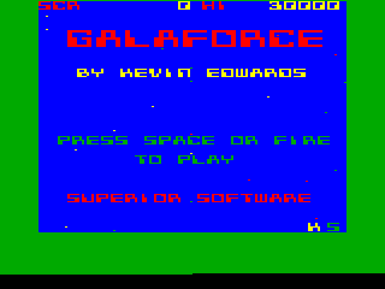

# Galaforce by Kevin Edwards and Kees van Oss

### Licence

Freeware (source code [available on request](mailto:contact@retrosoftware.co.uk), subject to copyright holders' permission)

*BBC Micro / Electron Galaforce © 1986 Superior Software / Kevin Edwards*
*Atomic Galaforce by Kees van Oss, 2012*

### Introduction

The classic shoot-'em-up *[Galaforce](Galaforce "wikilink")* was originally released on the BBC Micro and Electron in 1986 by Superior Software. Coded by legendary Acorn programmer Kevin Edwards, he has unearthed and generously shared the source code of the original BBC Micro version with RS and the first attempt to port the game is by our talented Atom coder Kees van Oss.


***Galaforce* BBC Micro disc cover scan, courtesy of [8bs.com](http://www.8bs.com/scans/games/disc/GALAFORCE_BBC_DISC.jpg)**   
*Posted: 18:53, 10 Nov 2012*

8-directional movement of the player's spaceship; fast and slow-speed bombs which home in when later zones are reached; keyboard and joystick control; self-play demo mode; high score table and superb atmospheric music.

In the midst of the 25th century, the United Cosmological Federation declared war on the savage, belligerent aliens inhabiting the Magellanic galaxy. Only the most experienced of the U.C.F. pilots were chosen to embark upon the perilous mission of conquering and overthrowing the hordes of Magelian, the Galaforce.

The Galaforce aliens attack in precise preconceived formations with each zone comprising several such formations. You must pilot your spaceship carefully avoiding the aliens, or shooting them whenever possible. Some aliens have to be hit more than once to destroy them. You have four spaceships and an extra spaceship is awarded if your score reaches 20,000 points.

[Discuss *Galaforce*](http://www.retrosoftware.co.uk/forum/viewforum.php?f=78)

***Galaforce Worlds** is available for Windows from Superior Interactive*
<http://www.superiorinteractive.com/galaforceworlds/>

### Platforms

#### Atom

***Port by Kees van Oss***

##### System Requirements

-   Standard Acorn Atom
-   32 KB RAM (\#0000-\#7FFF)
-   6 KB video RAM (\#8000-\#97FF)
-   VIA

<!-- -->

-   Colourboard (optional)
-   Joystick (optional)

##### Joystick Connections

An optional joystick can be connected to PORTB of the AtoMMC interface with software version 2.9.

`AtoMMC  Joystick`
`-----------------`
` PB0  -  Right`
` PB1  -  Left`
` PB2  -  Down`
` PB3  -  Up`
` PB4  -  Jump`
` PB5  -  nc`
` PB6  -  nc`
` PB7  -  nc`
` GND  -  GND`

##### Download

[Galaforce Acorn Atom disc/tape images](./images/Atom Galaforce.zip "wikilink")

This image archive includes both tape and disc versions of the game, in colour and monochrome. Read the included Readme.txt file for more info.

##### Atom Development Diary

A [Development Diary](GalaforceAtomDevDiary "wikilink") recording the details of the game's development by the author.

##### Screenshots


***Atom Galaforce* Title Screen early preview screenshot**   
*Posted: 23:34, 16 Aug 2011*

<table>
<tbody>
<tr class="odd">
<td>

<strong><em>Galaforce</em> Loading screen screenshot</strong> 
<em>Posted: 16:56, 10 Nov 2012</em>
</td>
<td>

<strong><em>Galaforce</em> Intro screenshot</strong> 
<em>Posted: 16:22, 17 Aug 2011</em>
</td>
<td>

<strong><em>Galaforce</em> High Score screenshot</strong> 
<em>Posted: 16:22, 17 Aug 2011</em>
</td>
</tr>
<tr class="even">
<td>

<strong><em>Galaforce</em> Gamestart screenshot</strong> 
<em>Posted: 15:51, 03 Sep 2011</em>
</td>
<td>

<strong><em>Galaforce</em> Zone 1 screenshot</strong> 
<em>Posted: 16:56, 10 Nov 2012</em>
</td>
<td>

<strong><em>Galaforce</em> Zone 2 screenshot</strong> 
<em>Posted: 16:56, 10 Nov 2012</em>
</td>
</tr>
<tr class="odd">
<td>

<strong><em>Galaforce</em> Zone 3 screenshot</strong> 
<em>Posted: 16:56, 10 Nov 2012</em>
</td>
<td>

<strong><em>Galaforce</em> Zone 3 screenshot</strong> 
<em>Posted: 16:56, 10 Nov 2012</em>
</td>
<td>

<strong><em>Galaforce</em> Zone 3 screenshot</strong> 
<em>Posted: 16:56, 10 Nov 2012</em>
</td>
</tr>
<tr class="even">
<td>

<strong><em>Galaforce</em> High Score Mono screenshot</strong> 
<em>Posted: 16:56, 10 Nov 2012</em>
</td>
<td>

<strong><em>Galaforce</em> Game Start Mono screenshot</strong> 
<em>Posted: 16:56, 10 Nov 2012</em>
</td>
<td>

<strong><em>Galaforce</em> Zone 1 Mono screenshot</strong> 
<em>Posted: 16:56, 10 Nov 2012</em>
</td>
</tr>
<tr class="odd">
<td>

<strong><em>Galaforce</em> Zone 2 Mono screenshot</strong> 
<em>Posted: 16:56, 10 Nov 2012</em>
</td>
<td>

<strong><em>Galaforce</em> Zone 3 Mono screenshot</strong> 
<em>Posted: 16:56, 10 Nov 2012</em>
</td>
</tr>
<tr class="even">
<td></td>
</tr>
</tbody>
</table>

##### Videos

{{\#ev:youtube|fG0wOHwuhZs}}
***Galaforce for the Atom update* by Kees van Oss**
*Posted: Fri Sept 30, 2011.*
{{\#ev:youtube|tsaApN-uG-U}}
***Galaforce for the Atom Update 2* by Kees van Oss**
*Posted: Sun Feb 12, 2012.*
