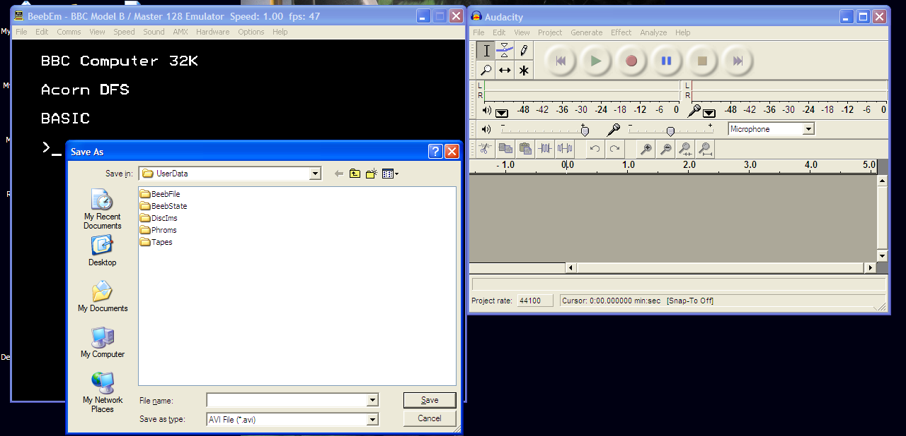
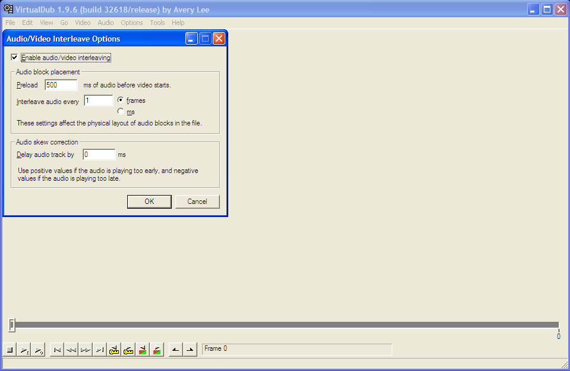

# How To: Create A BeebEm Video Review

After the success of Lion's [Random Game Reviews](http://www.stairwaytohell.com/sthforums/viewtopic.php?f=1&t=2589) on the Stairway To Hell forums, I thought it might be useful to create a quick step-by-step guide on how to put together your own video review, with freely available, cross-platform, open source software. If you'd like to use this to create some video reviews of Retro Software demos or releases, please link us to them in the forums!

The tutorial will cover the video making process on Windows XP Pro - probably the most popular platform around at the moment - though the software used is available for most of the other major platforms. The method described here relies on the video capture functionality of BeebEm which is not available, at time of writing, in the UNIX port of BeebEm. An alternative method, as used by Lion's original reviews, is to use a dedicated screen capture program for your operating system, such as the commercial program [Camtasia Studio](wikipedia:Camtasia_Studio "wikilink") for Windows. Such applications can be used to record an area of your desktop, capturing the emulator output and your commentary simultaneously. This avoids the need to capture the audio separately and fiddle with synchronising it to the video manually.

Note: if you struggle to multi-task - that is recording your commentary whilst playing through the game at the same time, don't forget you can always record a video of you running the software in BeebEm, without talking. Then you can playback the video and simply use Audacity to record you as you comment over the video being played back. Then use VirtualDub to apply your commentary to the video, in the same manner as described below.

### Install Prerequisite Software

Ensure you have a microphone installed and configured within Windows, then install the following applications (latest versions at time of writing in parenthesis):

[BeebEm for Windows](http://www.mkw.me.uk/beebem/) (4.11)
[Audacity](http://audacity.sourceforge.net/) (1.2.6)
[VirtualDub](http://www.virtualdub.org/) (1.9.6)

### Configure BeebEm

Start BeebEm, then:

-   Check the Video Options from the File menu. The default values, *Record at 640x512* and *Skip 1 Frame*, are usually fine but if you experience problems later with synching the video with your commentary on a lower-spec machine, you can experiment with them to improve the quality of your final video.

<!-- -->

-   Set the Display Renderer to *Windows GDI* under the View pull-down menu. In practice, I have found this improves BeebEm's ability to synchronise it's own audio, though it is less important in this case where we will be overlaying an audio commentary.

<!-- -->

-   Uncheck the *Freeze when inactive* option on the Options pull-down menu - this makes it easier to keep the audio closer in synch with the video.

<!-- -->

-   Check the *Joystick* option on the Options pull-down menu, if you have a PC joystick you want to use with the emulator.

<!-- -->

-   Select your preferred keyboard mapping from the Options pull-down menu, so that you're comfortable with controlling the emulated machine. Experiment and read the BeebEm instructions, as necessary.

<!-- -->

-   Select *Save Preferences* from the Options pull-down menu, if you want the settings to persist to your future BeebEm sessions.

<!-- -->

-   Select *Load Disc 0* from the File menu, and select the disc image of your chosen beeb software. Many of these images can be downloaded from the web, from sites like [Stairway To Hell](http://www.stairwaytohell.com/).

<!-- -->

-   Now get comfortable with playing the game a few times. Make sure you're happy with the keys and practice playing the game. If the sound effects or music are loud, turn down the volume on your computer. Remember, if they're too loud, they may obscure your commentary when you record it!

### Setup Your Desktop Studio

Start Audacity and position it close to BeebEm, side by side:



### Record Your Video And Commentary

-   Select *Capture Video* from the File pull-down menu of BeebEm.

<!-- -->

-   Choose a filename and folder to store the BeebEm video, but do **not** press Save yet!

<!-- -->

-   Position the Save As dialog box over the top of the Audacity window.

<!-- -->

-   Press Save and, as quickly as possible, press the large, red circular Record button in the Audacity window straight after.

<!-- -->

-   Click on the BeebEm application window to give it focus, then give Audacity a few seconds to start it's recording before beginning your video review - speaking clearly into the microphone. Holding down the SHIFT key and tapping BREAK (usually F12 is the equivalent in BeebEm), is the typical command to auto-boot a DFS disc.

<!-- -->

-   At the end of your review, click the large, yellow square Stop button in Audacity to stop the audio recording and then quickly select *End Video* from the pull-down File menu within BeebEm.

<!-- -->

-   Within Audacity, select *Export As WAV* from the pull-down File menu. Choose a filename and folder to save the audio commentary file - typically the same location as the video that was recorded by BeebEm.

### Add The Audio Commentary To Your Video

-   Run VirtualDub, accepting the licence agreement etc. if this is the first time the application has been run, until you reach the main interface.

<!-- -->

-   Select *Open video file...* from the File pull-down menu and choose the video recorded by BeebEm.

<!-- -->

-   Select *Direct stream copy* from the Video pull-down menu, to avoid a significant increase to the final file size.

<!-- -->

-   Select *Audio from other file...* from the Audio pull-down menu and choose the audio commentary saved by Audacity.

### Synchronise The Commentary With Your Video

Inevitably, no matter how fast you clicked the buttons - the sound will be slightly out of synch with your video.

-   Press the triangular \[Output playback\] button with the small o, third one from the edge of the screen, in the bottom left corner to gauge how far out the sound is.

<!-- -->

-   Select the *Interleaving...* option from VirtualDub's Audio menu.



-   In the Audio skew correction, update the *Delay audio track by* with an estimated value in ms to correct the synchronisation.

<!-- -->

-   Listen again to the output playback, and keep modifying the audio track delay value, until you are satisfied with the video output. Note that it is easiest to listen for an action within the video that has an accompanying, distinctive sound effect within the game, and try to match the two up.

<!-- -->

-   When you are happy with the video output, select *Save as AVI...* from the File menu and choose a filename and location for the final video.

### Optional: Apply Some Professional Video Magic

If you want to, you can now edit the video using free programs like [Kino](http://www.kinodv.org/), [Cinelerra-CV](http://cvs.cinelerra.org/) or any of the many popular proprietary video editing applications to add in extra scenes, accompanying text or slow-motion replay effects etc.

### Upload To YouTube And Tell Us About It

Now you're done, and the final AVI video should playback - including your own commentary - in Windows Media Player, when the AVI file is double-clicked. You can also delete the original video and audio commentary files, if you choose. You should now be able to upload the final file to a video-sharing site like [YouTube](http://www.youtube.com/), and can then spread word of your creation on the [Retro Software](http://www.retrosoftware.co.uk/forums/) or [Stairway To Hell](http://www.stairwaytohell.com/sthforums/viewtopic.php?f=1&t=2589) forums.

Congratulations!
