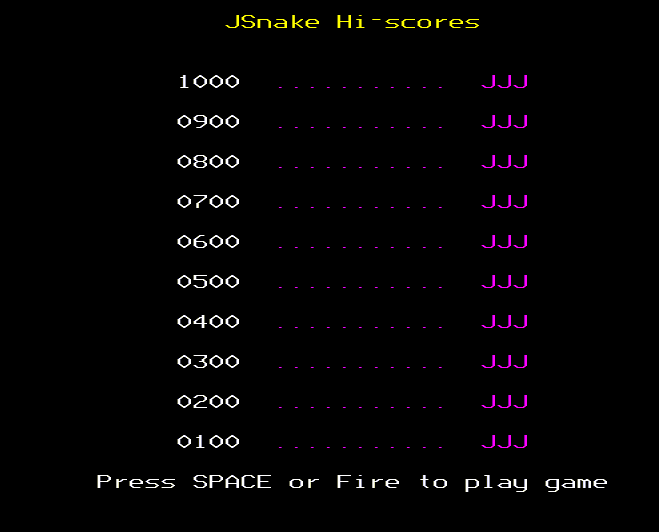

[&lt;----Back to JSnake Dev Diary Index](JSnakeDevDiary "wikilink")

## May-November 2012

Coding came to a near standstill as real life got in the way. I did manage to take a look at a niggling bug at this point. Inconsistent snake speed This bug – the snake speeding up as long as a direction key was pressed down.. then slowing back down to original speed when key was let go - was resolved chiefly through the help of PJ on the Retrosoftware forums. I was originally using the sprite plotting routine from [1](http://www.retrosoftware.co.uk/wiki/index.php/Basic_Sprite_plotter) I never did work out what exactly was going on. I think the issue was that the plot routine was suspending (briefly) OS interrupts and creating its own interrupt which enabled more redraw time for sprite plotting between screen refreshes. The routine is effectively an improved version of the standard VSYNC OS call. I just couldn’t get my code to work with it; this wasn’t a problem as PJ and others on the forums explained. I simply didn’t need the routine as I wasn’t doing very much animation. Using the normal VSYNC OS call was fine; I had smooth animation and the speed-up-on-key-press problem disappeared.

## December 2012-January 2013

I took a two week holiday on the Yucatan peninsula in Mexico over Christmas. I’m sure you’ll agree that a sunny holiday is an ideal time to be coding! For one reason or another, I was stuck in a hotel complex for a few days, so I did a lot of coding on my laptop by the swimming pool sipping the occasional Margarita.

#### High score table

For some reason, whilst on the plane to Mexico, I became obsessed with the idea of implementing the high score table as a linked list. This would be fine in a high level language that has linked lists as part of its implementation (i.e. C, C++, Java et al) but in assembler for 10 high score entries on a machine with very limited memory.. it is rather a silly thing to do. It would have been at least as efficient to write a sort routine which would have used only a fraction of the memory. But I wanted to implement a linked list in assembler for the challenge. Maybe the routine will come in handy some other day when needing to sort through a much larger set of elements. I won’t write about linked lists here – many reading this will know about them, and if not, Wikipedia explains how they work: <http://en.wikipedia.org/wiki/Linked_list>

It took 3-4 days of coding to be able to be able to manipulate the list to point to all elements in ascending order. I implemented by initialising an empty high score table in memory via EQUS statements. I then initialise several pointers. Nodes are updated to point to the next (“sorted”) element as new high score entries occur.

Use cases: New score &gt; highest score in current table. New score &lt; lowest score in table New score &lt; highest score and &gt;=lowest score

It took me a long time to debug.



#### Related routines

-   Display the high score table
-   Enter high score routine

I wanted this to be similar to old arcade games: only 3 characters are allowed for user initials in high score table. Logic was implemented to track cursor position, and prevent cursor moving too far to left or right. This felt very “professional” to me, very different from using the BASIC “INPUT” command.

[&lt;----Back to JSnake Dev Diary Index](JSnakeDevDiary "wikilink")
