# Nyan SID

The development diary for *Nyan SID* - a quick little mini game with SID and BBC music.
Maybe not as quick as I thought it was going to be.

## Sept 2011 - "*The Beginning*"

Mon 19 Sept 2011: A Funny Demo
Lion posts a video of a BBC Demo called Nyan Cat over on the Stardot forums:



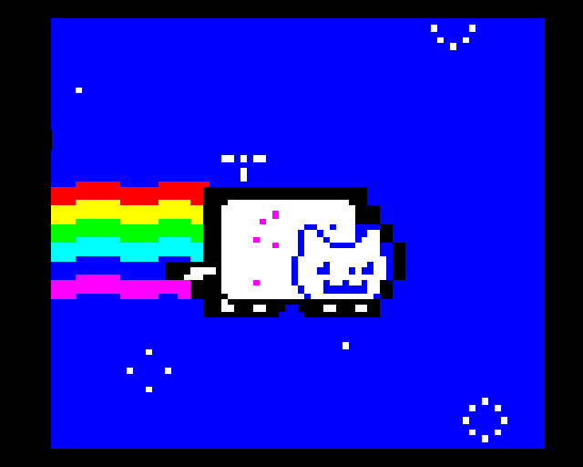



[Link Here](http://www.stardot.org.uk/forums/viewtopic.php?f=2&t=4500)

What the hell is Nyan Cat I think?
I soon discover it comes from an animated gif called 'Pop Tart Cat' by prguitarman: <http://www.prguitarman.com>

And then somebody else added some music and posted the result on YouTube: <http://www.youtube.com/watch?v=QH2-TGUlwu4>

I think the music makes it!
Anyhow it occurs to me this will make the perfect starter project - I've been meaning to write a proper Mode2 game for some time and even had a couple of goes that have ended up unfinished.

Since the scope of this is a lot smaller maybe I'll be able to complete it this time.

And Sir Morris asks for a BeebSID version - no problem I figure!

## Nov 2011 - "*Midi 2 SID*"

Sat 26 Nov 2011: Making some music
I try converting a midi file to run on the BBC SID chip. My very first test is a 3 channel Tetris tune. I convert the midi format into a 3 byte format: TIME, FREQ, CHANNEL. I also add a SID envelope editor so I can change the sound - the result sounds very BBC-ish, unfortunately not as impressive as the existing SIDs. There must be some other magic that makes existing SID tunes sound so good.



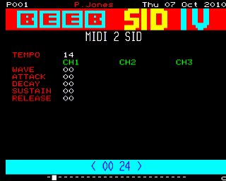



## Dec 2011 - "*Proving the Game*"

Wed 14 Dec 2011: Detecting the SID chip
I want to be able to detect if the SID chip is there so can automatically use it to play the music or switch to the standard BBC. I ask around on the forums and MartinB comes to the rescue. <http://www.retrosoftware.co.uk/forum/viewtopic.php?f=73&t=712> The method is to play a noise sound on channel\#3 and pick up the output from a special register to see if it changes - if it doesn't then the SID is not present.

    ._IS_SID_PRESENT:
        ;   set master volume to zero
            LDA #0
        STA     SD_VOLUME

        ;// set freq of channel 3
        LDX #24
        LDA FreqTablePalLo,X
        STA SD_FREQL_3
            LDA FreqTablePalHi,X
        STA SD_FREQH_3

        ;// play a noise sound
            LDA #$81
            STA     SD_CNTRL_3

        LDA SID_OUTPUT
        STA firstvalue

        LDX #0
    .loop44:
        LDA SID_OUTPUT
        CMP firstvalue
        BNE gotsid
        INX
        BNE loop44
        LDA #0
        RTS

    .gotsid:LDA #1
        RTS

Thu 15 Dec 2011: The Sprites
Time to start the game. I get the cat frames from a gif.







Fri 16 Dec 2011: The Game - on the PC
Now I have all the elements - the cat and star sprites - I write the game in 'c' on the pc to see if it will work.

It's pretty simple - you have three stars - neutral, good and bad. Bad sucks energy from you, good boosts your energy. When you're out of energy the game ends. The time you survive is your score.



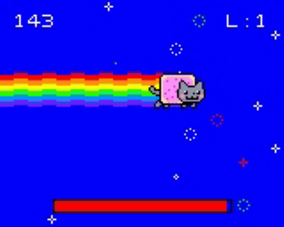



## Jan-Feb 2012 - "*The Music*"

Sun 29 Jan 2012: Envelope Explorer
I've got a program called Envelope Explorer as a way to test different pre-defined envelopes. I can select one for 64 envelopes to find the best match. I modify it a little to edit the envelope values and it plays a tune in the background so I can pick the best sounding envelopes.



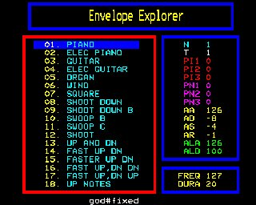



Sat 04 Feb 2012: Getting some Midi
I've been using a nyan midi I had found but then come upon a SNES .FTM version that I think sounds better. Converting it involves changing the FTM into a NFS in FamiTracker and then to the midi. For some reason only one track comes through, but as a bonus this version of the music has the intro tune as well.

Sun 05 Feb 2012: More Midi
I'm using Famitracker to play the orginal .FTM file.

<http://famitracker.com/>
I discover this program will not save a midi file but can output a midi stream. To capture this stream I have to use another program called 'Midi Yoke'. This program will enable other programs to pick up the stream. I then use a third program called 'WinJammer' to pick up the midi stream and save it out as midi. Phew - what a load of messing about, anyway I now have a full 4 track version of the music. The first thing I do is remove the drum track as I want at least 1 channel free on the BBC to play sound sound effects.

Tue 07 Feb 2012: Loop the Music
Get the music to loop correctly. Get it to play the intro only once.

Sat 11 Feb 2012: Envelopes
Experimenting with different envelopes for the SID tune. I write a program to test what the filter does. The Duty wave is quite good a making a buzzing type sound. The lowpass filter makes the sound less electronic and more 'natural' I notice existing SIDs will often change the cutoff frequency dynamically but I don't do that, I just have to select a cutoff frequency above all the notes in my particular track - in this case the bass track.



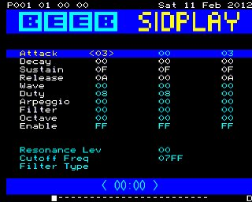



Tue 14 Feb 2012: SID File Creator
Another way to test sid envelopes. This time I create a C64 sid file directly that I can play on the pc sidplayer.exe This program helps me change and see what the envelope parameters are. It's actually faster to use than creating a BBC disk each time and playing that through an emulator. Talking of emulators I normally use Beebem to develop with over B-em as it autoruns the disk and so is a little quicker to use with lots of iterations, the big disadvantage being it doesn't play SID music of course - so I fact I end up using both emulators! I decide on a slow die off for the backing track and a square wave like one for the lead with a but of duty to give it a bit of a buzz.



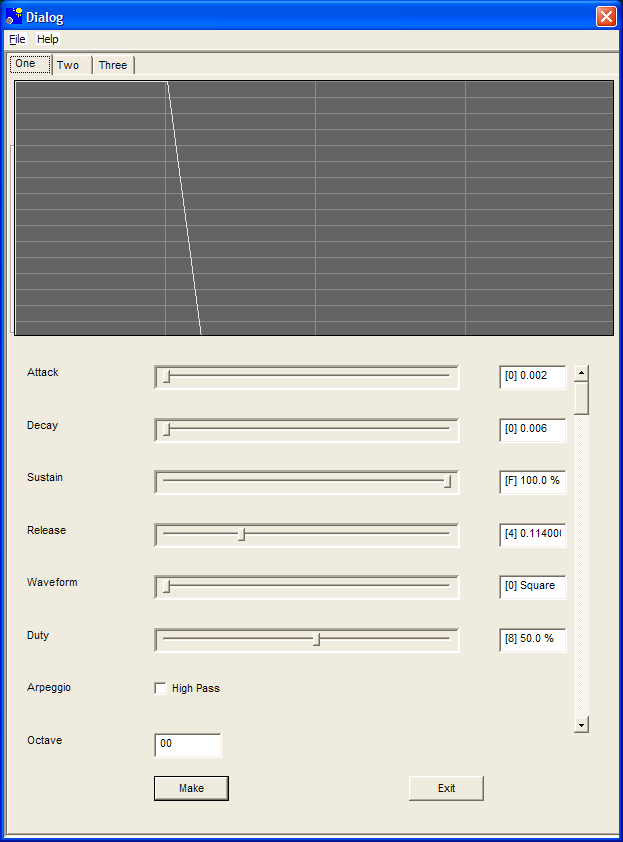



Sat 18 Feb 2012: Finishing the Music
Finally I'm happy with all the envelopes so the BBC and SID tunes are finished!
Now it's time to think about the graphics code.

I use Francis G. Loch's [BBC Micro Image Converter](BBC_Micro_Image_Converter "wikilink") to make a background picture from the original gif.

## Week 1: 14-19 Feb 2012 - "*Starting the Graphics*"

Sun 19 Feb 2012: Starting the Graphics
To start I setup a Mode2 screen and load a picture into screen memory. Then I grab Steve O'Learys sprite routine from: <http://www.retrosoftware.co.uk/wiki/index.php/Basic_Sprite_plotter> and draw the cat sprite. As my pixels are double height I modify the routine to double space the lines. It's a real shame I can't put the video chip into some sort of line double mode - then drawing sprites would be twice as fast and I'll have lots of free memory - oh well... Then I add some keyboard reading so I can move the cat around the screen.



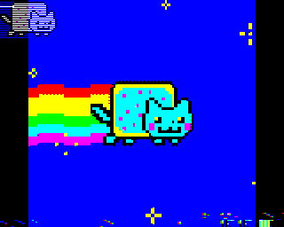



## Week 2: 20-25 Feb 2012 - "*Writing the Game*"

Mon 20 Feb 2012: Writing the Game
Draw the rainbow, stars and animated the cat. I count frames to see how fast it runs and display that as dashes at the top of the screen. The frame rate is ok until I draw the rainbow then it drops to 3/50ths.... This is a shame because I know moving to hardware scrolling is going to be a pain.



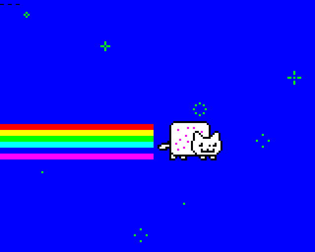



Tue 21 Feb 2012: Speeding it up - Using Hardware Scrolling
It now runs a lot faster but the cat leaves a trail.







Wed 22 Feb 2012: Hardware Scrolling
Add the rainbow back - now with hardware scrolling it takes no time - I just have to clear a rectangle at the edge of the screen every frame.
I gain some more speed when I draw the cat in one pass with a special double height sprite drawer instead of two passes with the original drawer. Add the stars. I discover drawing one star per frame is a lot a faster than drawing all 8!







Thu 23 Feb 2012: Running out of memory
I want to see a score at the top of the screen so I add a print\_byte subroutine. I need to add a character set - 16 characters at 10 bytes each (4x5 pixels) means +160 bytes - I immediately run out of memory! I find this nifty code to print a hex digit - it manages to print 0-9 and A-F without any jumps!

    ._PRINT_DIGIT:
            SED             ;Enter BCD mode
            CLC             ;Ensure the carry is clear
            ADC     #$90    ;Produce $90-$99 (C=0) or $00-$05 (C=1)
            ADC     #$40    ;Produce $30-$39 or $41-$46
            CLD             ;Leave BCD mode
        JSR _PRCHAR
        RTS

<http://www.obelisk.demon.co.uk/6502/algorithms.html>

Fix a screen boundary address wrap bug in the sprite drawer - as the screen now has hardware scrolling addresses above $8000 have to wrap back to $3000. As the screen scrolls this boundary can be anywhere - like in the center of the screen.

            LDA SCREEN
        CLC
        ADC #&80
        STA SCREEN
            LDA SCREEN+1
        ADC #&02
        BPL ok
        SEC
        SBC #&50
     .ok:   STA SCREEN+1

Move the init code high in memory so it's only used once.
Sort and display the map file to see what's using all the memory.
The stars are not very random so I find a new random routine that does a better job:

    ._RANDOM: TXA
        PHA
        TYA
        PHA
        LDA #1              ; store 1 in TMP
            LDX #3
    .RAND1  STA TMP,X
            LSR A
            DEX
            BPL RAND1
            LDY #$20            ; calculate SEED = SEED * RAND4 + TMP
            BNE RAND5           ; branch always
    .RAND2  BCC RAND4           ; branch if a zero was shifted out
            CLC                 ; add multiplier to product
            LDX #3
    .RAND3  LDA TMP,X
            ADC RAND6,X
            STA TMP,X
            DEX
            BPL RAND3
    .RAND4  ROR TMP             ; shift result right
            ROR TMP+1
            ROR TMP+2
            ROR TMP+3
    .RAND5  ROR SEED3           ; shift out old seed, and shift in new seed
            ROR SEED2
            ROR SEED1
            ROR SEED0
            DEY
            BPL RAND2
        PLA
        TAY
        PLA
        TAX
        LDA SEED3
            RTS
    RAND6    DB  $00,$19,$66,$0D ; multiplier (high byte first!)

<http://6502.org/source/integers/random/random.html>
Actually on their page theres a bug I think - mixing up ADC RAND4,X when it should be ADC RAND6,X The stars are now good.

Fri 24 Feb 2012: Throwing away bootup code
Previously I had the program load in two parts - $400-$800 and $900-$3000. This is because all the memory from $400-$3000 can be used by the game except $800-$900 which is used by the OS's sound system. I load the $400 section directly in at $400 and the $900 in at $1900 and then relocate it. So the loader program sits at $4000 and has bootup code in it that is only called once and can be thrown away thus saving a bit of memory. Anyhow I decide it's simipler to load program as one file from $400-$3000 and then just let the OS overwrite page 8 later. This means I now move my loader code up to $4500. I move more bootup code up into the loader region and save 128 bytes! \\

Sat 25 Feb 2012: Speed - Timing the code
Display the time taken at the top of the screen. Measure the frame rate with a hardware counter.

        LDA $FE45
        STA clk1
        JSR _MAINLOOP
        LDA $FE45
        STA clk2

I find when the counter hits around $20 the game takes longer than a 1/50th and the screen gets all corrupted. I add RTW's hardware keyscan code from these forums: and gain about 5 ticks - an amazing speed increase! <http://www.retrosoftware.co.uk/wiki/index.php/Reading_the_keyboard_by_direct_hardware_access>

Sun 26 Feb 2012: Out of Memory again - Finding dead code
I have a debug version of Beebem that I change to count when each address is used by the processors PC. Using this info I can see what code is never used or only used a little. This helps me get some bytes back by deleting unused code and moving other code used only once into the 'throw away' bootup area.

## Week 3: 27-04 March 2012 - "*Hardware Sounds*"

Mon 27 Feb 2012: More stars
Now I have a little memory spare I add the red and white stars and a star type table.

Tue 28 Feb 2012: Collision
Add collision with the stars via a 80 byte collision table and make a sound when you hit a star. The collision table corresponds to the number of fat pixels on the screen - collision is really fast - I just have to check if the table contains a star index (1-8) number at the position I am at.

Wed 29 Feb 2012: Hardware Sounds
I want to add a energy bar at the bottom of the screen but the processor has no free cycles. As reading the keyboard is a lot faster than using the OS I think doing the same thing for the sounds might help as well.

I get the following code to successfully make some sounds and integrate it into the music player. The only problem is now I have no envelope control and even have to turn the sounds off myself - luckily I have some memory spare in which to fit all the new code. This code comes from the Advance User Guide.

    ._MAKE_SOUND:   SEI
            LDA     #&FF      ;// PortB set as output
            STA     &FE43

            LDA Midi2Bbc_Low,X
            ORA #&80
                JSR _DIRECT0

            LDA Midi2Bbc_High,X
                JSR _DIRECT0

            LDA #&90     ;// volume
            JSR _DIRECT0

            CLI
            RTS



    ._DIRECT0:      STA &FE41   ;// Set volume or frequency

                LDA #0
                STA &FE40   ;// Output register B
                NOP
                NOP
                NOP
                NOP
            NOP
                LDA #8
                STA &FE40   ;// Output register B

            RTS

Thu 01 Mar 2012: Need more memory - Grabbing Page 8
As I'm not using OSWORD to make sounds anymore I should get able to use the memory from $800-$8FF for my own purposes. However I find this area is getting corrupted even if I'm not making any sounds. Eventually I set the IRQ vector to turn of the OS before I relocate my code downwards and this fixes it - I guess the OS is processing sound even if you can't hear anything...
Fri 02 March 2012: Writing the Envelopes Myself
I add code to create envelopes as the OS is no longer there to do it for me - I have a table of volumes I set every 50th of a second. Then the next day I rewrite the envelope routine: I change it to use four ADSR rate bytes so it uses less memory. It's almost like the standard Acorn Envelopes now as well except I update mine at 50Hz and they did theirs at 100Hz.
Sat 03 Mar 2012: Title Page
I add a title page. As usual I run out of memory so I put in some very basic compression. As all teletext codes are 7bit if bit 8 is set then the byte means a count of spaces. As most pages have a lot of blank space in them this is a good saving - it reduces the data for the title page down to 200 bytes. To draw the page in code it would take at least 7 bytes per line of text so this is a good savings.



<image:Nyan_titlepage.jpg>



I toggle bbc/sid play on the TAB key. Stop BBC sounds when I turn the SID on. I discover what happens if you scroll the start address in mode7:



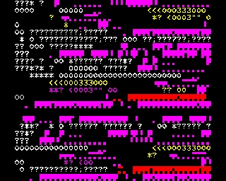



Sun 04 Mar 2012: HiScore Page
I add a hiscore entry page. As the OS isn't around anymore to do the key input I give it a three letter entry system to save space.



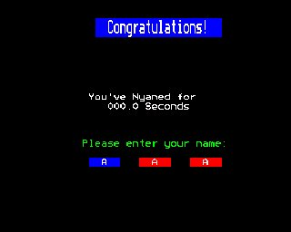



## Week 4: 5-11 March 2012 - "*No Memory*"

Mon 05 Mar 2012: No Memory - Again !
I give up for trying to find any more memory - what a chore! - I remove the hiscores altogether to save memory.



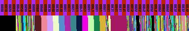



Fri 09 Mar 2012: The End Page
I finish the 'top nyans' page. As I only store one hiscore entry now I change the hiscore name input to be serveral letters. To do this I have to add a 26 byte table to translate the letters A-Z into their inkey codes. To get some memory back I remove extra bytes from midibbc table as the BBC can only make a subset off all the 256 midi frequencies.



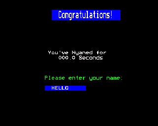



Sat 10 Mar 2012: Start the Diary
Inspired by the other games (like Jungle Journey) on Retro Software I decide to write a diary. I'd already noted what things I'd programmed as I went along so it's just a matter of putting that altogether in a nice html document. Anyway coding the game is not so much fun now as I run out of memory every time I add something....

Sun 11 Mar 2012: Looking for Free memory
I improve the map2bmp program to color code the data (blue) and code (red) areas. To help the program find code and data I introduce a naming format:

    .Variable:EQUB $23

    ._CODE: NOP
    .loop:  NOP
        BNE loop
        RTS

Where a \_ means code, a Capital means data and all other labels are ignored (loop, over, etc.) This makes it easy to tidy the code and data areas up and see large subroutines. The black pixels are free memory - there is a little sliver of black at page $2F00.



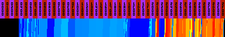



## Week 5: 12-18 March 2012 - "*A Memory Breakthrough !*"

Sun 18 Mar 2012: Doh!
The problem with memory has always been the large main sprite (18x21 bytes) with its twelve frames of animation. Why twelve you ask? Well that's how many their were in the original gif. In desperation I'm ready to rip some frames out when I discover that the actual cat animation repeats and has only six frames - this is absolutely terrific and results in a very large memory savings! Now I'll have room for all the additional game logic code I need to write to finish the game. The memory map is now looking a lot healthier.



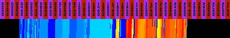



## Week 6: 19-24 March 2012 - "*Hardware Palette*"

Fri 23 Mar 2012: Font Stuff
I add a fullstop to the font so I can display the time as 123.4 at the top. That makes just 17 characters used to save memory. The last character has some tearing on the screen but I don't know what to do to solve this - maybe I'm just not plotting them fast enough - it's pretty annoying as there's only five characters plotted - It seems if the problem isn't memory then it's speed. I clean up the games main flow so you go from title screen to game to end screen and back to the title - just like a real game now but without the game!

Sat 24 Mar 2012: The Energy Bar and Palette
Make the Energy Bar work and swap its colours if the game is using the SID chip or not. Delete stars when you hit them. For the end sequence I set the palette in the hardware - very easy as it turns out!

        LDA palette_index
        ASL A
        ASL A
        ASL A
        ASL A
        ORA color_value
        STA $FE21

Run out of memory in zero page now as I hit the $A0 limit - so remove some unused variables. As I understand it the OS still uses $A0-$FF so I can't use those locations.

## Week 7: 26-1 April 2012 - "*Sound Disaster !*"

Tue 27 Mar 2012: Fixing the Tune
The tune is still sounding strange sometimes on the BBC. I convert the notes into a BMP and immediately see that some midi notes are out of range on the BBCs chip that can only do a subset of the 128 midi frequencies 47-111 and the SID can only reach 105. To fix this I move all the notes up an Octave and now the music is finally correct.



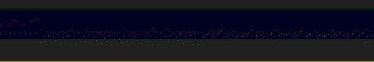



Sat 31 Mar 2012: Sounds on a real BBC
So I finally play the game on a real BBC and the sound doesn't work! Get the disassembly of the OS rom from the BBC Lives <http://bbc.nvg.org/docs.php3> and the SOUND command and it does this:

     EB22    SEI             ;disable interrupts
     EB23    LDY     #&FF    ;System VIA port A all outputs
     EB25    STY     &FE43   ;set
     EB28    STA     &FE4F   ;output A on port A
     EB2B    INY             ;Y=0
     EB2C    STY     &FE40   ;enable sound chip
     EB2F    LDY     #&02    ;set and
     EB31    DEY             ;execute short delay
     EB32    BNE     &EB31   ;
     EB34    LDY     #&08    ;then disable sound chip again
     EB36    STY     &FE40   ;
     EB39    LDY     #&04    ;set delay
     EB3B    DEY             ;and loop delay
     EB3C    BNE     &EB3B   ;
     EB3E    PLP             ;get back flags
     EB3F    RTS             ;and exit
     

My existing code is similar but doesn't wait so long so I switch to this one. I try all day but the music always seems to get corrupted - sometimes it sounds ok and it sounds just fine on booth Beebem and B-em so I don't understand what is wrong - it's driving me crazy....

Sun 01 Apr 2012: Fixing The Sound
With help from RTW on the forums <http://www.retrosoftware.co.uk/forum/viewtopic.php?f=73&t=744> I get the magic code to fix the music. The sound chip is shared with the keyboard so you have to turn the keyboard off first with:

        LDA     #15
        STA     &FE42
        LDA     #11
        STA     &FE40

## Week 8: 2-8 April 2012 - "*New Cat Sprite*"

Mon 02 Apr 2012: More Music
Add a die tune to end the game.

Tue 03 Apr 2012: Sound Effects
I add a sound command:

    SOUND CHANNEL, AMP_ENV, FREQ_ENV, FREQUENCY, DURATION

It's very similar to the BBCs native sound command but I have two envelopes. This saves me a little memory as most envelopes don't have a frequency part. Frequency envelopes take 8 bytes and are a value that you add to the frequency each frame for 8 frames (and then loop). Amplitude envelopes are 6 bytes - just like the BBC amplitude bit - AR,DR,SR,RR,ALA,ALD. When you hit the stars I make a sound.

Wed 04 Apr 2012: Update the Menus
I'd prototyped them some days ago and now finally put them into the game. These have a bit more colour than before.



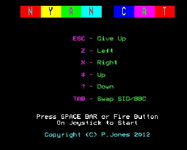






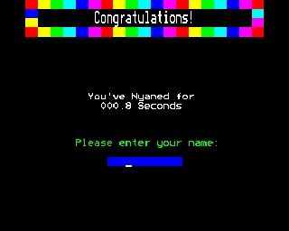






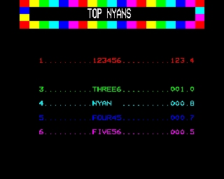



Sat 07 Apr 2012: New Cat Sprites
The original cat was a bit white as the original palette didn't match the BBCs very well - I remap the original sprite by hand and the cat is far more colourful now.



 



## Week 9: 9-18 April 2012 - "*Odds and Ends*"

Tue 10 Apr 2012: Fixing Memory Corruption
Sometimes I see the title page is corrupted. I set a trap in Beebem to give me the PC of any code that touches the memory of the title page. I discover if STA array,X when X&gt;size of array corrupts memory - no surprise there! I make sure X stays in range.

Mon 16 Apr 2012: Niggling Bugs I
Sometimes the stars would not get erased - I found out I was mixing up the X and Y registers and now that's fixed.

Tue 17 Apr 2012: Niggling Bugs II
For sometime the rainbow would occasionally fail to be deleted leaving an unsightly trail of pixels. I finally tracked it down to when I wrap the x-coordinate. I discovered I had to add 8 to the Y position if x wrapped thru 80. That fixed it!

Wed 18 Apr 2012: Level Progression
Change the star balance between red, green and white stars , set the background color and music tempo for each new level. Add a small background energy drain so the game isn't too easy, make the bad stars -2, good stars +3. I find I'd like to call random more often but I start to frame out - I guess it is a bit slow. After reading the JSnake blog I change the random number generator back to Richard Broadhurst's faster and now working version! <http://www.retrosoftware.co.uk/wiki/index.php/JSnakeDevDiary290212>

    ._RANDOM:
        LDA     seed
        ASL     A
        ASL     A
        CLC
        ADC     seed
        CLC
        ADC     #&45
        STA     seed
        EOR &FE44
        RTS

## Week 10: 16-22 April 2012 - "*Sprite Tearing*"

Fri 20 Apr 2012: Almost Finished
Almost finished but the sprite tearing isn't so good.Not sure what to do about that. I have a look at the other games here like Harry and Jungle but they don't seem to be doing anything to avoid tearing but they still look fine - strange.



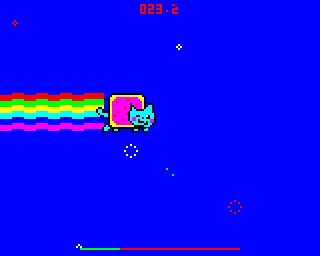



I set the background palette to cyan at the start of vblank, dark blue when I start to draw the cat and magenta when I've finished (with STA $FE21) . This is a pretty good trick as it's really fast and easy to see. Drawing the cat takes a very long time - over half the frame! It is pretty big at 36x42 pixels.



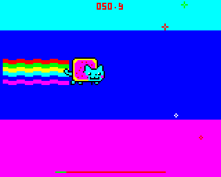



I rewrite the draw routine to be a little faster. The blue area gets smaller as a result.



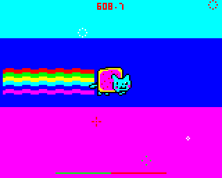



I add a timer interrupt which goes off on the y line after the cat. This is based on RTW's example: <http://www.retrosoftware.co.uk/wiki/index.php/How_to_do_the_smooth_vertical_scrolling> I set the timer in vblank to be a different amount depending on the y position of the cat. This removes the tear as the scanlines the cat is drawn at have already been refreshed. However the cat draw still takes a lot of time so you then can't avoid the tear sometimes.



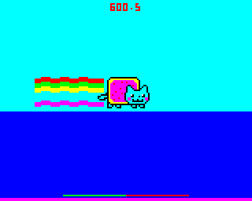




## Week 11: 27-29 April 2012 - "*The End*"

I work on the waves a little more to give the game more structure. Tweak their positions so they match where the player can move to. I run out of memory again, but find some dead code I can delete and finally fit my 8 level types in 64 bytes. I have to clean up the uniform to random wave transition by making sure the stars delete themselves and increase the red star frequency so you die a little quicker. I add a loading page and after some final testing - it's posted!
