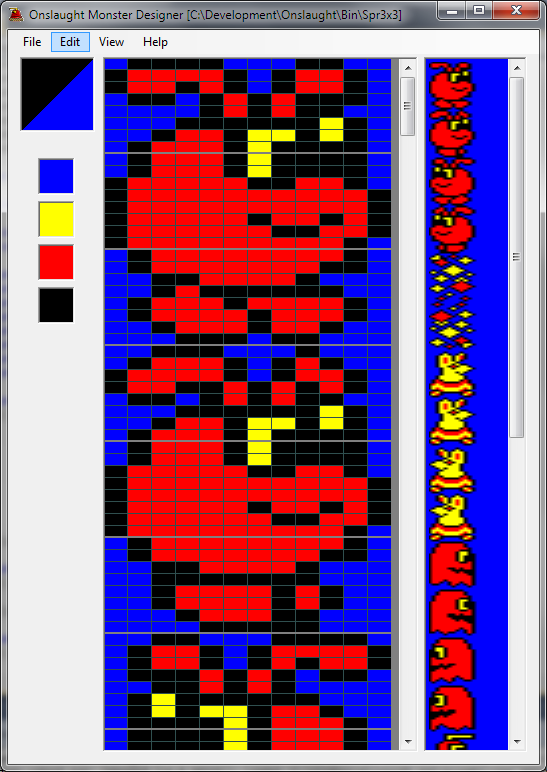



## 3rd December 2010

So, a couple of days ago, I got started on writing the tools I'll need to create content for Onslaught. It seems that I lost my old C\# sprite editor (maybe on my old dead laptop), so I had to start this from scratch, but just a couple of evenings later and I already have a pretty fully functional Monster Designer!

Onslaught effectively treats the monster sprites as an immense 12 pixel wide block, and it's more flexible if I can edit them in this format. Sprites needn't be 3 character rows high, so I can use the space exactly as I want, without being rigidly bound to 3x3 blocks. In the cases where I have 1 or 2 character wide sprites, I can fit them together into a 3-character wide space, and save myself some memory. I already have some new creatures which do exactly this...

The scenery editor is going to be closely based on this code - then all that remains is a map editor, which is going to be the most complicated, but also the one which'll be most fun to use!

*[&lt;&lt; Previous entry](OnslaughtDiary20101201 "wikilink")* --- *[Next entry &gt;&gt;](OnslaughtDiary20110527 "wikilink")*

*[Home](OnslaughtDiary "wikilink")*

------------------------------------------------------------------------

### Comments

-   (Example comment to demonstrate markup).
    -   [Richtw](User%3ARichtw "wikilink") 17:36, 3 December 2010 (GMT)

