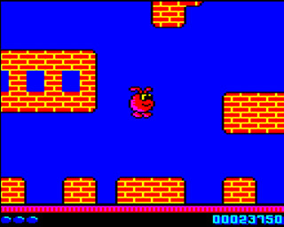

# Rich Tech 2 (engine name, eventual game title TBD) by Rich Talbot-Watkins

### Licence

Software licence TBC

### Introduction

Expected Features:

-   Scrolling tech (a la Firetrack, but windowed, multi-directional)
-   Map printing (for plotting new slivers of screen which have scrolled on)
-   Sprite routines
-   Sound / music engine, plus two tunes!
-   Some nice demo-style animating wibbly text routines
-   The screen centres around the player, so if the player jumps sideways, then the screen will move in an arc around him.

### Sample Screenshots

{{\#ev:youtube|ttpGeDIjfeU}}
**Early video preview re-using *Onslaught* (now *[Blurp](Blurp "wikilink")*) gfx which will eventually be replaced with something new & original**
*Posted: Thurs Jul 24, 2008 15:40*
or download a 'raw' video of *Rich Tech 2* running at the *true* frame rate: [Rich Tech 2 AVI Video](./images/Richtech2 video.zip "wikilink") (449.1 KB zipped, expands to 15.9 MB).

**(early developmental screen shot)**
*Posted: Weds Jul 23, 2008 20:22*

### Change Log

Not released yet
