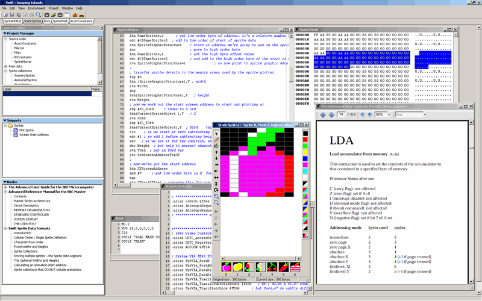

# SWIFT

***A BBC Micro Integrated Development Environment, for Windows***



# Video

{{\#ev:youtube|MrvE6ewoN0E}}

[Click for larger picture](http://www.retrosoftware.co.uk/wiki/index.php/Image:Swift-v4.2_ScreenShot.gif)

### Licence

This software is copyrighted [freeware](http://en.wikipedia.org/wiki/Freeware) and can be used for commercial or non-commercial purposes.

### Introduction

Swift is a Project Management tool for handling [BBC Micro](http://en.wikipedia.org/wiki/BBC_Micro) Machine Code.

These are its main features:

-   Project based (you can have many sources files in your project, assembler,text,sprite collections and raw binary data)
-   Built in code editor
-   Built in Sprite Editor with animation facility
-   Built in hex editor (for raw data files)
-   As many code,sprite and hex windows open as you wish
-   Multiple assemblers can be installed into Swift, although at present only the P65 is tested as working (and is the recommended install)
-   One click assembly (just click a button to get the assembler associated with your project to assemble the source) with all errors and reporting coming back into an error window within the IDE
-   Supports error throwback - double clicking an error opens the appropriate code window and highlights the line
-   All project items have their own properties and you can assign notes to them
-   "Snippets" window to store useful snippets of code to be used across projects, dragging and dropping to/from this window.
-   Multiple emulators can be installed into Swift and each project you have can have a different emulator assigned to it (although only tested and guaranteed to work with BeebEm at present)
-   Assembled code can be written direct to a DFS disk image of your choice (which can be set for individual projects)
-   One Click Testing: you can click one button that will assemble your source code, write it to your projects DFS disk, auto launch the emulator you've chosen for this project, load the disk and, if required, make the emulator run your code ... all in one click from the IDE!
-   Assembler editor windows can be configured for background colour and font
-   Supports extra options for merging various files within your project together to produce one object file, yet allowing you to keep logical parts of your project in seperate files
-   Supports projects where code is placed in seperate areas of the BBC's memory, allowing them to be easily referenced from other code in your project via use of calling labels... no need to remember hex addresses anymore!
-   Search facility for both assembler source and binary files. Allowing searching of all files in project with an easy to access search results window
-   Code Limits: allows you to set warnings if your grows in size beyond a given memory address.
-   Supporting windows can all be docked or undocked as required.
-   Context sensitive editor pop up menu to allow you to quickly jump to label definitions or find all occurances of labels
-   Supports context sensitive books in PDF format, allowing you to look up keywords from your code quickly in any of the manuals you've installed

------------------------------------------------------------------------

### Download

<table style="width:10%;">
<colgroup>
<col width="2%" />
<col width="8%" />
</colgroup>
<thead>
<tr class="header">
<th>
Date:
</th>
<th>
19-October-2011
</th>
</tr>
</thead>
<tbody>
<tr class="odd">
<td>
Filename:
</td>
<td>
<a href="Media:Swift_4.2.5.zip" title="wikilink">Swift 4.2.5.zip</a> <strong>Important : You need at least version 7 of Adobe PDF Reader installed to use this version.</strong>
</td>
</tr>
<tr class="even">
<td>
Filesize:
</td>
<td>
763kb
</td>
</tr>
<tr class="odd">
<td>
Stable release:
</td>
<td><ul>
<li>Fixed bug where index out of range errors occurred for some projects that linked files together and had been run or assembled</li>
</ul></td>
</tr>
<tr class="even">
<td>
Known issues:
</td>
<td>
When trying to jump to a label in any source file, if the label is on the very first line of the file then it will not be found. Work-around : Have comments or a blank line at start of file
</td>
</tr>
</tbody>
</table>

**Previous versions for historical reference can be found *[here](http://www.retrosoftware.co.uk/wiki/index.php/Swift_previous_versions)***

------------------------------------------------------------------------

### Swift Books

Swift supports books in PDF format. **[Click here for a demonstration](./images/BooksDemo.zip "wikilink")** of how books can be used.

**Important : You need at least version 7 of Adobe PDF Reader to use the books facility.**

If you want to add your own books please examine the "definition.txt" file that accompanies each book. Here are the currently available books.

[Advanced user guide](./images/BBC Microcomputer Advanced User Guide.zip "wikilink") Suitable only for Version 4.2 beta 2 and above of Swift

[Master Advanced user guide](./images/MasterAdvRef.zip "wikilink") (Note, this file has been altered slightly from the original to maintain correct page order, if the original creator objects please contact me.) (Version 4.2 beta 2 and above)

[Swift Sprite Data Formats](./images/Sprite Data Formats.zip "wikilink") Explanation of how sprites are stored by Swift (Version 4.1 beta 5 and above)

------------------------------------------------------------------------

### Additional Software

You must also install at least an assembler (and probably you'll want an emulator as well):

-   **Ophis - a P65 based assembler**
      
    <http://hkn.eecs.berkeley.edu/~mcmartin/ophis/Ophis-1.0-win32-installer.exe>

    Just run the installer and select any default items. (NB if you're only using this with Swift you do not need to update your Path var as it suggests)

Swift supports BeebEm and B-Em directly (you may be able to get others to work also)

-   **BeebEm**
      
    <http://www.mikebuk.dsl.pipex.com/beebem>

<!-- -->

-   **B-Em**
      
    <http://b-em.bbcmicro.com/>

------------------------------------------------------------------------

### Tutorials

Several tutorial videos are available to guide you through the Swift set up and features of Swift.

**NB : Some of these tutorils use older versions of Swift and what you see may not look exactly like the version of Swift you may have.**

It is recommended that you download the P65 assembler documentation from <http://hkn.berkeley.edu/~mcmartin/P65> as the videos are not really a tutorial in P65 6502 assembler; rather a tutorial in the use of Swift (although some areas of P65 are highlighted).

-   **[FirstRun](./images/SwiftFirstRun.zip "wikilink") (3.5mb zipped)**
      
    How to set up Swift when you run it for the very first time

<!-- -->

-   **[Tutorial 1](./images/SwiftTutorial1.zip "wikilink") (10mb zipped)**
      
    Creating a new project.

    Assembling

    Running and auto booting your code in BeebEm

    Changing "General Settings" - text editor colours and fonts

<!-- -->

-   **[Tutorial 2](./images/SwiftTutorial2.zip "wikilink") (16mb zipped)**
      
    Copying existings files into your project

    Searching files

    Aliases

<!-- -->

-   **[Tutorial 3](./images/SwiftTutorial3.zip "wikilink") (15mb zipped)**
      
    Error Throwback

    Writing more modular code, the "require" pragma statement.

    Label clashes

<!-- -->

-   **[Tutorial 4](./images/Swifttutorial4.zip "wikilink") (25mb zipped)**
      
    More on writing modular code using extra Swift facilities

    Curing variable name clashes

    The Swift "merge" facility

    Scattering code throughout the BBC's memory map

    Cross referencing labels in other project items and memory locations

    Raw data (binary) files and the Hex editor

    Creating user defined Boot files

    Setting code limits

<!-- -->

-   **[Tutorial 5](./images/SwiftTutorial5.zip "wikilink") (21mb zipped)**
      
    Macros

    Limitations of the Swift "Merge" facility

<!-- -->

-   **[Tutorial 6](./images/SwiftTutorial6.zip "wikilink") (22mb zipped)**
      
    Including Binary (raw data) files in a project

    Indeting code

<!-- -->

-   **[Tutorial 7](./images/SwiftTutorial7.zip "wikilink") (23mb zipped)**
      
    New Project manager window in Swift Ver. 2.0

    Using label values in the BeebEm debugger

    Using Swift with BeebASM 0.6

<!-- -->

-   **[Tutorial 8](./images/SwiftTutorial8.zip "wikilink") (23mb zipped)**
      
    Using the Sprite Editor

<!-- -->

-   **[Tutorial 9](./images/SwiftTutorial9.zip "wikilink") (23mb zipped)**
      
    Using the animation facilities. Other new sprite editing additions.

<!-- -->

-   **[Tutorial 10](./images/SwiftTutorial10.zip "wikilink") (696K zipped)**
      
    Writing BASIC programs and running in emulator.

------------------------------------------------------------------------

### Feedback

I would be very grateful for any feedback from users of Swift.

To contact me, please leave a message in the [appropriate forum](http://www.retrosoftware.co.uk/forum/viewforum.php?f=16) on this site or email me, Steve O'Leary, at **navalenigma AT hotmail.com**

You can also use our [Bug Tracker](http://www.retrosoftware.co.uk/mantis/bug_report_page.php) to report a bug or request a new feature for SWIFT.

### Frequently asked questions

Q 1. ) I get an "Interface not supported" message when I try to add a book.

You are using a version of Adobe Acrobat Reader that is not supported by Swift. Please upgrade to the latest version.

Q 2.) The application fails to start properly and I get a pop-up box with the words 'Class not registered'.

You must install at least Adobe Acrobat version 7 or above.

### Links

[P65-Ophis Command Reference](http://hkn.berkeley.edu/~mcmartin/P65/ophis-ref.html)

[Tutorial -](http://hkn.berkeley.edu/~mcmartin/P65/docs.html) although aimed at C64 it might be useful (see it as a supplement to the videos)
