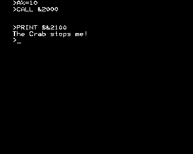

# 14/11/2010: Coding Starts

With a bit of free time (child and wife having a nap), it's time to try and warm up skills that haven't been used for over 20 years. I'm writing the message decoding routine in 6502 assembler.



It amazes me how much you remember and how much you forget. Lots of messing around with both indexed and indirect registers; then further messing around with the BeebEm debugger (there are so many ways it ought to be improved) and finally I get a working version, which will take a message number in A% and will then print the decoded string.

Things learnt:

-   INC is not the same as ADC (Zero flag, not Carry dammit)
-   Lines in the BBC BASIC interpreter are tokenised (i.e. don't chose .PRINT as a label)

After a suggestion from Samwise, I decided to move the code I'd written to my PC and continue under the SWIFT IDE. This require a bit of further hacking, and to change the code so it writes the decoded message to a memory location (so I can easily changed the publishing code later).

I also added some basic init code to move and mess around with pointers. It's a small start, but a major one.

The only problem is that if we run it from BASIC I get strange line feeds, and sometimes repeated words of OSCLI. I'm not too worried about this as the final code won't be run from BASIC, but I'm curious as why there any output at all (is it my zero page locations)?

## Comments
