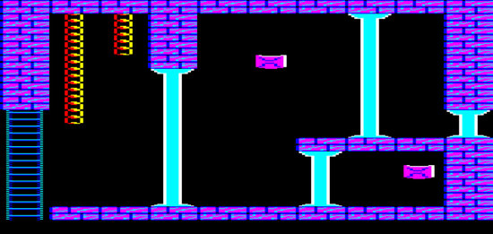
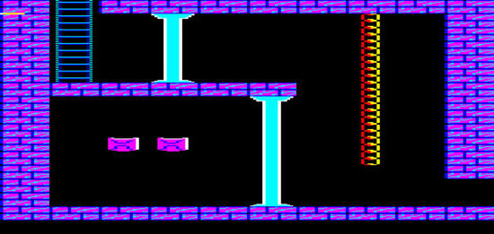
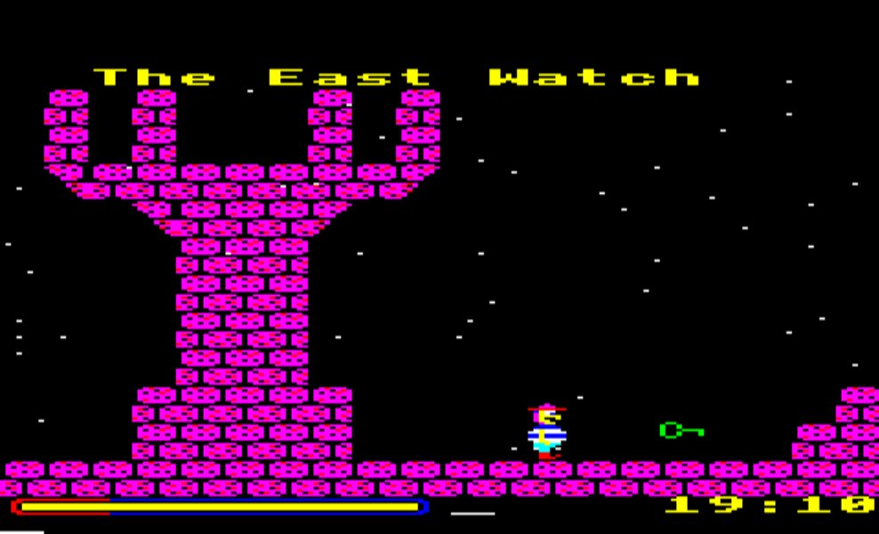

# The Two Towers (Working Title) by James Watson

### Licence

Software licence TBC

### Introduction

Expected Features:

-   a loading screen
-   a 230 screen single-load, MODE 2 *Citadel*-type Arcade Adventure game
-   screen map and game editor
-   game editor can name each individual screen when designed
-   each screen is made up of 20\*11 blocks (220 blocks per screen)
-   character looks very similar to the chap out of magic mushrooms
-   character can climb ladders and go behind certain objects!
-   objects, such as lifts and other game characters, some moving, made of sprite blocks
-   possible to pick-up up to 3 objects at once and use them on other screens (i.e. unlocking doors)
-   possible to drop an object at any clear position on any screen
-   a white selector bar for use when carrying and using objects
-   energy bar (not lives), which depletes when falling from a high level
-   a timer to complete the game (maybe up to an hour)
-   time & energy capsules can be collected and used to increase the game time limit and player energy. These capsules can be placed on any position in any screen.
-   pause function
-   Escape to quit and restart. When the game quits, all variables are reset to their default state.

Game Editor:
Basically each screen is made up of 220 blocks (11\*20). Each bit in a byte represents 1 block, so each screen requires 28 bytes. But with only one block type per screen. Then I’m allowing another 9 btyes for each screen for various things, I.e block sets and pallet colour switching, screen flipping etc. Basically I will design each screen using a single base block then hopefully ‘grow’ the rest of the screen using random techniques to place ladders, corner tiles ropes etc. Then place keys and locks and moving platforms in after. The screenshots below were created like this. If I don’t get good results I will go back to a standard two blocks per byte.
Offers of Help:
During the later stages, would anybody like to design a loading screen and game music/sounds?

[Discuss The Two Towers](http://www.retrosoftware.co.uk/forum/viewforum.php?f=5)

### Downloads

***The Two Towers***
Not released yet.
http://www.retrosoftware.co.uk/???

### Sample Screenshots

{{\#ev:youtube|Mexfyc6qZ1w}}
*Posted: Tue Jan 01, 2008 11:46 pm*

*Posted: Mon Dec 31, 2007 2:08 pm*

*Posted: Mon Dec 31, 2007 2:08 pm*

*Posted: Mon Dec 31, 2007 2:08 pm*
{{\#ev:youtube|jpHn8\_0fUbo}}
*Posted: Thu Dec 27, 2007 1:39 pm*
{{\#ev:youtube|V3gQCE5TtRU}}
*Posted: Sat Dec 22, 2007 11:31 pm*

### Weekly Diary

Not released yet

### Change Log

Not released yet
