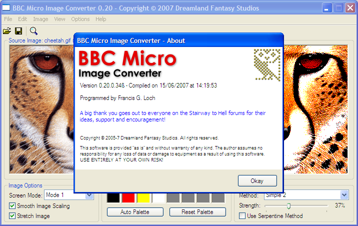
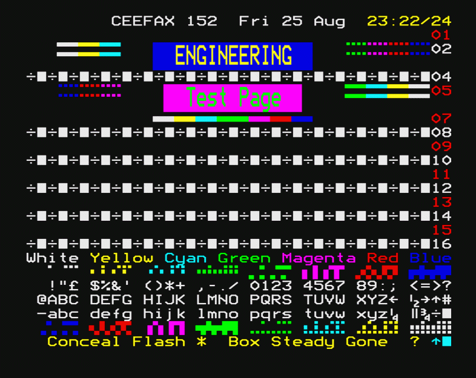
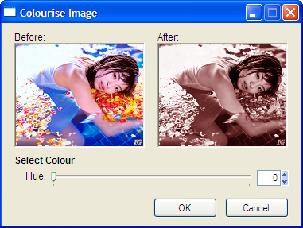
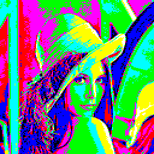

# Image2BBC (previously BBC Micro Image Converter)

### Licence

This software is copyrighted [freeware](http://en.wikipedia.org/wiki/Freeware) and can be used for commercial or non-commercial purposes.

### Introduction

BBC Micro Image Converter was originally developed as a tool for converting images from the BBC Micro screen dump format to BMP format. After the release of BBC Micro Image Converter there was some interest from people for a tool that could convert in the other direction, i.e. from modern image formats to the BBC Micro.

Image2BBC (originally entitled Img2BBC) was developed initially as a plug-in module for BBC Micro Image Converter, but soon became its own entity as its feature set grew.

As of version 0.20 the two programs are now being amalgamated together, although much work still needs to be done for them to be integrated properly.

[Discuss BBC Micro Image Converter](http://www.retrosoftware.co.uk/forum/viewforum.php?f=27)

[Report Issue / Feature Request](http://www.retrosoftware.co.uk/mantis/bug_report_page.php)

Electron User Group Review of Image2BBC 0.7: <http://www.acornelectron.co.uk/eug/revs/dreamland/Image2BBC_000.html>

### Downloads

**_Image2BBC: ImportTTX 3.1_** Part of the next version of _Image2BBC_, _ImportTTX_ allows the conversion of BBC Micro Mode 7 screens to BMP, JPG and PNG images.

Sun June 8, 2014 9:32 pm: <http://www.dfstudios.co.uk/?dl_id=36>

**_BBC Micro Image Converter for Windows 0.20 beta_**

Latest "unofficial" release. See change log below.

Fri Jun 15, 2007 1:42 pm: <http://www.dfstudios.co.uk/?dl_id=5> ([local mirror](../../retrosoftwarecouk_wiki-20160918-wikidump/images/Image2BBC.zip "wikilink"))

**_BBC Micro Image Converter for Windows 0.7.7.2 beta_**

Last official release. Only converts from BBC Micro screen dumps to BMP.

Thu Dec 29, 2005 11:46 am: <http://www.dfstudios.co.uk/?dl_id=4> ([local mirror](../../retrosoftwarecouk_wiki-20160918-wikidump/images/BBCmicroimageconverter.zip "wikilink"))

**_Slideshow DFS disc images_** Based on images that have been converted using early, pre-0.8, releases of Image2BBC converter.

Sat Feb 10, 2007 9:11 pm: <http://www.dfstudios.co.uk/?dl_id=2> ([local mirror](../../retrosoftwarecouk_wiki-20160918-wikidump/images/Converted images.zip "wikilink"))

Fri Jan 05, 2007 9:30 am: <http://www.dfstudios.co.uk/?dl_id=3> ([local mirror](../../retrosoftwarecouk_wiki-20160918-wikidump/images/Gallery.zip "wikilink"))

Just load either of the disc images into your favourite emulator and press Shift-Break to run it.

### Sample Images

Some examples of images that have been converted from modern formats to BBC screen dumps using BBC Micro Image Converter:

 

 

### Change Log

_BBC Micro Image Converter 0.20 Fri Jun 15, 2007 1:42 pm_

Activated the import BBC screen function, although this is presently unfinished. Renamed to BBC Micro Image Converter to reflect the BBC to image conversion functionality and future Mode 7 'teletext' conversion functionality. Reorganised the menus a bit. Added solarise function.

The import BBC screen function is still very buggy, primarily due to the limitations of the current GUI (the new one isn't ready yet!). To import an image you will need to set the screen mode to what you want first, then the image will be imported at that screen mode. From there you can treat the image more-or-less as normal.

_Image2BBC 0.14 Thu May 31, 2007 3:36 pm_

Added a QVGA (320 x 240) resolution option and two more dithering options. Reclassified Image2BBC as a beta release since it has been publicly available for some time now.

_Image2BBC 0.13.2 Thu Mar 22, 2007 12:41 am_

Minor bug fix (error in PPM loader).

_Image2BBC 0.13.1 Wed Mar 21, 2007 3:29 pm_

Added support for Amiga image formats (\*.iff, \*.ilbm and \*.lbm), Windows cursor images (\*.cur) and PPM files (currently untested). Minor bug fix in the new image loaders

_Image2BBC 0.13 Wed Mar 21, 2007 12:50 am_

Added support for GIF, WMF, EMF and ICO image formats (EMF currently untested as I don't have any images in this format). Extended the image file format filter to include .rle, .upi, .jfif and .jpe extensions. Added the Shiau-Fan dithering method and a modified version of it. Added some additional error checking. Fixed some bugs.

_Image2BBC 0.12 Fri Mar 16, 2007 4:08 pm_

Started rewriting parts of the code to allow for easier porting to other platforms. Completely rewritten dithering routines resulting in a reduction in executable size. Added the false version of the 'Floyd-Steinberg' dithering algorithm. Modularised the code resulting in a further reduction in executable size. Made some improvements to the histogram function. Made some general improvements and enhancements. Bug fixed a possible division by zero error in the Auto-Process Level routine.

_Image2BBC 0.11 Sun Mar 04, 2007 11:22 pm_

Added brightness, contrast and gamma controls. Also added a histogram function. Some changes made to the user interface (e.g. changing of 'Retain Aspect Ratio' to 'Stretch Image'). A few 'under the bonnet' refinements were also made.

Note that in the 'Brightness and Contrast' window I have not got around to putting in the individual RGB channels yet. The only option at present is the adjustment of all the channels simultaneously.

_Image2BBC 0.10 Sun Feb 25, 2007 8:30 pm_

Added auto-process image function which can help to lighten and darken images and can improve the colour as well. Also added image flip/rotate, colour inversion and convert to greyscale functions. Some optimisations were made to some of the dither routines. Removed the second auto-palette function in preparation of a newer improved routine. Lots of sections of the code have been rewritten and lots of bug fixes have been made.

There have also been some modifications done to the GUI in preparation for new features such as 'Brightness and Contrast...' and 'Show Histrogram' under the 'Image' menu, but these are currently ghosted out.

_Image2BBC 0.9.1 Fri Feb 23, 2007 9:02 pm_

Fixed the bug in the new image handling routines. The conversions are now completed in lightning quick time! New engine uses direct memory access to the images which is many times faster rather than working on them using standard image routines. For even the most complex conversion it is almost instantaneous rather than upto just over 6.5 seconds on my system for the previous routines.

_Image2BBC 0.9 Thu Feb 22, 2007 10:24 pm_

Added a basic toolbar and option to use NTSC screen resolutions (i.e. a vertical resolution of 200 pixels instead of 256). Converted images can now also be previewed at full screen. Facility to save converted images as BMPs, JPEGs or PNGs in addition to BBC screen dumps. Some more optimisations and general improvements in stability.

The image handling routines have been completely rewritten so that they are a lot faster than previous versions. Unfortunately there is a bug in them somewhere that mucks up the dithering algorithms so the new routines have been left deactivated for now.

_Image2BBC 0.8.7 Wed Feb 21, 2007 1:37 pm_

Fixed a couple of bugs that were introduced during the last update. Removed some redundant code.

_Image2BBC 0.8.6 Wed Feb 21, 2007 12:24 pm_

The bug with large images has now been fixed.

_Image2BBC 0.8.5 Wed Feb 21, 2007 11:46 am_

The bug with the loading large images on some systems is still present. Made some changes to try and fix this.

_Image2BBC 0.8.4 Wed Feb 21, 2007 10:47 am_

Changed the behaviour of the zoomed preview so that you can click on the image to close the window. Also made some changes to try and fix a bug that causes large images to fail on some systems.

_Image2BBC 0.8.3 Tue Feb 20, 2007 6:42 pm_

Added drag 'n' drop capability. Just drag the icon of a supported image file onto the Image2BBC window and it should load automatically.

_Image2BBC 0.8.2 Tue Feb 20, 2007 1:25 pm_

The screen resolution is now displayed above the converted image preview. Made some optimisations so that the converter is now 4-5 times faster than before! Some other minor changes made.

_Image2BBC 0.8.1 Sat Feb 17, 2007 6:54 pm_

Fixed a minor bug.

_Image2BBC 0.8 Thu Feb 15, 2007 10:45 pm_

New features include new dithering algorithms, dithering by serpentine method, zoomed preview (useful for displaying Mode 0 conversions properly) and optional aspect ratio correction. In addition to these there have also been a lot of "under the bonnet" improvements and optimisations including a better conversion engine. There have also been a number of bug fixes.

_Image2BBC 0.7.1 Sat Feb 10, 2007 4:48 pm_

The only change in this version is that it now creates .inf files when an image is saved for use by programs such as BBC Explorer.

_Image2BBC 0.7 Fri Feb 09, 2007 3:02 pm_

User can now select their own palette and have the choice of two auto-palette routines. Added an option to enable/disable the smoothing of scaled images. Before this was on by default, but some images (e.g. screenshots of PC games with CGA graphics) look better with this off.

_Image2BBC 0.6 Sun Jan 14, 2007 3:21 am_

First "unofficial" alpha release to the public. Added a graphical user interface, although not fully functional yet. There are also a number of things such as another method of the auto-palette routine that are not currently accessible via the current GUI.

_Image2BBC 0.5 (Unreleased) Fri Jan 12, 2007 8:27 pm_

Started to convert Image2BBC to work as a stand-alone product rather than as a plug-in module for BBC Micro Image Converter.

_Image2BBC 0.4 (Unreleased) Mon Jan 08, 2007 11:38 am_

Added some more dithering algorithms.

_Image2BBC 0.3 (Unreleased) Tue Jan 02, 2007 6:49 pm_

Some refinements made to the conversion algorithm so that the resulting images look a bit better.

_Image2BBC 0.2 (Unreleased) Mon Jan 01, 2007 2:40 pm_

Got the dithering (Floyd-Steinberg only at the moment) working.

_Image2BBC 0.1 (Unreleased) Sun Dec 31, 2006 5:44 pm_

Initial version intended as a plug-in module to BBC Micro Image Converter which was mainly an experiment to test the image conversion process. Does not yet do any dithering or saving as a BBC file.

_BBC Micro Image Converter 0.7.7.2 Thu Dec 29, 2005 11:46 am_

First public beta release.

### Diary

_12th April 2015_

The base libraries have now been tested under the 32-bit and 64-bit versions of Windows, Linux and MacOS. A number of optimisations have been made and a few bugs highlighted during testing have now been fixed.

_9th April 2015_

There have been more refinements to the FastImage library, Mode 7 converter and image processing library. Also fixed a minor bug in the image processing library. The routines for loading and saving BBC screen dumps have now been completely rewritten for the new libraries.

_5th April 2015_

Thanks to feedback I have received, the Mode 7 font has been amended for accuracy. Along with a number of improvements in the Mode 7 import code, the converter now also recognises the flash and conceal teletext control codes:

_2nd April 2015_

I've been spending quite a bit of time working on the Mode 7 import function of _Image2BBC_, and I've finally got it working with the Ceefax engineering test page.

_29th March 2015_

The code for the image processing functions have now been tidied up and optimised (e.g. the dithering functions are now ~10% faster). New functionality was added to the FastImage library to simplify some of the image processing routines further.

_23rd March 2015_

All of the image processing functions are now working under the new FastImage library. All that is left with the image processing functions is to tidy up the code and optimise where possible.

_22nd March 2015_

The FastImage library has been updated and is now hopefully complete, although it still needs to be fully tested on Linux and Mac platforms. The library to import teletext screen dumps has been updated for the new FastImage library and is now also easier to work with from a programming point-of-view. Approximately half of the image processing functions have been updated for the new FastImage library, but this is proving to be a big job due to the major differences in the way the original FastImage library worked compared with the current one.

**UPDATE:** Over 90% of the image processing functions are now working under the new FastImage library, although some tidying up and optimisation of the code still needs to be done.

_8th June 2014_

Work on redesigning the user interface has started. The design will be much simpler and more modular in comparison with my previous one which ultimately became quite complex and difficult to manage. Also, the Mode 7 import routine has been rewritten to work with the new version of the FastImage library and has been released as the standalone _ImportTTX_ software.

_1st June 2014_

The last of the Windows specific code has now been replaced with code that is cross-platform compatible. More of the image processing functions have been updated. Some redundant code has been removed and some more optimisations have been done.

_13th May 2014_

Work is still continuing to improve cross-platform compatibility. More of the image processing functions have been rewritten and better optimised, but there is still a lot of work to do yet.

_3rd May 2014_

The image libraries have been reworked so that they now work under 64-bit OSes (tested on 64-bit Windows, Linux and MacOS X).

_30th April 2014_

I started porting _Image2BBC_ over to 64-bit Linux only to discover that I have a HUGE crash-inducing bug in my image libraries when compiled for this processor architecture. I will need to look over all the code again and fix this issue.

_26th April 2014_

A large portion of the image processing component of Image2BBC has been completely rewritten. The majority of effects can now be passed through a single subroutine rather than numerous individual subroutines making the code smaller, easier to maintain and easier to add new effects.

_17th April 2014_

After a long hiatus, I have decided to continue development of Image2BBC (as it will now officially be known). I am currently doing a review of the code and redesigning sections of it primarily for better flexibility and maintainability. So far I have completed the review, update and documentation of my FastImage library (the base library for my image processing functions).

_27th November 2009_

Just a quick update on what is happening. Apart from some minor tidying up of the code and a few bug fixes very little progress has been made recently due to various circumstances (family commitments, workload, holidays, etc.). I've also been struggling somewhat with the GUI design with my current approach as some sections are ending up far more complicated than I would like. I may need to scrap the current GUI design and start again. I'm also starting to look at multi-lingual support so the start from scratch may not be a bad idea in this respect.

_24th September 2009_

Minor bug fix made to the adjust image gamma routine as the individual RGB gamma values were not being validated first.

_19th July 2009_

Added a workaround to fix a reported bug when dealing with monochrome BMP files. A problem could arise where the monochrome image would have incorrect colours, e.g. black and green instead of black and white.

_16th July 2009_

Optimisations made to the invert and solarise image functions.

_30th June 2009_

Fixed a bug in the colour reduction routine that was attempting to access the image data before it had been validated. If the image data was invalid the program would crash. Also made a minor optimisation to the colour reduction routine.

_4th June 2009_

The importing of BBC screens part of the program is nearing completion. Below is a snapshot of the current version showing the conversion of a Mode 7 or teletext screen.

The GUI will still need to be checked out under Linux and MacOS and any layout issues fixed.

_30th May 2009_

Tested the current version of the code under the Windows 7 release candidate. Everything appears to be working as expected without any further modification to the code.

_29th May 2009_

Very minor bug fix made to the colourised greyscale routine in the 'image processing' component.

_25th May 2009_

Another improved method of colour reduction has been added, so the user now has a choice of three different methods. Minor bug fix made to the dithering routines when the dithering method was set to 'None'. Tidied up the new colour reduction routines a bit and removed some redundant code although further optimisations will still need to be done. Very minor bug fix made to the 'find the nearest colour' routine in the 'image processing' component.

**UPDATE:** The colour reduction routines have now been optimised.

_22nd May 2009_

Added rewritten colour reduction routines to the 'image processing' component. These are the routines that would automatically select a BBC palette based on the source image, i.e. the 'Auto Palette' function. This rewrite makes it easier to add in additional methods of colour reduction.

**UPDATE:** An improved method of colour reduction has been added. The original method still remains available for use.

_31st March 2009_

Work on the image converter had stopped at the start of the year due to some personal and family problems, but things are now moving again. The code has been updated to compile under the latest version of PureBasic since a few things changed when 64-bit support was added. Some refinements have also been made to the BCS image format and a number of points clarified in the supporting BCS developer documentation.

_4th November 2008_

Added an 'equalise image histogram' function to the 'image processing' component.

_3rd November 2008_

Fixed a long-standing bug in the file save routine that could cause a filename such as 'image.png.png' to be generated.

_31st October 2008_

Fixed a bug in the full screen preview routine that would scale an image incorrectly on monitors that did not have a 4:3 aspect ratio.

_27th October 2008_

Added a 'tint image' function to the 'image processing' component.

_24th October 2008_

Done a quick port of the latest code to Linux fixing a couple of issues along the way. Just to show that there is progress being made on the Linux version there is a screenshot below of the 'colourise image' function along with the current Windows version for comparison. There are some minor layout issues that still need to be addressed in the Linux version.

 

**UPDATE:** Also done a quick port to MacOS. Again, as with the Linux version, there are some minor issues with the layout that will need to be fixed:

_23rd October 2008_

Rewrote the algorithm for the 'colourise image' function. Now the saturation and luminance can also be adjusted in addition to the hue. Tidied up and optimised the code for the 'adjust image hue', 'colourise image' and supporting RGB&lt;-&gt;HSL/HSV converters.

_22nd October 2008_

Added a 'colourise image' function to the 'image processing' component. As with the 'adjust image hue' it still needs a bit of refinement. Here is an example of the 'colourise image' functionality:

_21st October 2008_

Added an 'adjust image hue' function to the 'image processing' component, although it needs a little bit of refinement.

_20th October 2008_

Redesigned the posterise image algorithm in the 'image processing' component to be faster and more flexible than the previous one.

_18th October 2008_

Updated the scroll image function so that it can optionally wrap the image. Fixed a bug in the scroll image function that would occur if one of the scroll offsets was larger than the actual image.

_17th October 2008_

Added crop image and scroll image functions to the 'image processing' component. Also renamed the reduce image depth function to posterise image.

_16th October 2008_

Work has started on the redesign of the GUI which is being done completely from scratch.

_3rd October 2008_

After a hiatus from programming I returned to working on my image converter a couple of weeks ago. I've developed a custom screen storage format for the BBC called the BCS (BBC Compressed Screen) image format. The BCS format compresses the screens and also allows storage of the mode and palette used. Although BCS is in a working state there are still some refinements and additions to be made to the format.

_17th July 2008_

Minor bugfix made to the 'fast image' component.

_14th July 2008_

The 'import teletext' component has been tested to be working under Linux without any further modification to the code.

_13th July 2008_

Work on adapting the code for Linux has started. The 'fast image' component has been updated to work under Linux. So far all the image processing routines that I have tried (e.g. dithering of images, gamma correction and edge enhancement) appear to work as expected without any further modification to the code.

_9th July 2008_

All of the dithering functions have now been incorporated into the 'image processing' component. Added the ability to adjust the individual RGB channels to the adjust brightness, contrast and gamma routines. Added a reduce image depth function to the 'image processing' component. Fixed a possible division by zero error in the adjust gamma routine.

_6th July 2008_

Added the facility of compacting files on a disc image (i.e. the equivalent of the BBC's \*COMPACT command) to the repertoire of the disc image functions.

_4th July 2008_

Added the facility of creating blank BBC disc images to the disc image routines. This will be useful later on once the 'save file to disc image' functionality is added. Also fixed a bug in the routines for obtaining the disc info.

_3rd July 2008_

Fixed a bug with the edge enhancement routine that would leave unwanted borders around some images. The edge enhancement routines have also been further optimised for an increase in speed.

_2nd July 2008_

Added edge enhancement routines to the 'image processing' component. As an example of this new feature take the following images:

  

The image on the left is the original image, with the one in the middle being the image converted to Mode 4 without edge enhancement and the one on the right with edge enhancement. There is still some fine-tuning of the algorithm to be done and it still needs to be optimised.

Also made a minor improvement to the simple error diffusion dithering method.

**UPDATE:** The edge enhancement routines are now completed and optimised. Added an option to get just the outline of an image, an example of which is below.

_1st July 2008_

Made a number of optimisations to the BBC disc image handling routines.

_30th June 2008_

Updated the 'import teletext' component to enable easier handling of files loaded from BBC Micro disc images. Also fixed a minor bug if the size of the teletext screen dump was less than the full size of the screen.

_29th June 2008_

Added the facility to load files straight from a BBC Micro disc image, although this is still a work in progress. Eventually saving directly to a disc image will be incorporated eliminating the need for other tools for copying files to and from BBC Micro disc images.

_27th June 2008_

Fixed a bug in the 'fast image' component that caused image corruption on Windows 98 systems. Added held graphics functionality to the 'import teletext' component.

_26th June 2008_

Added double height text functionality to the 'import teletext' component, made a number of optimisations and fixed a few bugs. There are two modes for the import teletext function which are low resolution and high resolution. An example of the import teletext function in both modes is below:

_25th June 2008_

Completed rewriting the 'import teletext' component for better consistency and easier maintainability. It is still missing some functionality however.

_24th June 2008_

Fixed a bug in the 'fast image' component that could cause the program to fail when processing images with an alpha channel.

_21st June 2008_

Fixed a small bug in the new dithering algorithm when used with the Atkinson dithering method.

_20th June 2008_

The dithering algorithm has been updated to produce greatly improved images, especially at the higher dithering strengths. As an example the picture of the baboon below in the middle is the original image with the one on the left being the original dithering algorithm and the one on the right being the new algorithm.

  

As you can see the image produced by the new algorithm is much more faithful to the original with the original algorithm producing a more "washed out" effect. The dithering settings used in both cases for these were Stucki at 100% dither strength with serpentine dithering on. The output image settings were set to Mode 1 using black, red, green and cyan.

_19th June 2008_

Completed rewriting the 'dither image' component. Like the previously mentioned components, the source code has been rewritten to be more consistent throughout and easier to maintain. The Bayer method of dithering has been added. Improvements have been made to the error handling/checking.

_18th June 2008_

Completed rewriting the 'fast image' (custom image drawing routines) and 'image processing' components. The source code of these components have been rewritten to be consistent throughout and easier to maintain. Everything has been optimised for improved speed, memory efficiency and executable size. The image processing routines are now more robust with additional error checking/handling, better recovery handling and cleaner exiting of functions (e.g. freeing up memory that is no longer required) if things do go wrong. Further bugs that have been found have been removed.

_16th June 2008_

I thought that I would start keeping a diary on this project, especially since I've been working on it pretty heavily over the past couple of weeks.

The program is currently being rewritten almost from the ground up to make the code more streamline. There have been a huge number of bugs discovered in the process and removed. Lots of optimisations have also been done. Some of the functions (e.g. image processing) have been made more flexible by the addition of more options.

Added a new option to convert images to a colourised 'greyscale' allowing greyscale images to be displayed on black and white displays, an example of which is below. The image on the left is the colourised 'greyscale' image and the image on the right is how it would appear on a black and white display.

 
