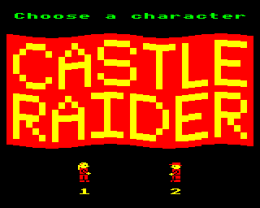
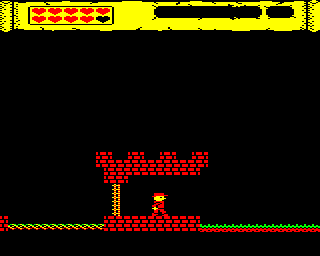

## Castle Raider Development Diary

### Part 3

**_by David Boddie_**

See the main [Castle Raider](Castle_Raider "wikilink") page for information about the game itself.

I've split the diary into separate parts. See [Part 1](Castle_Raider/DevelopmentDiary "wikilink") and [Part 2](Castle_Raider/DevelopmentDiary/Part2 "wikilink") for earlier entries. See [Part 4](Castle_Raider/DevelopmentDiary/Part4 "wikilink") for later ones.

An overview of some of the development issues can be found on the [Thoughts](Castle_Raider/DevelopmentDiary/Thoughts "wikilink") page.

#### Just Out of Sight (2014-02-06)

To get back into development, I picked what I considered to be the easiest item on the "to do" list: the bug involving monsters moving through scenery when just off-screen. Conceptually, the solution is easy: just check the spans of tiles the monster is trying to move through. However, the data structures are really oriented around putting things on the screen, starting with the left edge; we aren't usually concerned with what happens beyond that edge. The implementation of the solution involves measuring the x coordinate of the monster relative to the "previous" span that starts off-screen before the "current" span. If the updated x coordinate becomes positive when adjusted like this, we can say that we have found the span the monster wants to move into. If it is still negative, we check the previous span in the list, and so on. For the purposes of this routine, negative coordinates are anything in the range from 128 to 255.

Monsters don't seem to sneak through ceilings and floors now, but vigilance is still required. At least I'll know which part of the code is broken if they escape again!

Meanwhile, I'm once again considering what features the game needs. However, this time I'm thinking about removing features. In particular, the breakable tile feature is nice, and doesn't involve all _that_ much code, but storing the individual tiles in the level data is expensive for what you get, and I don't really like the idea of modifying the level data itself during the game. I'm not ripping the code out right away, but it's going on the "nice to have" list of features that will have to go when I run out of memory.

#### Still Out of Sight (2014-02-22)

The previous fix for monsters sneaking past ceiling and floors didn't work. Horizontally moving monsters flaunted their ability to move into and past scenery when skulking around off the left-hand edge of the screen. The flaw in the algorithm was my usual forgetfulness when it comes to preserving the accumulator - one of the downsides of working with a processor with only three useful registers and at the assembly level. Hopefully, the last change fixes this by simply storing the span-relative coordinate while doing things like updating the pointer to data (which obviously "corrupts" the accumulator).

I took the opportunity to expand the range of x coordinates that the monsters can occupy so that the player can't just "lose" monsters by making them go off-screen. This may yet cause problems if there are monsters with overlapping horizontal ranges, and may also reduce the number of monsters that will be seen together in high density areas if other monsters have already been placed. There is, after all, a limited number of monsters that can be active at any given time.

Since I recently added support for palette changing on the Beeb, I've created a new demo to show the current state of the game: [CastleRaider-demo4.zip](../../retrosoftwarecouk_wiki-20160918-wikidump/images/CastleRaider-demo4.zip "wikilink").

#### Making Things Coherent (2014-03-01)

I started to organise the levels into something more than a few disconnected locations. I'm quite happy with the layouts of some of them: the dungeons and caves, for example. However, others were really trying too hard to fit the name and theme of the game at the expense of gameplay, so they were either deleted or revised. No doubt I'll revisit the levels later and change my mind over some of the decisions I've made.

#### There You Are (2014-03-06)

When the game begins, the player's character is alone and they only encounter monsters as they scroll onto the screen. This was the result of a limitation in the way monsters are created that is linked to the way they are stored alongside the map data. In principle, it should have been possible to show the monsters that should appear on the initial screen by simply examining the monster spans that lie on the current screen, but it seemed like a lot of effort. However, when the character enters and leaves portals, any monsters that should have been there are obviously missing. This meant that a routine had to be written to handle that case. As an aside, it should only have been necessary to write a routine that shows the monsters on the initial screen in the game since we should be able to track all the monsters' comings and goings as we scroll about the level (which is all entering portals does) but, for some reason, the scrolling routines fail to do this correctly when navigating between portals.

Anyway, I wrote a routine to show the monsters at the current location, taking into account that the monster spans are displaced left from the map spans by two columns. Initial testing has been mixed: it generally works well but, sometimes, returning to a location where a monster can appear when the monster has already been created causes another to appear, which probably means that I'm not filling the visible monster table correctly. I'll be fixing that next.

#### Marauding Monsters (2014-03-16)

There was much tweaking of visible monster offsets as I tried to find a way to marshal monsters onto the screen while monitoring them as they went out of range, but there was always either a problem with missing monsters or duplicates, created because the current visible offset happened to be pointing to an empty slot when it was time to scroll a new monster onto the screen. In the end, I did what I knew needed to be done: I added an extra field to the visible monster array that records the corresponding index into the monster data. This means that we now track which monsters in the map data have been created and avoid creating them twice. This appears to work reasonably well.

| |

|-------------------------------------------------------------------------------------------------|

|  |

| **Who are you? The character selection screen in the loader.** |

While this was going on, I started to tighten the focus of the game, removing unnecessary features, fixing minor issues and adding some user friendly niceties, like the character selection screen. The game itself won't have the space for both sets of character sprites, so the player will have to make a choice before the game is loaded.

| |

|---------------------------------------------------------------------------------------------------------------------------------|

|  |

| **Dodging monsters in a tricky descent. I'm fairly happy with the levels, but some further improvements will doubtless occur.** |

I also tried to get the levels closer to their final state, putting keys and doors in appropriate places. Although the game could support quite a few collectable objects, we're not going to use so many, so I cut it down to a minimal five keys and two items of treasure. I've been play-testing the levels and not hating them, so maybe I'm lining up to start on the last set of features. These will include visual feedback on the number of "lives" the player has left, sound effects and a minimal title screen.

#### Counting Down (2014-03-18)

Although we are already keeping track of the number of lives the character has left, we didn't show anything in the top panel. Implementing something for that was easy but required a bit of housekeeping first. Using common routines and routine exit points saved a bit of memory, but it was a struggle to find bytes here and there. If we want to add anything more to the game then more space saving measures will need to be taken.

| |

|------------------------------------------------------------------------------------------------------------------------|

|  |

| **The panel now shows the number of lives left.** |

#### Spending Time to Save Memory (2014-03-21)

With little free memory left, I started to investigate ways to put data in the screen memory in a way that was not distracting before giving up and trying more conventional ways to save memory. The idea was to put code in memory, but only use the bottom four bits of each byte. This would require twice the amount of memory for each piece of code, but would ensure that only red and black pixels would be shown. After trying to write a routine to unpack code stored this way and execute it, I gave up.

Instead, I looked at the zero page memory map in issue 2 of the Advanced User Guide and decided to repurpose the Econet and filing system workspaces for some global variables. As a result, many operations became shorter by a byte each, saving about 150 bytes in total. With this windfall, it was possible to implement basic joystick support and a simple title screen. There is some space left, but perhaps not enough to implement everything we still need. We'll see how it goes.

Some additional savings were made by finding duplicate data structures and writing code to use shared structures instead. It may be the case that some of the lookup tables still contain features like this.

#### Titles, Collisions and Deoptimisations (2014-03-22)

Not being a hardcore 6502 hacker, I often write code that's a bit too verbose, clearing flags a lot and not taking advantage of the flag setting features of the various instructions. I realised while reading the [NMOS 6502 Opcodes](http://6502.org/tutorials/6502opcodes.html) tutorial/summary that I could discard a lot of comparison instructions in the code, and especially those that are comparing the accumulator with zero (CMP \#0). I went through the code discarding as many of these as I could find and saved even more memory. I also found comparisons where the value could be zero and optimised many of these away, too. Unfortunately, there were side effects to this - some of the LDA <value> BEQ <target> sequences that resulted from this didn't behave in quite the way I expected, so some reversions were necessary.

Using the memory saved from code simplification, I implemented a simple title screen for the main game so that it doesn't immediately start when it loads. At the moment, it's just showing some text and waiting for the Space bar or a fire button to be pressed to start the game.

The collision checks between the main character and monsters have also been a bit fuzzy. While reverting a change to comparison instructions, I realised that I was not comparing the character and monsters' vertical and horizontal positions with half row or half column resolution. That has now hopefully been fixed, making it slightly harder to duck past monsters at various places.

#### A Musical Interlude (2014-03-30)

I started to think about providing some nice music in either the loader or the end of game sequence. The Electron isn't well blessed with musical capabilities, though there are some [impressive compositions](http://stardot.org.uk/forums/viewtopic.php?f=1&t=7996&sid=47a3dafce733e9a15203706c804e90fa) given its limitations. I've experimented a bit with direct ULA access to try and achieve some nice effects, but the results aren't impressive and I was a bit disappointed.

Coming back to the game itself, I've added some simple sound effects and pause/unpause key support. The game also waits when the character dies to break up the gameplay a bit. Since the game now makes noises, I also added support for turning sound off and on.

Meanwhile, the fight to reclaim memory continues. I started the day with about 173 bytes free and finished with 36, and that's only after some work to reduce code duplication.

#### Name of the Game (2014-04-05)

On reading the Electron Advanced User Guide (version 2), I discovered that various low memory pages can be used, hopefully without bad side effects. This means that various working data structures can be located there, saving memory in the higher pages for program code. In addition, we can perform the usual tricks of loading data in the loader program and copying it into the working area as long as we don't locate the working area in the cassette buffer (page A). The current approach is to use the pages containing soft key definitions and user defined characters (pages B and C). We need to avoid page D because that's used by the Plus 1 on the Electron, and we support analogue joysticks plugged into the Plus 1.

| |

|--------------------------------------------------------------------------------|

|  |

| **The in-game title screen.** |

I initially wanted to create a title screen that used normal level data so that I could reuse existing code to display it, and maybe even scroll it around. However, my design couldn't be stored efficiently using the level data structures, so I resorted to writing a new routine to display it. This retrieves the data stored in the working area, unpacking bytes as groups of four tiles and reusing the tile plotting routine for bank 2 to display them on the screen. The title text, having been copied into the working area immediately after the title data, is pulled out and fed to the VDU system for printing.

#### Disks and Demos (2014-04-24)

Before the Easter break, I started to focus on getting a demo together for the Wakefield show. Ideally, if someone wants to load up a demo on a real machine, they'll need something other than a UEF file, so I started looking at disk images again. Previously, when I created disk images for Jungle Journey, I created them by hand, loading files from UEF files in an emulator and saving them to pre-existing disk images. Since I don't want to do this for Castle Raider, I wanted a way to automate this process. As a result, I took some code from my ADFSlib Python module and started to create a single-purpose solution for creating images. However, after managing to create an ADFS image, I realised that the game won't run from a regular ADFS file system because PAGE is too high. A temporary solution is to create a DFS image that runs under from a PAGE E00 DFS file system and make people use DFS instead!

The disk image [is available here](../../retrosoftwarecouk_wiki-20160918-wikidump/images/CastleRaider-demo-Wakefield-2014.ssd.zip "wikilink"). If anyone wants to try it out on a real or emulated Electron then please feel free to do so. It won't work on a BBC Micro because the bank switching code is machine specific. When I get closer to finishing the game, I'll create versions for the BBC and Electron for people to try.

#### Feedback (2014-05-11)

It looks like the recent demo got tested a bit at Wakefield (photos by [BeebMaster](http://www.beebmaster.co.uk/Wakefield2014/Wakefield2014-15.html) and [flibble](http://home.marutan.net/~peter/subsite/photos/misc/20140426/target11.html)) but I haven't yet heard any reactions to the game apart from a brief mention in [a show report on the stardot forums](http://stardot.org.uk/forums/viewtopic.php?f=25&t=7636&start=150#p85477).

In the meantime, my brother played the demo and gave me some useful feedback about various parts of the game, some of which has already been addressed - making some levels more forgiving in places where it's easy to miss a jump. I also need to revisit the dungeon and wasteland levels and make them a bit more balanced. While performing some level tweaks, I realised that I was wasting quite a bit of space by having separate Start and Ending levels in the level data. Since it doesn't really matter if they're separate or not, merging them meant that I could remove some blank tiles from the end of the Start level and start the Ending level with bricks. This freed up a few more bytes that I will spend on further level improvements.

#### Rearranging the Furniture (2014-05-17)

I was quite happy with the final jumping puzzle in the game but felt that it was facing the wrong direction. Since I haven't looked at the game for a while, I thought I'd just fix this and tidy up a few other bits of the map. This led to a reassignment of some of the keys and doors to make it slightly more work to find the key for the castle's exit, but also to make the player re-explore parts of the map.

I also tidied up the BBC Micro-specific code to save a few bytes, making it possible to build tape and disk images for that machine again.

#### Finding the Finishing Point (2014-09-28)

I fired up the game to do some play testing and found that the panel wasn't cleared properly when a new game was started. As usual, the carry flag was the culprit.

The other reason to look at the game again was to try to line up for the last coding effort required to complete development. At this point, all the gameplay is done, the levels are defined and more or less finished, so we're really only looking at niceties like a "game over" screen and a "well done" screen. The first of these just needs code to be written; the second required some preparatory work. In the game, the player wins by reaching a certain point. Although there is a mechanism in the game for checking where the player is on the map, there was no check for a specific finishing point. In fact, there was no defined finishing point to check for. I added a check into the main loop and added some supporting code to the supporting tools for defining a finishing point. After some tests, the game ends when the player reaches a certain point.

The next thing to do is to write some code for the two outcomes.

#### Plugging the Gaps (2014-09-30)

The free space I have left at this point is in the so-called working area in pages B and C. We will have to use what remains of this space to have any chance of including a reasonable ending to the game. To start with, I included some text to print when the player has lost their last life - nothing terribly inspiring - and appended it to the title screen text that already gets copied down into the working area when the game's loader runs. The next thing to do will be to free up some more space in the main game code, so that we can actually call any new code we write, then start to figure out what that code will contain.

#### Mapping Things Out (2014-10-02)

The map drawing utility has been unusable for quite a while, so I decided to take it easy this evening and fix it. There are some issues with deciding which parts of each level should have a given colour because I use portals to give parts of the main level different colours, but that can possibly be fixed later. It might also be useful to cut the main level into pieces automatically.

| |

|------------------------------------------------------------------------------------------------|

|  |

| **A generated piece of the game map.** |

While looking at the build script, I realised that I might have free space in the level data that I could claim for code, and it turned out to be the case. Now the "finished" level data has been assigned just enough space to fit into memory and the free space reassigned to the code area. We'll need to use that to jump into the game completion code located further down in memory.

#### Work in Progress (2014-10-04)

With the idea that the ending sequence code would reside in the working area low in the memory map, I started moving code that would be useful down into the working area, exporting the address of each routine in a list of assembler definitions. Problems occurred with the way that the data was assembled, requiring some pieces to be assembled separately and given their own .org directives to ensure that absolute jumps in the code worked after the code was relocated at run-time.

An annoying corruption problem occurred with the title screen animation that appeared to be caused by the expanding code pushing the data into a place where it was overwritten but I couldn't figure out why it was. Only after giving up on the idea of reusing some of the routines, such as the mode switching code, in the ending sequence did I figure out that the cause was the palette switching code which used a fixed set of memory locations to store temporary values. When I wrote the code, the addresses used seemed high enough up in memory to be safe, but the additional data eventually pushed the end of the code (and title data) up to that point and beyond. Now, we use a block of memory in the working area and the build script checks whether it has been reached.

Having freed up some memory in the main game, and with some free memory in the working area to play with, I tried to see if I could fit two sets of character sprites in memory at the same time. To save space, I wrote a routine to flip one set of sprites so that I would only need to store left-facing sprites for the unused character in the working area. Unfortunately, the routine to do this is about the same size as the space saved by not storing the right-facing sprites, so there is nothing to be gained by this approach. Plus, I would need to move the character selection code into the main game or the working area, and that would take up even more space. It was an interesting diversion, anyway, even if it was a little frustrating.

#### Bringing It All Together (2014-10-07)

I've had some ideas about the ending sequence. So, in an attempt to make room in the main game code, I've moved some more routines into a separate file which now contains all the miscellaneous routines and is loaded by the game loader. I also combined all the sprites into a single file. While doing this, I encountered an interesting data corruption problem in which a number of the shifted sprites had a single byte corrupted. Reloading the data later in the loader fixed this, so I thought there might be a bug in the loader that overwrote the memory occupied by the map tiles, unnoticed previously since they were loaded after the player selects a character.

It turned out that I had forgotten to remove the sprites file from the list of files that have markers generated for them. These markers are used by the interrupt routine that is run while the game loads. The initialisation code for the routine flips the bits in various bytes in memory in preparation for checking them against suitable values later on, and we no longer need to do that for the sprites file because the sprites are now loaded at the start of the loader.

#### Drawing Closer to the End (2014-10-09)

Just a few preparatory steps towards writing the ending sequence this evening, such as making sure that I know how to find screen addresses without writing lots of unnecessary new code by looking in the plotting.oph file for ready made routines. Also, remembering that the coordinate system in the game is slightly different to the system used by the operating system's text plotting routines. Nonetheless, there should be an obvious place to write the code, even if space is running out again.

#### Squeezing It In (2014-10-12)

I've been trying to get my head round what needs to be done for the ending sequence while trying to save every possible byte of remaining memory. I recovered 32 bytes from the sprite area by noticing that it was positioned too low in memory. We discard one of the player sprites in the loader, so keeping 32 bytes of them around was a waste. I also noticed that I was using a lot of unnecessary CLC instructions as usual, so many of those have been dropped. As for the sequence itself, I wasted some time looking for bugs in my code when, all the time, the problem was that OSBYTE 4 (wait for vsync) corrupts various registers.

Having finished the main code for the ending sequence, I'm not really satisfied with it. The effect doesn't look as good as I expected and there isn't really enough memory to make it look nicer. It looks like something simpler is needed.

#### Getting Musical (2014-10-26)

I dug out some old music routines with the thought that I would reuse them and ended up discarding them once I realised I could get the OS routines to do what I wanted. There were initial distractions regarding envelopes that could be used for the notes but, despite liking one of them to start with, I decided to use plain sounds for the music. The envelope I liked was reused for a sound effect elsewhere in the game.

The struggle for memory continues with the usual savings-that-cause-problems. The hints and tips in [this forum thread](http://www.retrosoftware.co.uk/forum/viewtopic.php?f=88&p=6907) turned out to be useful in identifying places where savings were possible, and I speculatively moved common code into subroutines as well, taking the apparently unnoticeable speed hit as a result.

I've done a fairly boring end sequence for now, I think. I'd like to tart it up a bit more but it seems increasingly unlikely that I'll spend the time to do it. If I think of something clever then I might change one or two things, but otherwise it's time to play test the game once more.

Another issue that might also be worth looking at soon is the memory usage on the BBC Micro. Right now, it's not possible to fit the game into memory due to the larger size of the screen handling code for that machine. Optimisations are no doubt possible.

#### Platform Parity (2014-10-27)

Rewriting the code to handle the Beeb's palette and screen banks, plus some general refactoring, reduced the code size enough to allow the Beeb version of the game to squeeze into the available memory. As a result, here's a pre-release version of the game for both platforms: [CastleRaider-prerelease1.zip](../../retrosoftwarecouk_wiki-20160918-wikidump/images/CastleRaider-prerelease1.zip "wikilink"). Note that it plays too quickly on the Beeb, so something will have to be done about that.

#### Up and Down Again (2014-10-28)

One of the nice things about the Electron was that, by the time disk drives became available for it, the controller interfaces featured on-board RAM so that they didn't have to use the system RAM as a workspace. This means that I can assume that PAGE will be at &E00 for both tape and disk systems and that I won't have to avoid the system memory from, say, &E00 to &1900. Unfortunately, the same can't be said for the BBC Micro, where DFS (the most popular for disk systems) uses this memory for filing system workspace, making it a bad idea to overwrite it while loading files from disk. The solution for disk-based games on the Beeb is to load the program into memory above the workspace, switch to the cassette filing system, and copy the game code over the now-unused workspace memory.

I thought I might have to dump the game loader for the Beeb version of the game because I thought that there wouldn't be enough space above &1900 for both the loader and game code. However, it seems that the game code easily fits in the memory between the top of the loader and the start of screen memory. To simplify things, I just made both Beeb and Electron versions of the game load the game code in this gap and copy it down in memory afterwards. Now I can create DFS disk images that should actually work on the Beeb.

I also recovered a few bytes by simplifying some cosmetic details in the caverns level in order to add some delays to the BBC version's bank switching code. This makes the game playable on that machine.

#### Finishing Touches (2014-11-09)

Despite being off work for some days this week, and working from home on others, I didn't really get a chance to fix the remaining problems with music playback that I had found during tests of the disk-based versions of the game. During an unfocused evening at home, I tried to get stuck into development again and fixed a few annoying bugs, but didn't manage to maintain the momentum over the next few days. Today, however, I thought I'd at least try to sort out the music playback and managed to reduce the palette handling code on the Beeb to something sensible. It's now possible to create cassette and disk images for both the Beeb and Electron, so that means it's time to put out another release for play testing: [CastleRaider-prerelease2.zip](../../retrosoftwarecouk_wiki-20160918-wikidump/images/CastleRaider-prerelease2.zip "wikilink") - have fun!

#### Materialism (2014-11-30)

Following [some much appreciated feedback on the second pre-release](http://stardot.org.uk/forums/viewtopic.php?f=1&t=8883), I updated small parts of the game and its instructions to hopefully provide a better guide to playing the game. This culminated in [CastleRaider-prerelease3.zip](Media:CastleRaider-prerelease3.zip "wikilink") which I've yet to announce.

As part of the process to create this pre-release, I started working on the materials to accompany the final release. These will be similar to the ones for [Jungle Journey](Jungle_Journey "wikilink") with perhaps a bit more work on combining the cassette inlay with the cover art, which has yet to be drawn. I've also updated the [Castle Raider](Castle_Raider "wikilink") page with links to the three pre-releases so far and a collection of screenshots.

#### Cover Art (2014-12-06)

I've been focusing on writing basic instructions and doing work on the cassette inlay for the game, which also includes a Micro Power style cover for extra nostalgic value.

| |

|--------------------------------------------------------------------------------------------------------------------------------|

|  |

| **Work in progress cassette box cover for the game.** |

Since I like to do things the hard way, the cover is generated by a script, with fine-tuned coordinates for the illustration painstakingly entered by hand after much experimentation. It's not all done yet - you can tell that from the sparseness of the scene. I'll be finishing this up over the rest of the weekend.
