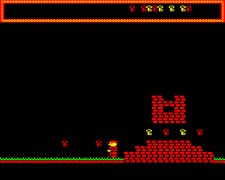
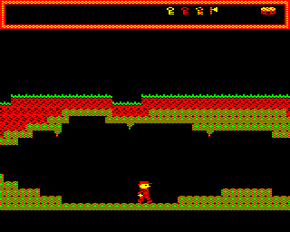
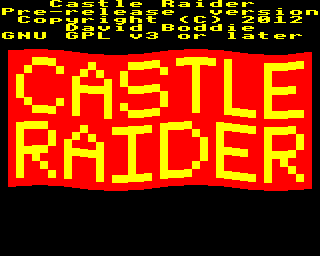
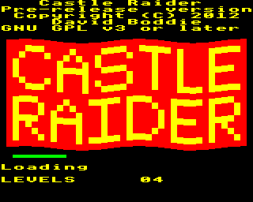

## Castle Raider Development Diary

### Part 1

**_by David Boddie_**

See the main [Castle Raider](Castle_Raider "wikilink") page for information about the game itself.

I've split the diary into separate parts. See [Part 2](Castle_Raider/DevelopmentDiary/Part2 "wikilink"), [Part 3](Castle_Raider/DevelopmentDiary/Part3 "wikilink") and [Part 4](Castle_Raider/DevelopmentDiary/Part4 "wikilink") for later entries.

An overview of some of the development issues can be found on the [Thoughts](Castle_Raider/DevelopmentDiary/Thoughts "wikilink") page.

#### Laying Foundations (2012-01-07, 2012-01-08)

Before I started writing [Jungle Journey](Jungle_Journey "wikilink"), I had been looking at writing some sort of game for the Electron that used scrolling. Games with scrolling scenery were released for the Electron despite the lack of hardware support for it, but everything needed to be done in software. The results vary in quality, but some games stand out: [Firetrack](http://en.wikipedia.org/wiki/Firetrack) has excellent vertical scrolling, [Perplexity](<http://en.wikipedia.org/wiki/Perplexity_(video_game)>) has good horizontal and vertical scrolling, [Ravenskull](<http://en.wikipedia.org/wiki/Ravenskull_(video_game)>) has reasonable horizontal and vertical scrolling, [Moon Raider](http://www.acornelectron.co.uk/info/micropower/i-moon.html) has fast, smooth horizontal scrolling, [Ballistix](http://www.acornelectron.co.uk/info/superior_acornsoft/i-ball.html) has variable speed vertical scrolling, and [Predator](http://www.acornelectron.co.uk/info/superior_acornsoft/i-pred.html) has parallax horizontal scrolling. Although not quite like the others, [Thrust](<http://en.wikipedia.org/wiki/Thrust_(video_game)>) also features smooth, multi-directional scrolling.

Of all these games, Moon Raider is the one that inspired the scrolling routine I decided to use. My impression is that the game only plots the differences in the scenery that are needed as it scrolls from right to left. The objects - missiles, fuel dumps, guns - require additional work, but there are at most one of these per column of scenery, so there isn't too much to plot every frame. The scrolling occurs in steps of two pixels and, because the ground is a single colour, you never notice that "real" scrolling is not occurring.

Initially, I thought about doing something very close to what I think Moon Raider does, plotting over existing graphics with EOR operations to update scenery, but I also wanted to have more complex scenery, not just a uniform ground that slips past the eyes. In theory, Moon Raider could have had a dithered pattern 2 pixels wide for the ground, but perhaps it wouldn't be as convincing to look at. I wanted to have 2 pixel scrolling steps, but use tiles that were wider than two pixels. The problem with this is that, if you have a 4 pixel wide tile and want to scroll by 2 pixels, you need to update all of the tile, and that means redrawing every tile in a span of identical tiles.

The solution I decided to use was to use two screen banks: one to show scenery at scroll offsets 0, 4, 8, and so on, and another to show scenery at scroll offsets 2, 6, 10, and so on. Each bank is scrolled by 4 pixels, to take advantage of the trick of only redrawing the edges of spans of identical tiles. To scroll by 2 pixels, we simply switch banks to show the pre-scrolled scenery.

| | |

|-------------------------------------------------------------------------------------------------------------|-------------------------------------------------------------------------------------------------------------|

|  |  |

| **Spot the difference: Close ups of sprites plotted on bank 1 (left) and on bank 2 (right).** |

#### Background on Foreground (2012-01-15)

The version shown in the [YouTube video](http://www.youtube.com/watch?v=gcNpMDtMzQ4) shows the scrolling at work, but this version has one important hidden limitation: the way the level data is stored limits the number of tile types to 8. This is because the initial level format uses a single byte to describe the tile type for a given span of tiles on a given row (theoretically 256 types of tile), but required a convenient way to describe the join between two spans with different tile types for plotting on bank 2. The compromise solution involved storing a byte in which the top 5 bits described a "merged" tile (for bank 2) and the bottom 3 bits described the tile used for the span itself. This meant generating a collection of "merged" tiles based on the adjacent tiles found when level data is generated. With a possible set of 56 "merged" tiles from an initial set of 8 tiles, there was also the chance that the final level would be too complex for the 5 bits allocated in the level format.

After some discussion on the forums, I thought that 8 tile types was a bit poor. After all, once you have blank spaces, ground, grass, bricks, bridges and doors, there's not much room for creativity. Expanding the range of available tiles was possible but required a different, less convenient approach to plotting "merged" tiles, involving constructing them when plotting spans of tiles on screen. In the end, the trade off was made, hopefully without much of a performance impact.

The next question was that of how the level might change while the game is played. Even though the level format doesn't store every tile - only spans of tiles - there won't be room in memory to have another unmodified set of level data that can be used to restore modifications to the level. The approach I am taking instead is to store actions that modify parts of the level data when the player's character interacts with "triggers" in the level.

| |

|-----------------------------------------------------------------------------------------------------------------------------|

|  |

| **Some of the different tiles in use at the moment. The player is about to step on a visible trigger tile to open a door.** |

#### Taking a Detour (2012-02-16)

As I write this, I realise that it's been over a month since my last proper update. During that time I started to add support for collectable objects, extending the use of trigger tiles to cover that case as well. I'm not really happy with the result - it's too much of an abuse of the trigger mechanism to do things like make tiles remove themselves and things like that. In addition, I'm a bit worried that having a potentially sparse table of actions and an even larger collection of level modifications might take up too much memory before I've even designed basic levels. I'm torn between leaving the code in there, removing only the hackery required to support objects embedded in the scenery, and removing all the trigger code completely. Perhaps I'll create a branch without triggers and explore other gameplay options.

Before I got sidetracked looking at Electron hardware, I started to try and improve the jumping motion of the main character in the game. Initial efforts led to some odd game freezing behaviour and loading problems, so it's possible that I'm overwriting code with other code, or something. I think this is what I'll finish next because I'm not at all satisfied with the current jumping motion.

#### A Change of Plan (2012-02-19)

Before even starting to look at the jumping motion, I ripped out the trigger/action code and replaced it with something a bit simpler. Each span of tiles will have a special type number that controls its visibility, and these will be set to suitable values at the start of the game. Most tile spans will be type 0, which will be fixed so that they are always visible. Other types will be toggled when the player does certain things.

While messing around with sprites and level layouts, I encountered some disturbing mishandling of tile spans, possibly caused by span lengths getting out of bounds. This is something I'll have to keep an eye on. Speaking of bug fixing, the crashing problem I mentioned earlier turned out to be the game code overwriting the game loader code, so that's one less thing to worry about.

#### Jumping and Falling (2012-03-04)

I felt that the main character's jumping motion was a bit abrupt, with vertical motion in steps of one or more map rows, so I decided to at least have some half row movement in there. It doesn't make a huge different, but hopefully the motion is a little smoother than before. I also made a little change to the falling motion - the character doesn't follow a parabolic curve when jumping and falling, but it's good enough for now. He/she no longer runs in mid-air, either.

Meanwhile, the problems with tile spans have appeared again. While very annoying, at least I now have the chance to deal with the bug properly.

#### Back on Track (2012-03-10)

I isolated the span rendering problem by plotting only certain rows in the playing area and focusing on just one screen bank. When plotting occurs on multiple rows, it means that a counter has gone out of range. In this case, the row counter exceeds an 8-bit value when the sum of the existing value and the size of the current span are greater than 255. Previously, I only checked for a value of 40, exiting the plotting loop for that row if the counter equals or exceeds it, but the value could be between 255 and 296 and fail to satisfy this test. Fortunately, we only need to check whether the carry flag is set to catch this case. In other words, we first check whether the new value is greater than 255 and, if not, check if it is 40 or greater.

Other time was spent looking at how the screen should be laid out, with a panel above the playing area. A certain amount of time was also spent trying to figure out why the game [can't be loaded again after Break is pressed](http://www.retrosoftware.co.uk/forum/viewtopic.php?f=73&t=748&p=5697) - it seems to me that a bug like this would have been noticeable for lots of other software.

#### Climbing Stairs (2012-03-11)

A couple of small tweaks today. The first was to enable tile visibility to be configured when the level is created instead of setting all the special tiles to be invisible when the game starts. The second makes the game nicer to play: the character now runs up stairs automatically, as can be seen in [this video](http://www.youtube.com/watch?v=oWwBlUYUaF8) of the current gameplay. My plan now is to start looking at adding other objects/enemies.

#### Falling Through the Gaps (2012-03-12)

Just to liven things up a bit, the player's character can now fall off the bottom of the level, losing a life in the process. I added some code to scroll back to the last known "safe" position in such an event. Just what the "safe" position is has yet to be defined.

#### Construction Kit (2012-03-17)

I've been experimenting with jumping motion again, trying to make it a bit smoother, but it still looks a bit sluggish. Meanwhile, stepping back a bit, I decided to put together a simple level editor for desktop environments to help make it less tedious to make changes to the game's map. It's a bit basic at the moment but it beats editing a text file. Speaking of which, the level data is written out as text files, so it's still possible to edit it the old fashioned way.

| | |

|----------------------------------------------------------------------------------------------|------------------------------------------------------------------------------------------------------------------------------------------------|

|  |  |

As usual, messing with level design exposes problems in the code with level painting, this time related to initial rendering of the level. That's been on my mental to-do list for a while, so I suppose that will be the next thing to tackle.

#### Procrastination (2012-04-27)

Since I'm still trying to get inspired enough to work on the gameplay, other infrastructural issues, like the level painting bug mentioned in the last entry, are left unfixed while I mess around with the editor and various level designs. At some point, I'm going to have to implement collectable objects just so that I can experiment further with level design. At that point, things should start moving again but, right now, I'm still trying to commit to the single, horizontal scrollable level format.

#### Picking Things Up (2012-05-04)

Before talking about collectable objects, there's something to say about the way special tiles were defined in the level format until now. Each span of tiles was defined using a pair of bytes, defined in binary like this:

` 00000001 00000004`

` type byte  number of tiles (minus 1)`

So this example would give us a span of tiles of type 1, 5 tiles in length. We store the number minus 1 because that lets us use 0 as a usable value - we never need to store a span of zero length. The type byte is split into two halves:

` sssstttt`

` 00000001 (s = 0; t = 1)`

The bottom four bits (t) are the tile number in the case where the top four bits (s) is zero. This is just a normal tile. If s &gt; 0 then we have a special tile. Previously, the value of s was the special tile number, an index into a visibility table, and the value of t meant the same as for normal tiles. Using this approach, you could mark lots of tiles with a particular value of s and turn them "on" or "off". The editor I wrote, however, linked each value of s with a particular value of t, meaning that you could only one type of tile in a door, for example. Given that limitation, I started thinking about have more types of special tile, using them for collectable objects, and the limitation of only 15 special tile numbers was too restrictive (special type 0 is implicitly used for normal tiles).

Now, when s &gt; 0, the whole byte is used as an offset into a visibility table and, to decouple the type value from the type of tile shown, it is also used as an offset into a tile type table.

` sssstttt`

` 00010110 (0x16) -> visibility`

`                          -> tile type`

This means that we still restrict the tile type shown for each kind of special tile, but we can pick arbitrary tile types to show for it. We can also define up to 240 special tiles if we want, though for practical purposes we will only allocate enough memory for 32, the first 16 of which will be scenery tiles and the rest will be collectable objects.

Collectable objects are treated specially in the routine that checks whether a player can move. For ordinary tiles, anything other than a blank span prevents the player from walking, falling or jumping into the part of the screen occupied by that span. For special tiles, the visibility of the span is taken into account: invisible spans are treated the same as blank space, but visible spans are impassable. Collectable items are an exception to this rule: when the player tries to cross one, it is marked as invisible and the player can continue to move.

| |

|-----------------------------------------------------------------------------------------------------------------|

|  |

| **Adding collectable items to the map involved some changes to the level data and some "register" management.** |

The above image shows some key objects added to the level. These are collectable but do nothing except cause their image to be added to the panel at the top of the screen. Of course, the images have to be plotted on both screen banks - we don't want to see flickering keys at the top of the screen!

The code to plot collected items in the panel was a problem to start with, causing unexpected side effects. It turned out that my use of zero-page addresses was a bit careless, with $70 to $73 being used for plotting while they were also used for other things. Some juggling of addresses solved the problem but I need to be more disciplined with address usage from now on.

#### Doors and Treasure (2012-05-05)

Doors are made up of non-collectable special tiles that are visible by default. To open a door, you need to pick up the corresponding key - when the player encounters a door tile, we add 16 to the special tile number to get the corresponding number for the key and check its visibility. If the key has been collected then we can make the door invisible.

Treasure is made up of pairs of collectable special tiles that are also visible by default. Since these tiles will appear next to each other, and we want them both to be collected at the same time, we check if the special tile number is in a certain range and remove both tiles in the pair.

| | |

|-----------------------------------------------------------------------------------------------------------------------|------------------------------------------------------------------------|

|  |  |

| **Doors can be opened with the right keys.** | **Treasure is made up of pairs of collectable items.** |

Looking at the defined special tiles so far, it seems that we might encounter some problems with partitioning the scenery tiles and the collectable tiles equally, especially since I'm considering using 4 tiles for treasure and 6 tiles for keys. This leaves 6 remaining tiles for objects that could have some effect or another, but the use of 4 treasure tiles effectively leaves 4 scenery tiles without a way to be modified by the player.

#### Special Tiles in General (2012-05-06)

I felt that the hard-coded handling of special tiles was unsatisfactory and wanted something a bit more general that could use all the available special tiles, deciding what kind of objects they should be on a tile-by-tile basis. To this end, I modified the values in the visibility table to contain collections of flags instead of just 0 or 1. Now they look something like this:

` vcdt0000`

Where the visibility flag is the most significant bit. This makes it as easy (and quick) to check for visibility when plotting but lets us store flags for collectable objects, doors and treasure in the same byte. There are a few more operations required when checking for certain kinds of tiles, but it should be about as fast as before.

#### First Demo (2012-05-06)

| |

|-----------------------------------------------------------------|

|  |

| **The player's quest currently involves cave exploration.** |

For those of you who are interested to see how the game plays so far, the first demo of Castle Raider is now available: [CastleRaider-demo1.zip](../../retrosoftwarecouk_wiki-20160918-wikidump/images/CastleRaider-demo1.zip "wikilink"). It is known to work in Elkulator, but may not work properly in BeebEm.

#### Thinking about Monsters (2012-05-07)

Castle Raider isn't supposed to be a pure puzzle game. I want it to be something more than a treasure hunt with a few awkwardly-placed platforms to jump between; just how much more remains to be seen. To this end, I have started to think about the possible enemies that the player will face and the sprite routines that I will have to confront. At the moment, I'm just sketching out the code for these and trying to overcome the mental barrier that comes with plumbing them into the game. Writing small pieces of code and keeping expectations low appears to be a non-intimidating way to do this.

#### More about Monsters (2012-05-08)

Started adding code to plot monsters. At the moment, monsters are aligned vertically with each row of scenery on the screen, but half-row alignment will also be added. Right now, if the routine is called, all it does is plot any monsters that are defined. They don't move or get scrolled when the player moves horizontally.

#### Monster Movement (2012-05-10)

I started to look into how monsters should be plotted and moved when the player scrolls the screen. Aside from some inadvertent breakage of the sprite addresses generated by the build script, things went more-or-less as expected. Further work will be required to make sure that monster sprites can be plotted at any point in the playing area, and plotting at the edge will also need to be considered.

| |

|------------------------------------------------------------------------------------|

|  |

| **Testing monster plotting and movement.** |

There will also need to be some cleaning up of the checks around scrolling to make it easier to decide when to redraw monsters, especially if the player doesn't scroll the screen.

#### Interruptions (2012-05-14)

For one reason or another I didn't get to do much this last weekend, and when I got back into coding I just wanted to play with some ideas instead of getting back to business. I have always found the idea of writing interrupt routines on the Electron a bit intimidating, yet I like the ones you get on the BBC where music plays while loading or, as with Skirmish/Joust, you get something arguably more impressive. Since the restrictions of the Electron's ULA apparently makes interrupt-driven music impossible, I was convinced that any kind of interrupt-driven entertainment was out of the question on the Electron.

Recently, I was told that it should be possible to do interrupt-driven stuff while loading from cassette, so I decided to look into it. I've seen things like loading timers before, but the usual experience with these is that they are typically wrong because of all the rewind action that loading games usually entails. Instead, my plan was to do a proper progress bar to show how much of the game has loaded. The way I do this is to assemble the loader with information about a few addresses that will be overwritten when data/code loads and record the values that will appear there. In the loader, I initialise those addresses with bit inverted values of those expected values, and wait until each of them changes to the correct value. As this occurs, I plot a bit more of the progress bar on the screen. It was fairly simple to implement and is quite a nice touch. At some later point, I'll tart it up a bit.

#### Monster Movement and Titles (2012-06-04)

I did a bit more work on plotting monsters and started to add logic to them, but things stalled again. In the meantime, I started chasing another idea that I've been thinking about for a while: an animated title screen.

| |

|---------------------------------------------------------------------------------------------|

|  |

| **Work in progress title screen.** |

The title screen is basically a waving flag - not all that exciting, but quite a nice effect. As with the scrolling, we're only plotting the changes to each column in the flag, so there isn't all that much to plot at any given time. The aim is to minimise all calculations and plotting so, no doubt, there is still much to be improved.

#### Cutting up Code (2012-06-05)

Broke the animation code into pieces to help fit it into the program flow of the interrupt routine used while loading from cassette occurs. Once basic initialisation has occurred, a pointer is stored which points to the next part of the routine to execute. Each part of the animation routine updates the pointer before returning, so this lets us split the animation into chunks that are hopefully short enough to avoid causing problems with the loading system.

| |

|---------------------------------------------------------------------------------------|

|  |

| **Now with wavy flag loading.** |

Before loading starts, the routine runs without this overhead, so it's almost as quick as the unadulterated version. The speed of the animation during loading is nothing to write home about, but that's not really important, given that it was only done to show that it is possible.

#### Second Demo (2012-07-29)

In preparation for the upcoming Homebrew Gaming Weekend, I've created a second demo of Castle Raider: [CastleRaider-demo2.zip](../../retrosoftwarecouk_wiki-20160918-wikidump/images/CastleRaider-demo2.zip "wikilink"). Hopefully someone will be able to transfer the files onto cassette/disk in time for next weekend. In the meantime, those of you who are interested to see the title screen in action can download it and try it out. Have fun!
