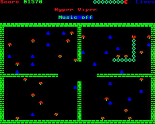
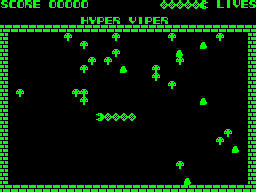
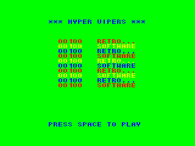
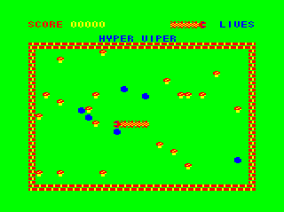
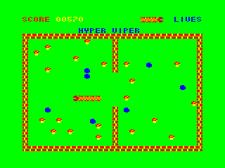

# Hyper Viper by Kenton Price

### Licence

This work is licensed by Kenton Price (<retrosoftware@kentonprice.com>) under the Creative Commons Attribution-NonCommercial-ShareAlike 3.0 Unported License. To view a copy of this licence, visit <http://creativecommons.org/licenses/by-nc-sa/3.0/> or send a letter to Creative Commons, 171 Second Street, Suite 300, San Francisco, California 94105, USA.

### Introduction

A long-forgotten snake game created at least a dozen years before Nokia put something similar on just about every phone ever, rediscovered in December 2009 when Arcadian went through Kenton's development disks from the 1980s, and finally released 25 years later by Retro Software. Whilst Kenton has little recollection of writing it, one of his friends recalls that in 1986 before he wrote _Ripton_ and _Starquake_, he was inspired by something he'd seen in an arcade and wrote _Hyper Viper_ in about two days. The name was in homage to Kenton's favourite fruit machine at the time, and indeed to this day (and he still wants one if you know where to get one), Barcrest's [_Hyper Viper_](http://www.youtube.com/watch?v=3Ae7WxWJb4Q) released in 1983. There is probably a clone of that fruit machine on those old disks somewhere too.

A new port to the Acorn Atom by Kees Van Oss was first showcased at the [In Da 80s](http://inda80s.cgeu.info/) event in Manchester, July 2011 and released in February 2012.

[Discuss _Hyper Viper_](http://www.retrosoftware.co.uk/forum/viewforum.php?f=68)

Read more about Kenton's latest mobile projects for Android mobile phones at [Little Fluffy Toys Ltd](http://www.littlefluffytoys.com/?p=367), including a game that many Acorn games players will instantly warm to: the seminal retro rocks-and-diamonds game for Android, [_Mole Miner_](http://www.facebook.com/pages/Mole-Miner/150250489873), which includes over 50 levels designed by Michael S. Repton.

### Platforms

#### BBC Micro / Electron

**_Original by Kenton Price, with contributions from Paul Davis and Pitfall Jones_**

##### Downloads

[*Hyper Viper* 1.1 DFS disc version](../../retrosoftwarecouk_wiki-20160918-wikidump/images/HyperViper1.1 DFS.zip "wikilink")

[*Hyper Viper* 1.1 ADFS disc version](../../retrosoftwarecouk_wiki-20160918-wikidump/images/HyperViper1.1 ADFS.zip "wikilink")

[*Hyper Viper* 1.1 tape version](../../retrosoftwarecouk_wiki-20160918-wikidump/images/HyperViper1.1 Tape.zip "wikilink")

[*Hyper Viper* 1.1 source code](../../retrosoftwarecouk_wiki-20160918-wikidump/images/HyperViper1.1 Source.zip "wikilink")

###### Archived versions

_Hyper Viper_ 1.0 ([DFS](../../retrosoftwarecouk_wiki-20160918-wikidump/images/HyperViper1.0 DFS.zip "wikilink")/[ADFS](HyperViper1.0 ADFS.zip "wikilink")/[tape](HyperViper1.0 Tape.zip "wikilink")/[source code](HyperViper1.0 Source.zip "wikilink"))

##### Port Details

Tested on real BBC Micro and Electron hardware, B-Em, BeebEm and Elkulator. This game is extremely fast and so the best experience is on a real BBC Micro; however a great experience can be had on B-Em. BeebEm has some minor issues with keyboard responsiveness, game timing and music - if you cannot use B-Em instead, try turning BeebEm's speed down to fixed speed 0.75.

_Features_

- Five screens

- Fast action

- Extremely addictive

_Features added by Paul Davis in 2011, not in the 1986 original:_

- Electron compatible

- Electron Plus 1 compatible

- Highscore table

- New rocks won't appear too close to the snake's head

- Do not allow snake to die by reversing on itself

- URL on front screen

_Features added by Pitfall Jones in 2011, not in the 1986 original:_

- Joystick support

With the complete source code available for this game, any of you talented coders are free to download it, make modifications or even port the game to alternative platforms (though not sell it - please see the full terms of the [CC BY-NC-SA 3.0 licence](http://creativecommons.org/licenses/by-nc-sa/3.0/)). We'd love to hear about any updates you make, in the [forum](http://www.retrosoftware.co.uk/forum/viewforum.php?f=68). If there are any contributed features which attract the author's attention, you may be asked if you'd like it included in an updated version of _Hyper Viper_ in the future. For inspiration, here are some of our suggestions for possible new features/improvements:

- some sort of timer or change of flashing speed to indicate when the flashing mushroom is about to change, both if it's been eaten and if it's not

- add joystick support - DONE: added to v1.1!

- modify/adjust the difficulty level - a controversial suggestion, as the game is deliberately pitched to be challenging from the start. Could this be improved without ruining the game? Let us know how you get on!

- port the game to a new platform - Atom port DONE!

- score points for eating the flashing mushroom: get 50 points

- score points for eating a rock (after having eaten a flashing mushroom): get 20 points

- when you've eaten a flashing mushroom, when it returns to gameplay (after eating a rock or mushroom or timeout), make it start on a rock, like it does at the start of the game, thus removing another rock from gameplay. (If anyone ever codes this, remember the incredibly unlikely edge case that someone's collected all the rocks!)

##### Screenshots

<table>

<tbody>

<tr class="odd">

<td>

<strong><em>BBC Micro Hyper Viper</em> loading screen</strong> 

<em>Posted: 13:34, 29 Jan 2011</em>
</td>

<td>

<strong><em>BBC Micro Hyper Viper</em> title screen</strong> 

<em>Posted: 00:39, 21 Feb 2011</em>
</td>

</tr>

<tr class="even">

<td>

<strong><em>BBC Micro Hyper Viper</em> high score screen</strong> 

<em>Posted: 00:38, 21 Feb 2011</em>
</td>

<td>

<strong><em>BBC Micro Hyper Viper</em> level 1 screen</strong> 

<em>Posted: 01:00, 20 Jan 2011</em>
</td>

</tr>

<tr class="odd">

<td>

<strong><em>BBC Micro Hyper Viper</em> level 2 screen</strong> 

<em>Posted: 01:00, 20 Jan 2011</em>
</td>

<td>

<strong><em>BBC Micro Hyper Viper</em> level 3 screen</strong> 

<em>Posted: 01:00, 20 Jan 2011</em>
</td>

</tr>

<tr class="even">

<td>

<strong><em>BBC Micro Hyper Viper</em> level 4 screen</strong> 

<em>Posted: 01:00, 20 Jan 2011</em>
</td>

<td>

<strong><em>BBC Micro Hyper Viper</em> level 5 screen</strong> 

<em>Posted: 01:00, 20 Jan 2011</em>
</td>

</tr>

</tbody>

</table>

##### Video

{{\#ev:youtube|VQXYLk4wgnc}}

#### Atom

**_Port by Kees van Oss_**

##### System Requirements

- Standard Acorn Atom

- 12 KB RAM

- 6 KB video RAM (\#8000-\#97FF)

- VIA

##### Downloads

[`Hyper` `Viper` `Acorn` `Atom` `disc/tape` `images` `and` `2500AD` `cross` `compiler` `6502` `version` `assembler` `source` `code`](../../retrosoftwarecouk_wiki-20160918-wikidump/images/Atom Hyper Viper.zip "wikilink")

##### Port Details

A new port of _Hyper Viper_ to the Acorn Atom by Kees Van Oss was first showcased at the [In Da 80s](http://inda80s.cgeu.info/) event in Manchester, July 2011 and released in February 2012.

##### Screenshots

<table>

<tbody>

<tr class="odd">

<td>

<strong><em>Atomic Hyper Viper</em> title screen</strong> 

<em>Posted: 00:27, 03 Feb 2012</em>
</td>

<td>

<strong><em>Atomic Hyper Viper</em> high score screen</strong> 

<em>Posted: 22:57, 13 Jul 2011</em>
</td>

</tr>

<tr class="even">

<td>

<strong><em>Atomic Hyper Viper</em> level 1 screen</strong> 

<em>Posted: 22:57, 13 Jul 2011</em>
</td>

<td>

<strong><em>Atomic Hyper Viper</em> level 2 screen</strong> 

<em>Posted: 22:58, 13 Jul 2011</em>
</td>

</tr>

<tr class="odd">

<td>

<strong><em>Atomic Hyper Viper</em> mono title screen</strong> 

<em>Posted: 00:50, 03 Feb 2012</em>
</td>

<td>

<strong><em>Atomic Hyper Viper</em> mono high score screen</strong> 

<em>Posted: 00:50, 03 Feb 2012</em>
</td>

</tr>

<tr class="even">

<td>

<strong><em>Atomic Hyper Viper</em> mono level 1 screen</strong> 

<em>Posted: 00:51, 03 Feb 2012</em>
</td>

<td>

<strong><em>Atomic Hyper Viper</em> mono level 2 screen</strong> 

<em>Posted: 00:52, 03 Feb 2012</em>
</td>

</tr>

</tbody>

</table>

#### Dragon 32/64 / TRS-80 Color Computer

**_Port by Phill Harvey-Smith_**

##### Downloads

COMING SOON

##### Screenshots

<table>

<tbody>

<tr class="odd">

<td>

<strong><em>Dragon / CoCo Hyper Viper</em> title screen</strong> 

<em>Posted: 11:41, 04 Aug 2011</em>
</td>

<td>

<strong><em>Dragon / CoCo Hyper Viper</em> high scores screen</strong> 

<em>Posted: 23:40, 08 Aug 2011</em>
</td>

</tr>

<tr class="even">

<td>

<strong><em>Dragon / CoCo Hyper Viper</em> level 1 screen</strong> 

<em>Posted: 11:42, 04 Aug 2011</em>
</td>

<td>

<strong><em>Dragon / CoCo Hyper Viper</em> level 2 screen</strong> 

<em>Posted: 23:27, 08 Aug 2011</em>
</td>

</tr>

<tr class="odd">

<td>

<strong><em>Dragon / CoCo Hyper Viper Mono</em> title screen</strong> 

<em>Posted: 00:19, 22 Aug 2011</em>
</td>

<td>

<strong><em>Dragon / CoCo Hyper Viper Mono</em> high scores screen</strong> 

<em>Posted: 00:20, 22 Aug 2011</em>
</td>

</tr>

<tr class="even">

<td>

<strong><em>Dragon / CoCo Hyper Viper Mono</em> level 1 screen</strong> 

<em>Posted: 00:21, 22 Aug 2011</em>
</td>

<td>

<strong><em>Dragon / CoCo Hyper Viper Mono</em> level 2 screen</strong> 

<em>Posted: 00:22, 22 Aug 2011</em>
</td>

</tr>

</tbody>

</table>
