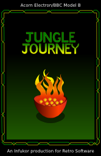
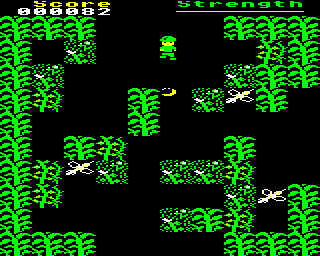

# Jungle Journey by David Boddie

| |

|----------------------------------------------------------|

|  |

### Licence

[GNU GPLv3 license](http://en.wikipedia.org/wiki/GNU_General_Public_License)

### Introduction

_Jungle Journey_ is an attempt to bring a _Sabre Wulf_-type jungle exploration and escape game to the Electron inspired by games like [Bug-Byte](wikipedia:Bug-Byte "wikilink")'s _[Dunjunz](wikipedia:Dunjunz "wikilink")_ and [Ultimate Play The Game](wikipedia:Ultimate_Play_The_Game "wikilink") titles such as _[Sabre Wulf](wikipedia:Sabre_Wulf "wikilink")_ and _[Atic Atac](wikipedia:Atic_Atac "wikilink")_.

I was always fascinated by the games made by [Ultimate Play The Game](wikipedia:Ultimate_Play_The_Game "wikilink") but, as an Electron user, I didn't get much of a chance to play them on a real machine. I always thought it was a bit disappointing that they never released their games for the Electron; not even cut down versions. A MODE 5 version of _Sabre Wulf_ would surely have been possible, and a slow version of _Knight Lore_ without all the needless bleeping would have been OK.

Anyway, I thought it would be fun to make some kind of _Sabre Wulf_-like game, just to show that something like that could have been made, although my 6502 coding isn't really all that great. The aim is to create something that's fun to play, with a bit of depth, too.

#### Story

The last flames of the campfire fade to glowing embers and I am alone. My recent acquaintances, their packs and paraphernalia have gone, leaving me stranded deep in the heart of this jungle realm. Clouds momentarily sweep the cold face of the moon and I perceive the clicks, whistles and cries of creatures in the hot air that cloaks this place. Desperately, I try to stay my panic and remember those fragments of wilderness craft learned and unlearned many years ago.

`   Choose your weapon carefully,`

`   Get ready for a fight.`

`   The jungle can be dangerous`

`   If you go there at night.`

`   There's time to pick up treasure,`

`   But no time to stop and stare.`

`   If you don't find the hidden cave`

`   You won't get out of there.`

Hopeless, I scramble to my feet, reaching for any weapon still left to me. Struggling through the dense undergrowth, I search for signs of a track or trail. At first glance, paths that seemed to lead to safety turn out to be impassable, overgrown by tangled and twisted vines. I remember the words of an old teacher:

`"Do not be tempted to use fire to make your way.`

` Many a traveller has strayed from the path, using fire to blaze a trail,`

` only to reach a dead end. Trying to return, they find that the jungle`

` has grown back. Those who are desperate enough will even seek out`

` forgotten routes when the way home is in sight."`

Sensing my presence, obscene creatures emerge from the darkness, hungry for prey. Only through skill and luck am I able to dispatch them back into the shadows. Even though I know I must journey deeper into this uncharted land to find the way home, the thought of vengeance drives me on.

[Discuss _Jungle Journey_](http://www.retrosoftware.co.uk/forum/viewforum.php?f=84)

### Platforms

#### Electron

**_Original by David Boddie_**

##### Electron Development Diary

A [Development Diary](JungleJourneyBBCMicroElectronDiary "wikilink") recording the details of the game's development by the author.

##### Downloads

The release version of the game is now available: [JungleJourney-1.1.5.zip](../../retrosoftwarecouk_wiki-20160918-wikidump/images/JungleJourney-1.1.5.zip "wikilink"). This includes tape, DFS, ADFS and ROM cartridge versions of the game. Note that the tape, DFS and ADFS versions are unchanged from version 1.1.4 of the game.

The latest source code for _Jungle Journey_ is available from the RS Mercurial repository. You can download it with a Mercurial client from the read-only repository:

<http://www.retrosoftware.co.uk/hg/junglejourney>

Or you can download a zip archive of the latest post-release code [here](http://www.retrosoftware.co.uk/hg/junglejourney/archive/tip.zip). This may contain bug fixes for issues discovered after the game was released.

The code is built using a Python script. You will need the [Ophis assembler](https://hkn.eecs.berkeley.edu/~mcmartin/ophis/) to assemble the code - this is done automatically by the build script. The output of the build script is a UEF file which can be used in Elkulator, BeebEm and probably ElectrEm.

##### Screenshots

<table>

<tbody>

<tr class="odd">

<td>

<strong><em>Jungle Journey</em> WIP screenshot</strong> 

<em>Posted: 00:19, 30 Aug 2011</em>
</td>

<td>

<strong><em>Jungle Journey</em>: WIP screenshot - using the boomerang round a corner</strong> 

<em>Posted: 21:30, 1 Sept 2011</em>
</td>

<td></td>

</tr>

</tbody>

</table>

##### Inlays

A cassette inlay has been created. Click the image below to download zipped PDF files for printing on A4 paper.

[<http://www.retrosoftware.co.uk/wiki/images/7/73/Jungle-Journey-BBC-Micro-Electron-cropped-inlay.png>](http://www.retrosoftware.co.uk/wiki/images/2/28/Jungle-Journey-BBC-Micro-Electron-inlay.pdf.zip)

##### Reviews and Appearances

_Jungle Journey_ was reviewed in [Electron User Group magazine \#74](http://www.acornelectron.co.uk/eug/74/a-jung.html), in [Five Games Five Minutes \#58](http://www.youtube.com/watch?v=EmSSC7Wb_0M) and in Volume 3 Issue 03 of [Drag 'n Drop magazine](http://www.dragdrop.co.uk/).

It appeared [on the Retro Software stand](http://twitpic.com/913qi2) at the event celebrating the 30th anniversary of the BBC Micro.

I produced a poster for a seminar at work about non-work things:  (archive contains a large PDF file).

#### Atom

**_Conversion by Kees van Oss_**

##### System requirements

- Standard Acorn Atom

- 32 KB RAM

- 6 KB video RAM (\#8000-\#97FF)

- VIA

- Colourboard

- Joystick (Optional)

##### Atom Development Diary

I started the conversion of Jungle Journey for the Atom about 6 months ago. The source was available and well documented. Converting the screens and font was relative easy. Next were the graphic sprites/tiles but due to the difference in resolution, all sprites and tiles had to be resized. This was a hell of a job because there are about 90 sprites in the game and that was the reason I stopped converting.

Then last August, there was the Videolympics/Homebrew weekend in Manchester. I went there and met David Boddie. After having a nice talk about programming and about the game, I decided to pick up the conversion again. David offered his help to resize the sprites/tiles.

The game is now fully converted with nice new Atom sprites/tiles and sound. In this version, Atom sound (beeper) is implemented but I'm experimenting with SID sound/music. Maybe later a SID version will be released.

##### Downloads

[`Jungle` `Journey` `Acorn` `Atom` `disc/tape` `images` `and` `CC65` `C` `compiler` `source` `code`](../../retrosoftwarecouk_wiki-20160918-wikidump/images/Atom Jungle Journey.zip "wikilink")

This includes tape and disk versions of the game in colour.

Type MAKE JUNGLE to compile the program.

An assembler listing is created in the JUNGLE.LST file.

Read the README.TXT file for more info.

##### Screenshots

<table>

<tbody>

<tr class="odd">

<td>

<strong><em>Jungle Journey</em>: Intro screenshot</strong> 

<em>Posted: 14:14, 27 Sep 2012</em>
</td>

<td>

<strong><em>Jungle Journey</em>: Highscore table</strong> 

<em>Posted: 14:14, 27 Sept 2012</em>
</td>

<td>

<strong><em>Jungle Journey</em>: Ingame screenshot</strong> 

<em>Posted: 14:14, 27 Sep 2012</em>
</td>

<td></td>

</tr>

</tbody>

</table>

##### Video

I've uploaded a video of the game with SID music as background music. FX Sounds have still to be added.

{{\#ev:youtube|XFQvPiargZw}}
