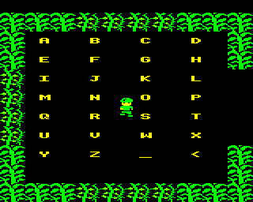
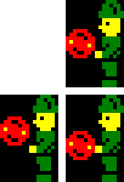
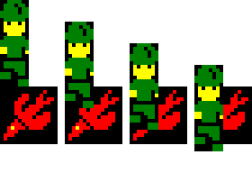

## Jungle Journey Electron Development Diary

**_by David Boddie_**

#### The Story So Far (2011-09-02)

Well, I started this some time ago, so it's not going to be as interesting to read as you might think. However, I found the other development diaries interesting, so perhaps I should start by looking at some of the things already implemented.

The basic idea for Jungle Journey came from a running joke about combining the worst aspects of Jungle Jive and Sabre Wulf to make a game that was futile to play, with the player completely defenceless against various Jungle creatures. On reflection, it seemed like lots of work to write a game just for a joke, so ideas began to form about a real game.

Inspired by the generated world in Exile, I've wanted to write an exploration game with a big map for some time - possibly a dungeon exploration game - and I worked towards a simple level generator (left, below). After watching the [video where David Braben talks](http://stardot.org.uk/forums/viewtopic.php?f=11&t=4284) about the algorithm behind Elite's galaxy generation, I decided to try something similar (right, below).

<table>

<tbody>

<tr class="odd">

<td>
 

<strong>A generated maze for a dungeon exploration game</strong> 

<em>Posted: 17:43, Sept 2, 2011</em>
</td>

<td>
 

<strong>A generated level for <em>Jungle Journey</em></strong> 

<em>Posted: 18:00, Sept 2, 2011</em>
</td>

</tr>

</tbody>

</table>

With some experimentation, it is possible to create some nice looking jungles, but it's still necessary to use some basic arithmetic tricks to divide the map into rooms with some exits blocked off. In theory, it would be possible to create maps as large as 256 x 256 rooms but, at that size, you start to see regularities in the rooms and exits, plus it could be quite tedious to play a game with a map that's so large. In the beginning, I wanted to take a large map and divide it into several levels, though it turned out to be difficult to decide on a map to use, so I settled on dividing the game into different levels, and use a different map for each level. To make each map a sensible size, and to have any chance of having space for any collectable objects, I chose 11 x 11 as the map size.

#### Rooms, sprites and colours (2011-09-02 continued)

Each room is 10 x 10 tiles, on a MODE 5 screen, which gives roughly square-looking tiles, but makes each tile an awkward size to deal with vertically, being 3 rows high. This leaves two rows for us to use for status items, like score and the player's strength. In the beginning, I wanted to put these at the bottom of the screen, but I moved them to the top of the screen later on for a good reason: to avoid flicker when sprites are moved. As with a lot of games, I used OSBYTE 19 (\*FX 19) to wait until the screen is about to be refreshed, try and get everything plotted as fast as possible. I put the score at the top of the screen to give us a head start.

The way the sprites are plotted is a bit strange, and possibly overkill for such a simple game. Out of laziness, I do what many games do, and use EOR operations to plot and unplot sprites. Plotting the same sprite data once puts the sprite on the screen; plotting it again removes it. My first attempts at trying to plot basically involved unplotting all the sprites then plotting them all again. This sounds fine in principle, but what happens is that the screen gets refreshed sometime after the unplotting has happened, leading to a lot of flickering sprites. That's not what we want to see. After some consideration, I realised that what I wanted was a fairly simple routine to unplot and plot each sprite in sequence as fast as possible. The way I do this is to create a list of unplotting and plotting operations and run through it when it's time to plot something. Because things are only added to this list when they move or are created, there might be unplot and plot calls for each sprite on the screen, just unplot calls when sprites are removed, or just plot calls when new sprites appear. There might even be no calls in the list when nothing needs to be updated. Ideally, I would profile or benchmark this, but for now I just hope that it's fast enough.

Since MODE 5 only has a four colour palette, with black and green being two colours we really need in the jungle, leaving us with two colours to play with. Ideally, I wanted the player to have more than one colour, so we choose yellow for one of these. To make the game appear to use more than four colours, I decided to change the palette in each room for the last colour.

#### Collectables (2011-09-03)

The jungle is full of collectable objects left behind by previous travellers, or perhaps by mischievous animals, and I needed a way to keep track of them all. They can't be stored in the map because the map is generated, not stored anywhere. One way to do this would be to have a list of objects and the rooms they occupy, which could possibly be stored in 12 bits per object, but it would be nice to have an object to collect in most rooms. I decided to just store an array of object numbers for all the rooms in the map. This takes up 121 bytes, but it means that I don't need to keep track of the room numbers. Where the objects appear in the rooms is decided by yet more algorithmic trickery.

#### Weapons (2011-09-03)

The player starts off with a weapon that moves until it encounters scenery, the edge of the screen, or an enemy. For simplicity, there is only one weapon on screen at a time. To make things more interesting, the player encounters other weapons that do slightly different things. Without spoiling any surprises, there are four of them, and this number dictates the number of levels that the player must visit to win the game.

**_Jungle Journey_: using the boomerang round a corner**

_Posted: 21:30, 1 Sept 2011_

#### Titles (2011-09-04)

Tried to get lots of different things done today: inter-level screens, sounds, titles and high scores. Finally, I play tested the game from start to finish and discovered something strange with the object generation on the final level. Memory is also getting tight now, with not a lot of room left for code if I want the game to run from disk on systems with PAGE at &1F00, like it appears to be in BeebEm.

**The title screen for Jungle Journey as it currently stands.**

Another thing that would be nice is a picture and a message when the game is completed. This will need to be loaded before the game runs, and there's not all that much space left between the game code and the sprites. Fortunately, I think I have a trick that can help with this.

#### Making Room (2011-09-04 continued)

I ran out of space for code in the current memory map I am using. However, after removing some unnecessary instructions, saving a few bytes, I realised that I could split the code and move the initialisation code into a loader. This frees up some space that I'd like to us for high score code and other things. I had some interesting problems with loading and running the game code from the loader, using OSCLI to effectively \*RUN the code, and in the end I decided to just load the code and jump into it.

The high score input routine I started to write filled up the remaining memory pretty quickly and I committed and abandoned it temporarily. However, while investigating an alternative with INKEY calls and getting frustrated with it, I found an unused key checking routine that I could delete. Now, with a bit more memory, maybe I can get the original high score input routine to work.

#### Hall of Fame (2011-09-05)

Spent a whole evening trying to squeeze the high score entry routine into the remaining space, and doing lots of consolidation to make enough space for it all. Ultimately, despite some clever tricks to determine where the player is relative to some letters on the screen, it all needed simplifying a bit. Fortunately, this saves even more space, so hopefully there will be enough space left to make it work.

**Enter your name, then leave.**

#### Moving Data and More High Scores (2011-09-06)

Spent the evening finishing the high score entry routing and moving data around in memory. Despite some setbacks, like enemies going missing and text appearing in the wrong place, things are moving forward again.

#### Getting Lost in the Jungle (2011-09-08)

One of my to do list items got me confused about the validity of the map generation code. Comparing the map in the game with a pre-generated map showed a mismatch between the objects and their locations. The map in the game looked nicer, so I wanted to keep that, but I couldn't figure out why the Python language map generator wasn't adding the same objects in the same places. After some diagnosis work, looking at the data in memory and wondering why one room was skipped, it turned out that the generator didn't know about the locations of the special key and exit rooms in that level. Adding this information lined everything up again.

Attempted to improve performance by pre-calculating enemy positions and reducing the number of times routines for motion and enemy creation are called, but flicker and jerky motion is still a problem.

#### Speeding Up (2011-09-09)

It occurred to me after finishing last night that I should try to spread the load of updating all the sprites over separate frames instead of updating all of the enemies every four frames. Some more simplification later and the game is slightly smoother. Testing the player demise animation revealed a simple bug in the strength plotting routine, so the whole painful affair was worthwhile after all!

After doing that, and while putting off some of the more creative but laborious tasks, I decided to add a Retro Software logo to the loading screen. I thought about using the standard Micro Power-style loader, but decided to try something new. I hope people like it! I'll probably go back and change it a bit to resemble the Ultimate Play The Game logo a bit more.

**Loading screen with "Ultimate" Retro Software logo.**

#### Nearing Journey's End (2011-09-11)

I tried adding some music today and gave up, disappointed with the results. I don't know if it's the way Elkulator runs on my computer or just my poor sound code, but the quality of the sound output I was getting was not what I was aiming for. I guess I'll have to wait for feedback from play testers to see if the other sounds are OK.

I moved quite a bit of data around and finally got around to adding some missing sprites, like the enemy explosions. Currently, I need to add two more enemies, so that will take a bit of time and effort. I'm putting it off for now. The data moving yielded some extra space for code: over 100 bytes. With this, plus anything else I can get by moving generated data areas down in memory, I could probably add some more features, but I'm looking to get some closure on this project and do other things. I may return to it later to add extra stuff, though I think it's more important to get something playable out there for people to enjoy.

The pre-release version I'm requesting feedback on is attached to [a message in the forum](http://www.retrosoftware.co.uk/forum/viewtopic.php?f=84&t=672).

#### A Change of Pace (2011-09-17)

One of the pieces of feedback in the forum was to [speed up the vertical movement](http://www.retrosoftware.co.uk/forum/viewtopic.php?f=84&p=5352&sid=983e255129b4c6e9be65d8cf4c638567#p5339) of the sprites from 4 pixel steps to 6 pixel steps. This should make the enemies move in directions that are closer to the diagonals as well. On the face of it, it should also simplify things like collision detection because there are fewer positions per tile that sprites can be in.

I spent an evening looking into the changes required to implement this improvement and it turned out that, while the technique used for collision detection remains the same, a bit more thought is needed to construct the look up table. With steps of 6 pixels but sprites that are multiples of 8 pixels, the sprites can overlap in places where it wasn't possible before. Ultimately, this means that each entry in the look up table needs to use 8 bits instead of the 6 it used before.

Once the collision detection had been figure out, the plotting routines needed to be changed. Before, each type of sprite had two plotting routines: one for positions where the sprite is aligned to a character row on the screen, and another for half row displacements. Now the sprites need to be plotted either aligned with a row or in one of three inter-row positions. Some modifications to existing routines and a bit of simplification later, it was time to try out the changes. Surprisingly, everything more or less worked as expected, though a few more flag clearing instructions were required to clean up the corruption you can see in the screenshot.

**New routines for plotting sprites didn't quite work first time, but not bad for a first attempt.**

I've been pretty lax at planning usage of zero page addresses in this game, especially for those which I use as temporary "registers". The new plotting routines used quite a few of these and, of course, they trampled over existing uses in other routines. One side effect of this was interference with the room generation algorithm that inadvertently created a new jungle to explore with rooms that would be slightly different each time you visited them! After a bit of reorganisation, things calmed down a bit, and I discovered another zero page address that I had been using only for room generation, reading from it but never initialising it. Removing it from the room generation code brought back the correct rooms, though I had to consult the pre-generated maps to be sure that things were back to normal. It's amazing how much you forget when you don't play the game for a few days - I had my first authentic play tester experience of getting lost in the jungle!

Another unexpected issue that came up with the change to the step size was related to the way that projectiles are handled. Before, each projectile was created half way down the player's sprite and this was always lined up with a character row on screen. Since there were six vertical steps per tile, the player could position themself next to a tile and shoot either above or below it in the same way. With the new step size, there isn't a way to have the projectile appear half way down the player, so we need to choose whether the projectile appears nearer the top of the player sprite or nearer the bottom. If we choose the top, it's easier to shoot over the top of scenery but difficult to shoot underneath it, and vice versa for a projectile near the bottom of the player's sprite. To get around this, the projectile is now fired from alternating places.

**Old and new style projectile handling.**

#### Preparing Another Pre-Release (2011-09-18)

With the new movement code in place, it's time to get feedback from play testers about whether or not that was a good idea. Another suggestion was support for joysticks, so I put in some code to hopefully read the analogue to digital (ADC) channels on a Plus 1-enhanced Electron.

As usual, play testing revealed some annoying bugs. One involved enemies "hiding" in tiles containing objects, making them immune to the player's projectiles. The short version of the story is that objects can now be destroyed by the player, so don't go running around shooting all the time! The title screen also got some attention. I chopped off the extra side stuff, which was only there to fill black space. As a result, the completion screen also got a little thinner and taller. I really need to spend some more time making that look nice.

The second pre-release can be found in [this message](http://www.retrosoftware.co.uk/forum/viewtopic.php?f=84&t=676) in the forums. Have fun!

#### Idling (2011-09-19)

Not much happening today. I hope I've fixed a bug with exploding scenery - we'll see, I suppose. I spent some time working on the completion screen. The game isn't ultra-difficult so I hope that most players will get to see it. Disturbingly, it has also given me some ideas for a sequel.

#### Keeping You Informed (2011-09-22)

I've been working on instructions using some custom code for writing SVG files. Yes, I know I could have used OpenOffice or something, but where's the fun in that?!

#### Making Things Less Predictable (2011-09-23)

Although I want to write a game that can be finished by most players, some of the feedback indicated that the game is quite easy. I wanted to make certain enemies move differently so that the player can't just use the same strategy throughout the whole game. After much frustration and messing around - the enemy movement flags are written by the directional movement routines - I managed to get certain enemies to move in fairly predictable and cyclical patterns. The next step will be to pseudo-randomly apply this behaviour to all enemies, or to make the enemy type generation routine give a wider variety of enemies - currently, it can get stuck generating the same type.

#### Cover Art and Instructions (2011-09-26)

I've been working on the accompanying materials again, so I've resized and moved the images that belonged to the above section down here. I've deviated from the classic Micro Power theme that most Retro Software releases use, going for an Ultimate look for this as well, though the instructions and back cover of the cassette inlay aren't really Ultimate-like at all. It's a bit more like a budget re-release of an Ultimate game.

    

**The front cover, inside pages and back cover of the cassette inlay.**

I'll look into arranging all these into a printable cassette inlay that will hopefully fit on one A4 page.

Meanwhile, I still need to concentrate and produce two more enemies for the last two levels of the game. Once they're done, bug fixes aside, the game will be complete.

#### Less Joy More Stick (2011-09-29)

My initial code for handling analogue joysticks turned out to be mostly aspirational in nature, producing nothing like the desired results. Fortunately, Elkulator uses the Allegro library's support for joysticks to emulate joysticks plugged into a virtual Plus 1 interface and we can, in theory, experiment with new-fangled USB joysticks. Unfortunately, I don't own any of these, but Samwise has been experimenting on my behalf and patiently testing new builds of the game, each with slightly different broken behaviour.

Ironically, I have access to a pair of Voltmace Twin analogue joysticks, but no way of using them until some day in the future when they will be reunited with an Electron and Plus 1.

#### Tidying Up (2011-10-02)

With Samwise's help, and a bit of hacking on Elkulator's sources, I seem to have resolved the problems with joystick support, so hopefully the game is now playable on analogue joystick-enabled hardware. Play testing revealed an interesting bug that caused enemies to be destroyed if the player fired at walls at point blank range - not something we should really allow. Beyond some visual fixes, progress has stalled as I procrastinate over the work required to draw the last two enemies. The instructions have changed a bit, but I'll wait until everything is finalised before uploading any more images of those.

#### Journey's End (2011-10-08)

I finally got around to drawing the sprites for the last two enemies. Testing the final one, I found that I had accidentally written the routine that selects the enemy type to only choose from the first four enemies - a simple bug to fix for a change.

With pretty much everything in place, I can only think of luxury items to add to the game, so it's time to release it. The cassette inlay needed a bit of updating, but it wasn't much work to get it to look fairly reasonable. Ideally, I'd produce a PDF of the document. However, its dimensions are not standard and the tools I am using don't seem to like the file at all. I'll look into it a bit more, but I don't want to spend too much time on it now. Likewise, I'll do a disk image and a new inlay at some point in the future.

The archive containing the release can be found on the main [Jungle Journey](Jungle_Journey "wikilink") page.

### Post Development

The following are some notes and comments about the creation of the game, and information about any further developments.

#### ROM Cartridges (2011-10-16)

Although I'd like to do an enhanced ROM version of Jungle Journey, I'm fairly content with the game as it is, but I thought it would be interesting to try and make a ROM cartridge version that loaded more-or-less instantaneously.

From the accounts I've read on various forums and Web sites, all the games released on ROM cartridge for the Electron used the ROM filing system to deliver the regular cassette versions of the games. Although the deployment mechanism is quite cool - loading a game from files on a ROM - this was a bit of a disappointment for most people since you still have to wait for the game to load. The Elkulator instructions mention that Starship Command required two ROMs, so I wonder if that did things differently, and there is a bootleg ROM version of Zalaga out there, but it would have been nice to see some proper cartridge-based games on the Electron.

It looks like the Windows version of Elkulator has a ROM menu that you can use to load cartridge ROMs. The Linux/Unix version doesn't seem to have that, but it was possible to modify the source to load some ROM images. It helps if you get it to load images with the correct file names, of course, so I wasted some time debugging 6502 code when I should have been looking more closely at my changes to the emulator...

Jungle Journey, code plus data, is larger than 16K in size, making it difficult to consider making a cartridge with a single ROM. Out of necessity, two ROM images need to be created and used: the first contains sprite data and "loader" code that copies the data into memory; the second contains the game code and is run from ROM. To "load" the second ROM from the first, I used what I consider to be a dirty trick: I copy a small piece of code to start the second ROM image from ROM into RAM, then execute it. I'm sure there must be a nicer way to call one ROM from another.

The result can be found in the repository. Running the _build.py_ script still generates a UEF image, but the _buildrom.py_ script creates two ROM images that can be used with an emulator - I've tried Elkulator and BeebEm with some success.

#### Read/Write (2011-10-17)

It helps things if you remember that not all data stored with the program was intended to be read-only, especially when the program is later stored in ROM. Noises won't sound right if the pitch was fixed when the ROM was created...

#### Adaptations (2011-11-06)

I got hold of a [Retro Adapter](http://keio.dk/retroadapter.html) and a convertor for use with the Voltmace joysticks that were waiting for the right hardware to be plugged into. Some experimentation was required to get things working - it seems that the _jscal_ tool on Linux systems is the thing to use - but I finally got to try out joystick support for real. Unfortunately, it turned out that some alterations to the joystick code were needed because I'd overlooked some parts of the code where keyboard reading can still occur, and the gameplay experience with joysticks was quite frustrating.

The end result is a new release (1.1) of both the tape/disk and ROM cartridge versions of the code. Check out the [Jungle Journey](Jungle_Journey "wikilink") page for the archives.

#### Behind the Scenes (2012-02-05)

As mentioned at the start of this diary, I experimented with a few map generation algorithms before finding one I liked. These were developed as programs written in the Python language that generate images of maps. As the game developed, I tried to update the program that generates the Jungle Journey maps in sync with the 6502 code, and I made it use the same sprites as the game itself. This means that it is possible to generate screenshot-style maps for all the levels without having to take screenshots in an emulator.

**Map of level 1. A [larger version](../../retrosoftwarecouk_wiki-20160918-wikidump/images/Jungle-Journey-Level-1.png "wikilink") is available.**

The program to generate maps can be found inside the _tools/maps_ directory, and must be run from that directory. It's slow because it does unnecessary things with images and palettes. If you examine the _make_maps.py_ program, you'll find that most of the constants that describe the levels are defined at the start of the file. If you've looked at the game code, you'll recognise some of these values; you can also see some of the other values I tried when searching for interesting maps to use.

Full size pictures for the levels can be found here: [level 1](http://www.flickr.com/photos/10144736@N08/7798055078/), [level 2](http://www.flickr.com/photos/10144736@N08/7798044182/), [level 3](http://www.flickr.com/photos/10144736@N08/7798043460/), [level 4](http://www.flickr.com/photos/10144736@N08/7798042790/).

#### Accidents Will Happen (2012-10-11)

While fixing a bug in his [Atom port of Jungle Journey](Jungle_Journey#Atom "wikilink"), Kees discovered that I'd missed a bug of my own in the collision detection routines. I'd also forgotten to commit my notes about collision detection to the repository. With that in mind, I thought that perhaps I should write something about how collision detection is done.

Initially, I wanted to use a simple set of bounding box checks to see if the player or projectile sprites overlapped with the monster sprites. This seemed to be a reasonable approach, but I found that I got confused about the way processor flags were set when subtracting and comparing positions and sizes of sprites. In addition, there seemed to be quite a few cases to consider, and the code seemed to be unnecessarily complex. After some thought, I realised that a simpler approach could be used that would take into account the sizes and relative positions of the sprites: the basic idea involves using a look-up table for relative positions of each pair of objects to see if they will overlap.

##### Ideal Solution

One way to do this would be to create an array containing a bitmap for each pair of positions containing a true value where two positions would produce a collision and a false value otherwise. If each sprite moved one pixel at a time, this would lead to a fairly large bitmap because we would have to cover all the cases where one sprite meets another from the left, right, top and bottom. In addition, for most sprites, the bitmap would contain mostly true values in the middle.

| | |

|---------------------------------------------------------------------------------------------------------------------------------------------------------------------------------------------------------------------------------------------------------------------------------------------------------------------------------------------------------------------------------------------------------------------------------------------------------------------------------------|----------------------------------------------------------------------------------------------------------------------------------------------------------------------------------------------------------------------------------------------------------------------------------------------------------------------------------------------------------------------------------------------------------------------------------------------|

|  |  |

| **Pixel-perfect collision detection:** In the bitmap, values are recorded for relative positions that result in collisions (true) or misses (false). In the first two images, the player misses the monster, the third image shows the player adjacent to the monster (miss), and the fourth image shows a collision (true). The values stored in the array for this row would include the sequence 0,0,0,1 preceded by 0 values and followed for the next 10 or so bits by 1 values. | **Collision bitmap:** Moving a player sprite relative to a monster sprite, we plot black pixels at the top-left of the sprite where the player does not overlap the monster and grey pixels where it does. Red crosses mark the top-left of the two player sprites - those relative positions are misses, as denoted by the black backgrounds behind the crosses. We can inspect the sprites and see that they interlock but do not overlap. |

Since we are not moving sprites pixel-by-pixel, we can reduce the quantity of data needed to describe collisions. We can reduce the number of relative positions to only those that the sprites can have when they can be positioned in four different horizontal and six vertical positions per tile. As shown below, the vertical checks start to look a lot simpler, especially if we only consider collisions between bounding boxes of sprites.

| | |

|------------------------------------------------------------------------------------------------------------------------------------------------------------------------------------|-----------------------------------------------------------------------------------------------------------------------------------------------------------------------------------------------------------------------------------------------------------------------------------|

|  |  |

| **Reduced accuracy collision detection:** When the player approaches a monster from above, only one relative location is safe. | **Collision bitmap:** This time, the player sprite can only be in certain positions relative to the monster sprite. Part of the player sprite is faded to show that the bitmap has a lower resolution than before, with each value representing a larger part of the screen area. |

By taking the next logical step, if we only consider overlapping bounding boxes, the bitmaps become even simpler, showing simple rectangular regions where collisions occur. At this point, there is a lot of redundancy in the bitmap, so we need to find a way to simplify it further.

| | |

|---------------------------------------------------------------------------------------------------------------------------------------------------------------------------|-----------------------------------------------------------------------------------------------------------------------------------------------------------------------|

|  |  |

| **Collision bitmaps for bounding box collisions:** The per-pixel bitmap gives higher accuracy than the reduced resolution bitmap, but they are the same shape. |

##### Actual Solution

This is where we deviate from the ideal solution of having a bitmap based purely on relative positions. In the game, we place the sprites in certain tiles on the screen using tile coordinates, but also position them within the tile with subtile coordinates. Horizontally and vertically, the subtile coordinates count from 0 to 3 with each subtile being 4 pixels wide and 6 pixels high. This is the basis that we use for comparisons between positions. However, note that the sprites themselves are multiples of 8 pixels high. This means that an 8 pixel high projectile at subtile position (0, 3) can protrude 2 pixels into the tile below.
