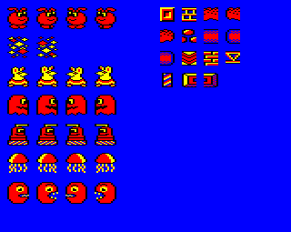

## 30th October 2010

Woke up with a Beeb buzz! It's pouring with rain outside, grey and gloomy, and I've just seen [JoolsH's excellent-looking Muscle March conversion for the Beeb](http://www.retrosoftware.co.uk/forum/viewtopic.php?p=4417#p4417). This, along with [MartinB's Clowns game](http://www.retrosoftware.co.uk/forum/viewtopic.php?p=4055#p4055), make me want to do something fun for the Beeb. Hmmm, I wonder...?

I remembered that, when I found a version of Onslaught to send to the archive, I found a slightly older copy of the source code and put that on the disc too. Armed with that, I should be able to carry on where I left off. So let's see what we've got so far.

The version of source code seems pretty up-to-date, in fact the only things that are missing seem to be the crappy high-score table I knocked up quickly for an Acorn User demo (no big loss), and implementation of 'lives' so that you'll die when you've used them all up. And, happily, it assembles and runs just fine! This means that, for the moment, I can try making changes to the source code on an emulated Beeb, to see how much room I have for improvements, both space- and speed-wise.

I decided to write a little program to extract the sprites from the binary files on the disc, and here are the results on the right- imagine my surprise to find a monster type (this evil Pac-man type creature at the bottom) which was never used in the game! I think the intention was that he was going to be emitted from a generator very rapidly, one after the other, to form a chain of creatures, caterpillar style - but funny to think that I don't even remember drawing it! Right now, my plan is to have very many different types of monster, more than 5 shown here, each with its own type of logic and movement.

So far we have:

**Mouse heads in cars**

_Yeeees_, well I remember Matt and I were fairly artistically-challenged at the time, and we hit upon these odd looking creatures which chugged along, and they just seemed to fit somehow. They are the easiest monsters to defeat, slow-moving, but often disposed to falling off the edge of platforms. I can't remember if they sometimes choose to turn around rather than falling off the edge of a platform.

<!-- -->

**Ghosts**

They are fast moving and they fly unpredictably through the air - however they're fairly easy to avoid given that they spend little time near actual platforms.

<!-- -->

**Daleks**

They are fast moving and they like to patrol platforms, as well as sometimes launching themselves off the edge. Be careful if one starts to chase you, they won't let up!

<!-- -->

**Jellyfish**

They are not much of a threat, more like cannon fodder really. They just swim up and down, but require a few hits before they die.

As well as these, I want to implement a caterpillar type creature (maybe using the Pacman sprite, or perhaps I'll use him for something else...), something which jumps, some crawling worms, and - who knows what else comes to me.

Rather than using a hardware scroll, _Onslaught_ uses two screen buffers, one which is displayed while the other one is being written to. Each frame, the entire playing window is redrawn - this has the effect of slowing it down a bit, but in fact the game is far more playable running at a slower speed, and there are so many things moving at any given time, that you don't notice the frame rate. Experimenting with the source code, I found that the game can actually very happily run at 25Hz, and is not far off running at 50Hz. Since it is capped at 17Hz (updated every three frames), this gives me so many opportunities (memory permitting) to concentrate on great fun gameplay, now I'm finally liberated from the shackles of trying to update everything in a frame. A further advantage of using a double buffered screen is that it guarantees no flicker (see also _Repton Infinity_).

I remember that Matt and I were very concerned at the time about maintaining the frame rate, and we cut a lot of corners to try and keep things fast. One of the sacrifices we made was that the moving sprites were not masked, which you can see clearly when two creatures are overlapping (look out for the nasty blue corners of the sprite rectangle). But this is horrible! I decided to see if this could be improved upon.

Currently, the code which plots a sprite is very simple:

<tt>

`LDA (read),Y         ; read sprite data`

`STA (write),Y        ; write to screen`

`INY`

</tt> (repeated 8 times, to plot a 4x8 character block of a sprite)

I decided to try treating 0 as a transparent colour, and generating a table which could be used to generate a mask byte from any byte of sprite data. Essentially, for every pixel of colour 0 in the byte it generates a mask pixel which preserves the background. For every other pixel colour, it generates a mask pixel which sets the background to black. Then it's possible to use:

`Read screen`

`AND with mask`

`OR with sprite data`

`Write to screen`

to plot a masked byte.

Armed with the clunky build system from the Onslaught disc image, and the cumbersome Beeb command-line editing, I decided to reimplement the sprite routine as a masking sprite routine which considered colour 0 as a transparent colour:

<tt>

`LDA (read),Y          ; read sprite data`

`STA maskindex+1       ; self modify the instruction below to load from masktable+n`

`.maskindex`

`LDA masktable         ; get the mask byte (mandatory that the masktable is aligned to a 256 byte address)`

`AND (write),Y         ; AND the mask with the screen background`

`ORA maskindex+1       ; OR with the sprite data (we have to reload it from the place we stored it just now)`

`STA (write),Y         ; write the byte to the screen`

</tt> (repeated 8 times, to plot a 4x8 character block of a sprite)

With trepidation, I ran the game, thinking I was already going to have affected the frame rate. No such bad luck - it still ran ably, and what's more, all the monsters were now beautifully masked. What an improvement! This is _definitely_ staying in the code!

There's one more trick I can use to get a little extra speed out of it - looking at the code above, for each byte of the sprite, there is a store to an instruction in the code, and this byte is then read later. What if this routine lived in the zero page? Then, this would save a cycle for the STA maskindex+1, and a further cycle for the ORA maskindex+1. It doesn't sound a lot, but consider that the sprite routine is one of the most iterated parts of code in a game. In _Onslaught_, each sprite is 72 bytes, and there are potentially 17 such sprites onscreen at once. That's potentially 2448 CPU cycles being saved, which gives us time to do other things, like render more dots, add more monsters, sound processing, or whatever. Hurrah!

Actually, I can even save some more! The loop is 'unrolled' 8 times (to save cycles on a CPY / BNE for each byte). What about if, for the first byte, instead of using indirect addressing, I use absolute addressing? Like this:

<tt>

`read=P%+1             ; read is the zp address of the `_`operand`_` of the following instruction`

`LDA &FFFF,Y           ; read sprite data`

`STA maskindex+1       ; self modify the instruction below to load from masktable+n`

`.maskindex`

`LDA masktable         ; get the mask byte (mandatory that the masktable is aligned to a 256 byte address)`

`write=P%+1            ; write is the zp address of the `_`operand`_` of the following instruction`

`AND &FFFF,Y           ; AND the mask with the screen background`

`ORA maskindex+1       ; OR with the sprite data (we have to reload it from the place we stored it just now)`

`STA (write),Y         ; write the byte to the screen`

`LDA (read),Y          ; read sprite data`

`STA maskindex+1       ; self modify the instruction below to load from masktable+n`

`.maskindex`

`LDA masktable         ; get the mask byte (mandatory that the masktable is aligned to a 256 byte address)`

`AND (write),Y         ; AND the mask with the screen background`

`ORA maskindex+1       ; OR with the sprite data (we have to reload it from the place we stored it just now)`

`STA (write),Y         ; write the byte to the screen`

</tt> (repeat this block 6 more times)

Thus 2 more cycles are saved, per 8 bytes, which has no space impact (in fact, it actually saves us 2 bytes!) but speeds things up a little bit more. The only problem is that we're using almost half of our zero page space for a sprite routine, but the saving is completely worthwhile!

Well that's all for today. Tomorrow, I've got to start porting the code over to BeebAsm so that I can finally wave goodbye to slow build times and clunky editing. Adiós!

_[Next entry &gt;&gt;](OnslaughtDiary20101031 "wikilink")_

_[Home](OnslaughtDiary "wikilink")_

---

### Comments

- Thought I'd add a place where people can add comments if they're so inclined. It's a bit DIY, but it'll have to do for now.

  - [Richtw](User%3ARichtw "wikilink") 08:33, 26 November 2010 (GMT)

<!-- -->

- Totally awesome and cunning use of both self-modifying code and the zero page to store it in! Nice one mate :)

  - [Mattg](User%3AMattg "wikilink") 22:40, 19 December 2013 (GMT)

<!-- -->

- Use the sequence `**~~~~` to automatically add a timestamped signature to the bottom of the comment. (This gets expanded by MediaWiki to the full text when submitted.)

  - [Richtw](User%3ARichtw "wikilink") 08:33, 26 November 2010 (GMT)
