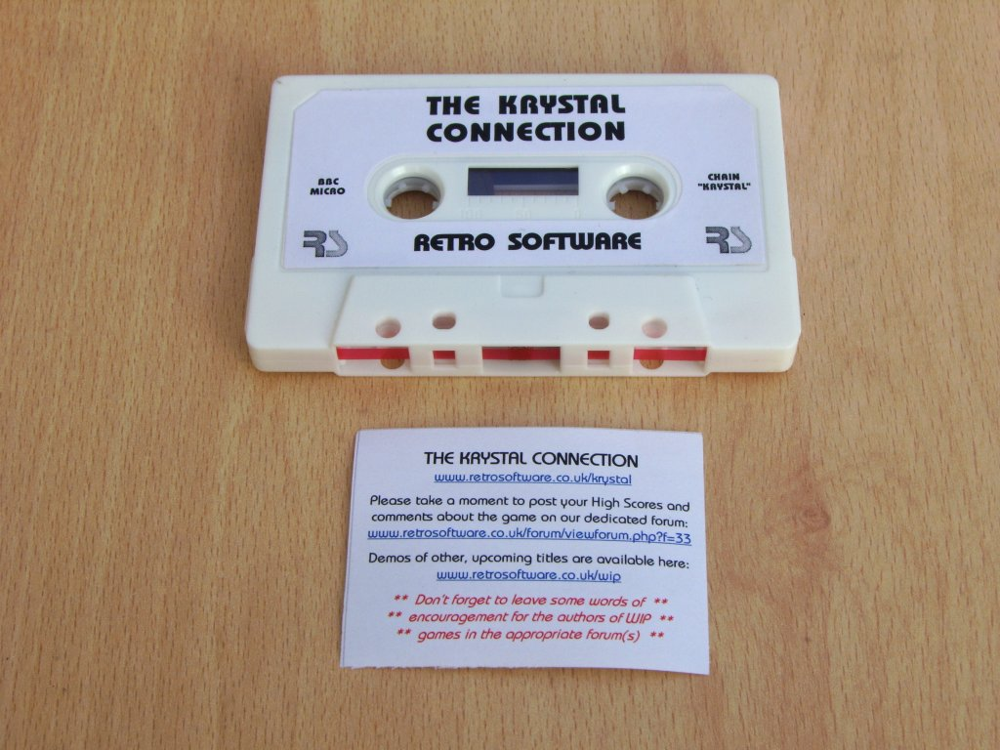
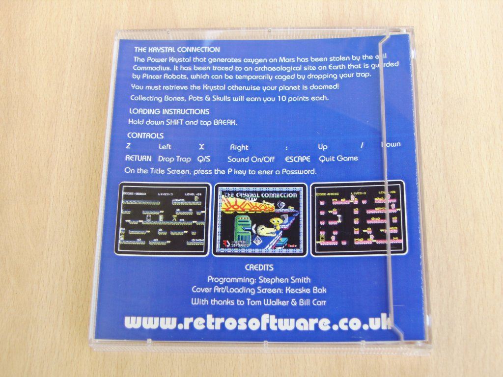
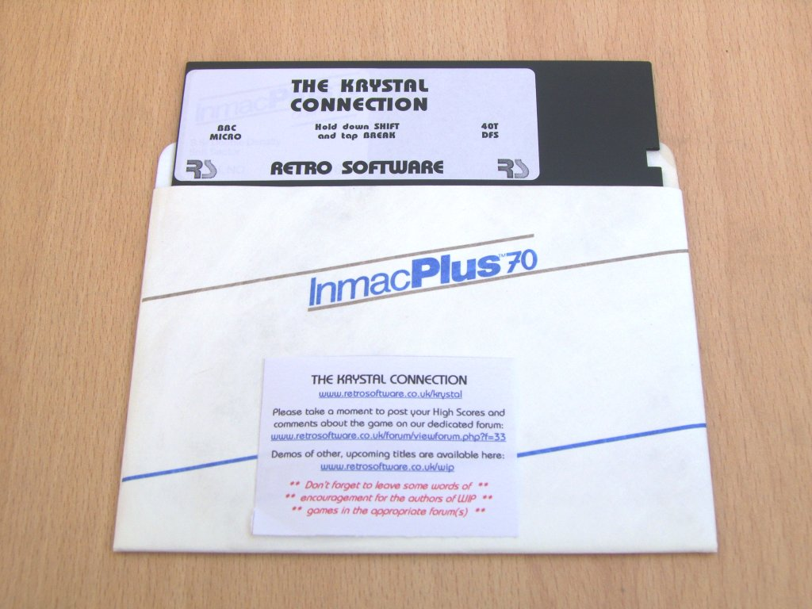

# The Krystal Connection by Stephen Smith

### Licence

Non-Profit Commercial

### Introduction

Back in 1985/86, Stephen Smith came very close to completing a platform game for the BBC Micro called "The Krystal Connection", which was due to be published by Melbourne House (Stephen still has the original contract and correspondence between himself and Alfred Milgrom).

Stephen forwarded the latest version of the game to Retro Software and, despite the lack of source code, we have been able to address the remaining issues (e.g. implementation of a working password/level skip system, Master compatibility, plus various other fixes and cosmetic changes).

We have also been able to add custom cover art and loading screen, thanks to the talented [Kecske Bak](http://www.kecskebak.co.uk) (Dave Jeffery).

The game is 100% machine code, features in-game music and uses hi-resolution Mode 1 graphics.

It was released by Retro Software at [Acorn World 2009](http://www.acornworld.co.uk) on September 12th 2009 in Huddersfield, and is now available for purchase online.

[Discuss The Krystal Connection](http://www.retrosoftware.co.uk/forum/viewforum.php?f=33)

### Ordering The Krystal Connection

The Krystal Connection is a blue label Retro Software title.

Formats, price and ordering details are available on the [Pricing Structure](Prices "wikilink") page.

_Note: the emulator CD-ROMs are not yet available but, until they are, anyone ordering one of the other physical releases can request an emulator image to be emailed to them, when placing their order_

### Storyline

The POWER KRYSTAL that generates oxygen on Mars has been stolen by the evil COMMODIUS.

It has been traced to an archaeological site on Earth that is guarded by PINCER ROBOTS which can be temporarily caged by dropping your trap.

You must retreive the Krystal otherwise your planet is doomed!

COLLECTING BONES, POTS AND SKULLS WILL EARN YOU TEN POINTS EACH.

### Keys

Z - Left

X - Right

: - Up

? - Down

RETURN - Drop Trap

Q/S - Sound Off/On

ESCAPE - Quit Game

### Credits

Programming: Stephen Smith

Cover Art/Loading Screen: [Kecske Bak](http://kecskebak.blogspot.com) (Dave Jeffery)

Release Preparation: [Tom Walker](http://www.tommowalker.co.uk) & Bill Carr

### Sample Screenshots

<table>

<tbody>

<tr class="odd">

<td>

<strong>The Krystal Connection In-Game Screenshot</strong> 

<em>Posted: Thu June 25, 2009 17:55</em>
</td>

<td>

<strong>The Krystal Connection In-Game Screenshot</strong> 

<em>Posted: Thu June 25, 2009 17:55</em>
</td>

</tr>

</tbody>

</table>

### Packaging

<table>

<tbody>

<tr class="odd">

<td>

<strong>Inlay for BBC Micro Cassette version (front)</strong> 

<em>Posted: Sep 20, 2009</em>
</td>

<td>

<strong>Inlay for BBC Micro Cassette version (back)</strong> 

<em>Posted: Sep 20, 2009</em>
</td>

</tr>

<tr class="even">

<td>

<strong>Media for BBC Micro Cassette version</strong> 

<em>Posted: Sep 20, 2009</em>
</td>

<td>

<strong>Inlay for BBC Micro 5.25&quot; Disc version (front)</strong> 

<em>Posted: Sep 20, 2009</em>
</td>

</tr>

<tr class="odd">

<td>

<strong>Inlay for BBC Micro 5.25&quot; Disc version (back)</strong> 

<em>Posted: Sep 20, 2009</em>
</td>

<td>

<strong>Media for BBC Micro 5.25&quot; Disc version</strong> 

<em>Posted: Sep 20, 2009</em>
</td>

</tr>

<tr class="even">

<td>

<strong>Inlay for Master Compact 3.5&quot; Disc version (front)</strong> 

<em>Posted: Sep 20, 2009</em>
</td>

<td>

<strong>Inlay for Master Compact 3.5&quot; Disc version (back)</strong> 

<em>Posted: Sep 20, 2009</em>
</td>

</tr>

<tr class="odd">

<td>

<strong>Media for Master Compact 3.5&quot; Disc version</strong> 

<em>Posted: Sep 20, 2009</em>
</td>

</tr>

</tbody>

</table>
