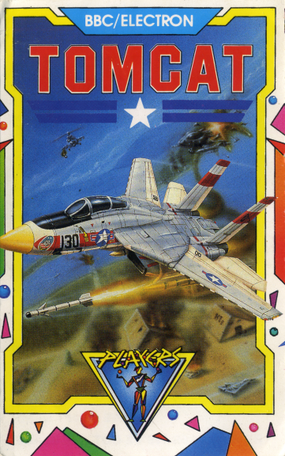

# F14 Tomcat by Kees van Oss

### Licence

Freeware (source code [available on request](mailto:contact@retrosoftware.co.uk), subject to copyright holders' permission)

_BBC Micro / Electron F14 Tomcat (c) Players software/D'N'A conversions by Adam Polanski_

_F14 Tomcat by Kees van Oss, 2015_

### Introduction

Tomcat is a vertically scrolling shoot 'em up in which the player takes control of an F14 Tomcat fighter aircraft, shooting at both air and ground targets whilst flying over four levels. The game is set in the future, some time after the first half of the 21st century. In the in-game universe, materials science has progressed such that human civilisation has found a way to cheaply build many artificial islands. The game is set on one such island, called ARTROCK 6 which is a completely automated defence installation. Due to a freak storm damaging the controlling software, the island has turned against its own side and has started attacking local shipping. The player's task is to fly in and completely destroy the rogue island.

Retro Software is therefore proud to reveal a brand new Atom port by the Dutch coder Kees van Oss. This new release is an astonishingly accurate version of the original title. The conversion was 'relative' easy because the resolution of the screen matches perfectly the Atom CLEAR4 resolution. Because it's a monochrome game, the graphics are exactly the same as the original Electron game. In the original game there were not many sound effects but they are also included in the Atom version.

### Platforms

====Atom==== **_Port by Kees van Oss_**

##### System Requirements

- Standard Acorn Atom

- 32 KB RAM (\#0000-\#7FFF)

- 6 KB video RAM (\#8000-\#97FF)

- VIA (for SID music)

- Joystick connected to keyboard matrix (Optional)

- Joystick connected to PORTB AtoMMC interface (Optional)

##### Joystick Connections

An optional joystick can be connected parallel to the first row of the keyboard matrix according to the Dutch Atom Group standard:

` row      column`

`#B000     #B001`

`write      read   Joystick`

`--------------------------`

`  0   - PB0 - #01 - Jump`

`  0   - PB1 - #02 - Left`

`  0   - PB2 - #04 - Up`

`  0   - PB3 - #08 - Right`

`  0   - PB4 - #10 - Down`

An optional joystick can be connected to PORTB of the AtoMMC interface with software version 2.9.

`AtoMMC  Joystick`

`-----------------`

` PB0  -  Right`

` PB1  -  Left`

` PB2  -  Down`

` PB3  -  Up`

` PB4  -  Jump`

` PB5  -  nc`

` PB6  -  nc`

` PB7  -  nc`

` GND  -  GND`

##### Downloads

[F14 Tomcat AtoMMC images](../../retrosoftwarecouk_wiki-20160918-wikidump/images/F14Tomcat.zip "wikilink")

[F14 Tomcat AtoMMC images with SID music](../../retrosoftwarecouk_wiki-20160918-wikidump/images/F14Tomcat-SID.zip "wikilink")

This image archive includes tape, disc and AtoMMC versions of the game. Read the included Readme.txt file for more info.

The sourcefiles are available on request and have to be compiled with the CC65 cross compiler.

Type MAKE F14CODE to compile the program.

An assembler listing is created in the F14CODE.LST file.

##### Screenshots

<table>

<tbody>

<tr class="odd">

<td>
 

<strong><em>F14 Tomcat</em> instructions</strong> 

<em>Posted: 21:00, 13 Dec 2015</em>
</td>

<td>
 

<strong><em>F14 Tomcat</em> controls</strong> 

<em>Posted: 21:00, 13 Dec 2015</em>
</td>

<td>
 

<strong><em>F14 Tomcat</em> selection screen</strong> 

<em>Posted: 21:00, 13 Dec 2015</em>
</td>

</tr>

<tr class="even">

<td>
 

<strong><em>F14 Tomcat</em> introscreen</strong> 

<em>Posted: 21:00, 13 Dec 2015</em>
</td>

<td>
 

<strong><em>F14 Tomcat</em> Level 1</strong> 

<em>Posted: 21:00, 13 Dec 2015</em>
</td>

<td>
 

<strong><em>F14 Tomcat</em> Level 2</strong> 

<em>Posted: 21:00, 13 Dec 2015</em>
</td>

</tr>

<tr class="odd">

<td>
 

<strong><em>F14 Tomcat</em> Level 3</strong> 

<em>Posted: 21:00, 13 Dec 2015</em>
</td>

<td>
 

<strong><em>F14 Tomcat</em> Level 4</strong> 

<em>Posted: 21:00, 13 Dec 2015</em>
</td>

<td>
 

<strong><em>F14 Tomcat</em> gameover</strong> 

<em>Posted: 21:00, 13 Dec 2015</em>
</td>

</tr>

</tbody>

</table>

##### Videos

{{\#ev:youtube|SqOHF9QK1bY}}

**_F14 Tomcat_ by Kees van Oss**

_Posted: Sun Dec 13._
