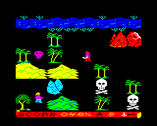

# Treasure Island by Paul Davis

### Licence

Software licence TBC

### Introduction

A BBC micro conversion of [Treasure Island](<wikipedia:Treasure_Island_(video_game)> "wikilink"), a simple maze game from 1985 by Greg Duddle originally supplied with the [Commodore Plus/4](wikipedia:Commodore_Plus/4 "wikilink"), and based on the [classic 1883 novel](wikipedia:Treasure_Island "wikilink") by [Robert Louis Stevenson](wikipedia:Robert_Louis_Stevenson "wikilink"). The aim is to explore the island, as Jim Hawkins, to find the treasure, collect certain items, and deal with any pirates that get in your way. Once you've found the treasure you must race back to the Hispaniola before Long John Silver catches up with you.

[Discuss Treasure Island](http://www.retrosoftware.co.uk/forum/viewforum.php?f=51)

### Features

- Colourful mode 2 graphics

- 'Sea shanty' style title music

- 8x8 screen playable area (flip screen)

- Easy to get into and play. Tricky to win with 100% score

- Limited availability of weapons adds a strategic element

- Collectable objects give some replay value. Play once to win, again to get 100%

**Features not in the original version:**

- High score table

- Island editor

- Additional enemy types to make gameplay more challenging.

### Status

The Plus/4 version of the game has been fully mapped.

All the graphics and music for the BBC version have now been created.

Main player sprite is currently able to move freely around the screen but no collision detection yet.

### Sample Screenshots

#### Original Commodore Plus/4 Version

<table>

<tbody>

<tr class="odd">

<td>
[[Image:Treasure_Island_C+4_TitleScreen.gif|375px|<em>'Treasure Island Commodore Plus/4 title screen <strong> 

<em>Posted: 14:40, 6 July 2009</em>]] 

</strong>Treasure Island Commodore Plus/4 title screen</em>' 

<em>Posted: 14:40, 6 July 2009</em>
</td>

<td>
[[Image:Treasure_Island_C+4_Screenshot1.gif|375px|<em>'Treasure Island Commodore Plus/4 in-game screenshot <strong> 

<em>Posted: 11:59, 6 July 2009</em>]] 

</strong>Treasure Island Commodore Plus/4 in-game screenshot</em>' 

<em>Posted: 11:59, 6 July 2009</em>
</td>

<td>
 

</td>

</tr>

</tbody>

</table>

#### BBC/Electron Version

<table>

<tbody>

<tr class="odd">

<td>

<strong>Treasure Island BBC title screen</strong> 

<em>Posted: 15:00, 31 December 2009</em> 

</td>

<td>

<strong>Treasure Island BBC high score screen</strong> 

<em>Posted: 15:00, 31 December 2009</em> 

</td>

</tr>

<tr class="even">

<td>

<strong>Treasure Island Electron title screen</strong> 

<em>Posted: 15:00, 31 December 2009</em> 

</td>

<td>

<strong>Treasure Island BBC screen 2c</strong> 

<em>Posted: 15:00, 31 December 2009</em> 

</td>

</tr>

<tr class="odd">

<td>

<strong>Treasure Island BBC screen 4g</strong> 

<em>Posted: 15:00, 31 December 2009</em> 

</td>

<td>

<strong>Treasure Island BBC screen 2d</strong> 

<em>Posted: 15:00, 31 December 2009</em> 

</td>

</tr>

<tr class="even">

<td>

<strong>Treasure Island BBC screen 1h</strong> 

<em>Posted: 15:00, 31 December 2009</em> 

</td>

<td>

<strong>Treasure Island BBC screen 6c</strong> 

<em>Posted: 15:00, 31 December 2009</em> 

</td>

</tr>

</tbody>

</table>

### Sample Video

Coming soon

### Playable Demo

Coming soon

### Development Diary

#### December 2009

_31st December_

Replaced the ancient screenshots with a new set taken from the current build of the game.

After what seems like forever and a day spent compressing and re-arranging data, there is finally some light at the end of the tunnel. All the game data (graphics, fonts, music, sound effects etc) is now complete in its compressed form and allocated to various points in memory. This has resulted in a pleasant surprise. It appears there will be enough memory left over to include the original 'scroll' score panel after all. I tried it out in the electron version (see the screen shots above). The beeb version will get it too, but for the moment still has the cut-down strip along the bottom of the screen.

Now, at last, I can get back to writing the game mechanics and feel like I'm make some progress for a change!

#### September 2009

_18th September_

Very little progress made this past month. Eventually managed to motivate myself back into doing some more work on the game this week.

• Spent some time designing a custom font and created the title screen and high score screen. The original game didn't feature a high score table but I think this will be a welcome addition.

• Created the graphics for the status panel. The vertical 'scroll' imagery used in the Plus/4 version has been moved from the side of the play area to a thin horizontal scroll running across the top of the screen.

• Converted the game's music and wrote a simple player routine for it. Surprisingly, it didn't take long and the results are pretty faithful to the Plus/4 version. Once again, though, the data takes up way too much memory and will need to be compressed.

• Some of the main character sprites needed to be re-drawn to reduce memory wastage and make them simpler to handle in the sprite plotter.

• Finally got the sprite plotting code to the point where Jim can be moved around the screen without leaving a pile of crap in his wake!

#### August 2009

_10th August_

Wrote the sprite plotting code for moveable characters and put in the sprites for Jim and LJS.

Now it just needs the ability to render different sized sprites and it can be used for the weapons too.

_8th August_

Completed the routines for compressing tile graphics. It only managed to shave off 2K (from 7K down to 5) which is slightly disappointing but it's enough to get the player sprites in there now.

_3rd August_

Finally able to make some more progress on the game.

Added the sprite plotting code for collectable items and enemy pirates. Still need to write a plotter for the moveable sprites: Jim, Long John and weapons.

Designed a compression scheme for the tile graphics to free up some much needed memory. It should also slightly improve the performance of tile rendering which is still a tad slow on the Elk version.

#### July 2009

_21st July_

All the screen data has now been entered. Not much memory left, just over 1000 bytes in which to fit all the game code!

Next job... putting the main player sprite into the game and letting him move around the screens.

_18th July_

Not much progress this past week or so due to illness.

I did manage to put in the final set of optimisations to the tile rendering code which is now almost 10 times faster than the original version.

Spent some time designing the data structures used to represent the screen maps. With that complete, I can finally make a start on putting all the screens into the game.

_7th July_

The graphics are now fully drawn.

Had another look at the slow tile rendering code. It's funny how when you look at things a few days later the solution seems to be blindingly obvious! Tile rendering is now 3 times faster, just about good enough for a beeb, but still too slow for the elk. I've got an idea on how I'm going to how to speed it up further which I'll try in a few days.

_5th July_

Started drawing the BBC graphics. About half way through so far.

_4th July_

Wrote some preliminary code to display sprites and map tiles. Profiling shows the sprite rendering to be plenty quick enough but the tile rendering engine is way too slow. This will need more work at a later date, but for now it's good enough to use while designing the graphics.

_1st July_

Mapped the Plus/4 version of the game including enemies, collectables and point allocations.
